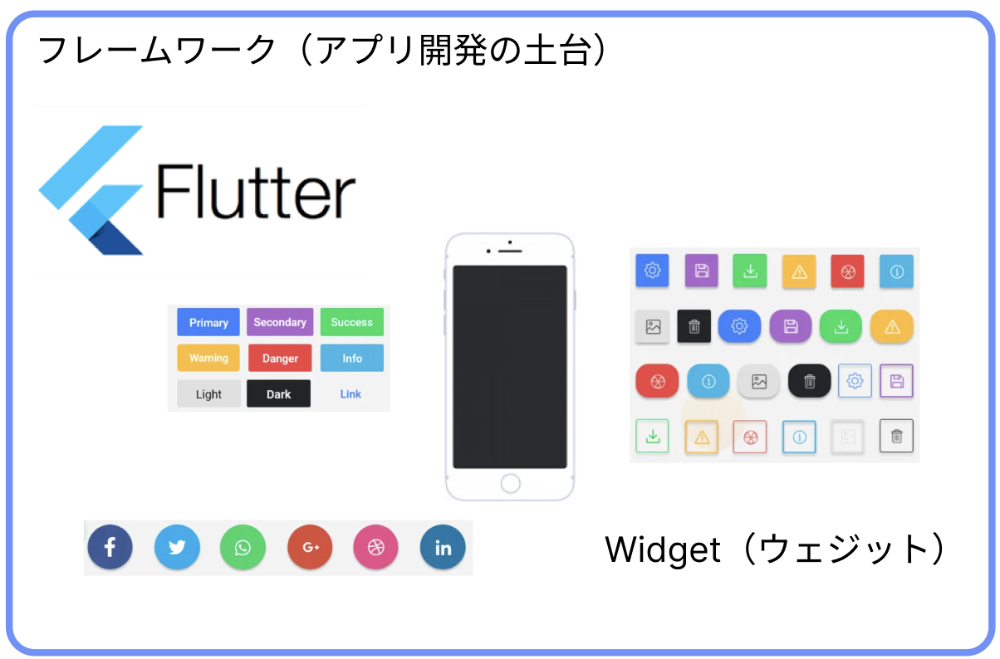
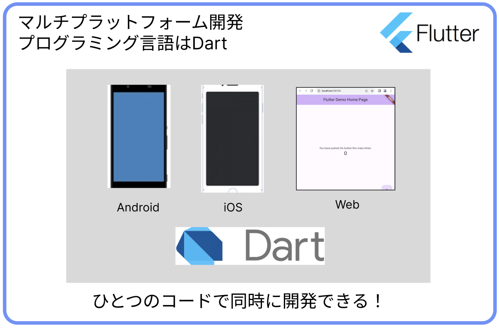
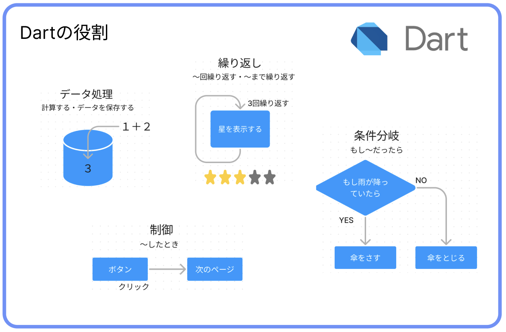
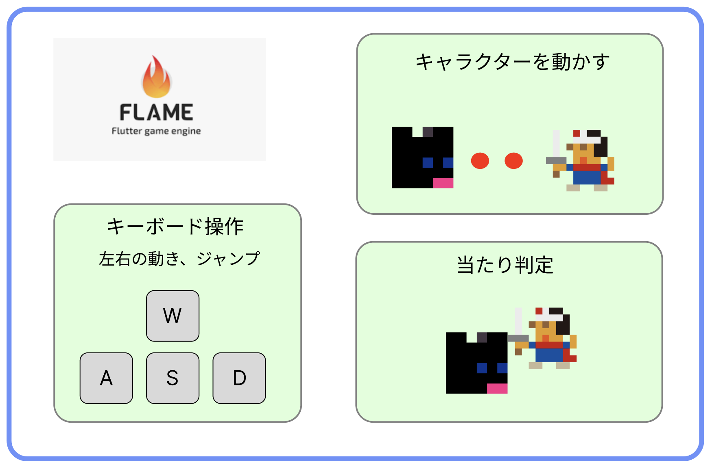

# **02_どんな言語を使うの？**

## **Flutter環境で開発**

Flutter（フラッター）とはGoogleが提供しているフレームワークです。  
フレームワークとはアプリ開発の土台となるもので、アプリ開発に必要な機能が多数搭載されています。  
例えば、Widget（ウェジット）は画面のレイアウトやボタンなどを構成するパーツで、組み合わせて使いやすいレイアウトやおしゃれなデザイン、動作を簡単に作ることができます。

FlutterではDart（ダート）というプログラミング言語を使って、Android / iOS / Web / Windows / macOS / Linuxの6つのアプリを全く同じソースコードで開発することができます。  

  

## **Dartは計算や制御を担当**

- データ処理
- 処理を繰り返す
- 条件分岐
- 制御  

  

## **flameを使ったゲーム制作**

flutterには`flameゲームエンジン`が用意されていて  
ゲームを作るための機能を簡単に使うことができます。

  

---

## **ゲームコースでできること**

---

## **授業の流れ**

  1. Dartプログラミング
     1. Dartの文法を学ぶ
     2. 問題演習  
  2. Widgetプログラミング
     1. Widgetの使い方
  3. flameの基礎
     1. ゲーム制作の基本的な機能を学ぶ  
     2. 課題
  4. サンプルゲーム制作
     1. 横スクロールゲーム

## **どこまでできるの？**

### flutterでできること  

今回制作するゲーム以外にもいろいろなアプリを作ることができます。

 - クイズ
 - じゃんけんゲーム
 - しりとりゲーム
 - TODOアプリ

### できないこと

 - FPSなど高度なゲームアプリ  
 - SNSなどの通信アプリ
