# **04_環境構築（Windows）**

## **1. Gitのインストール**

①公式サイトからインストーラーをダウンロード  

https://git-scm.com/download/win

 

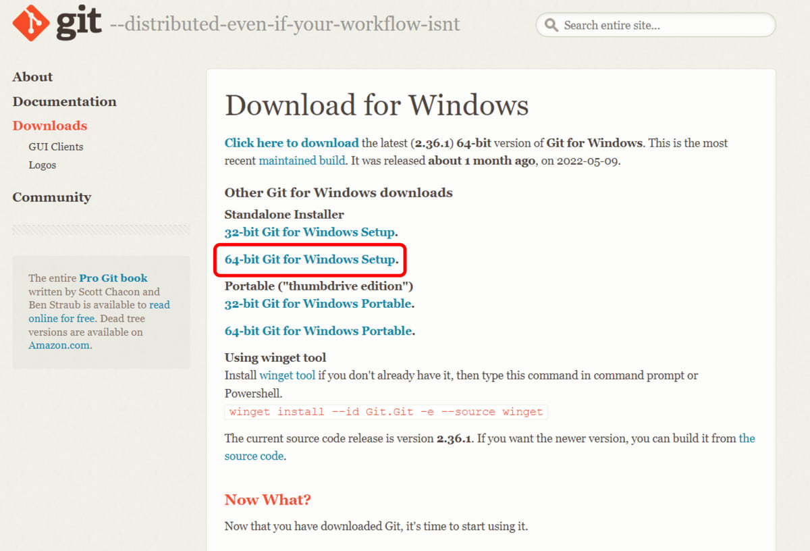  

 

[Next]をひたすらクリック  
[Install]をクリック  
最後に[Finish]をクリック  

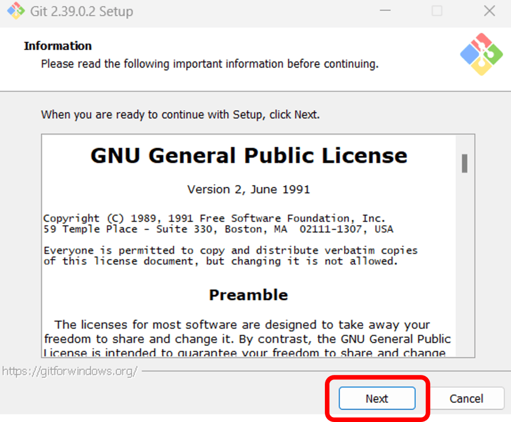  
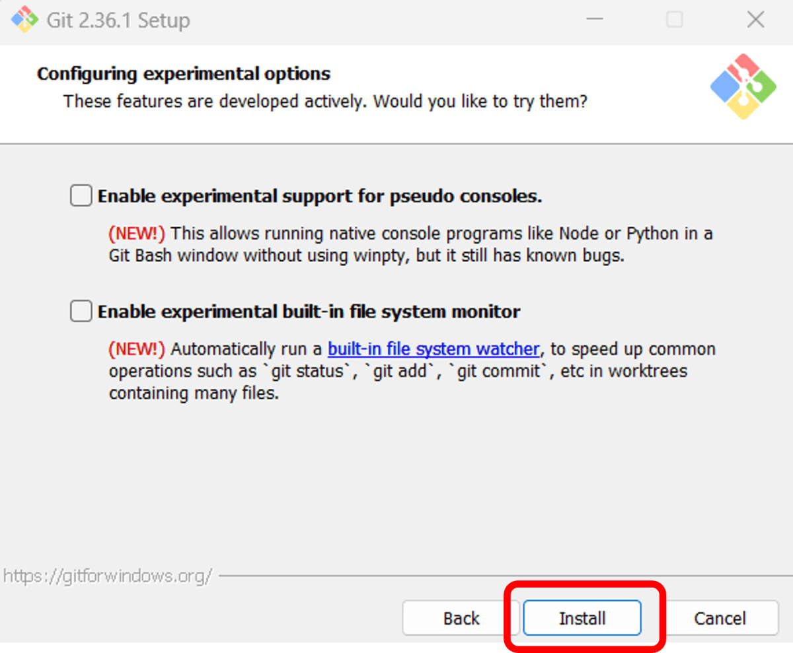  
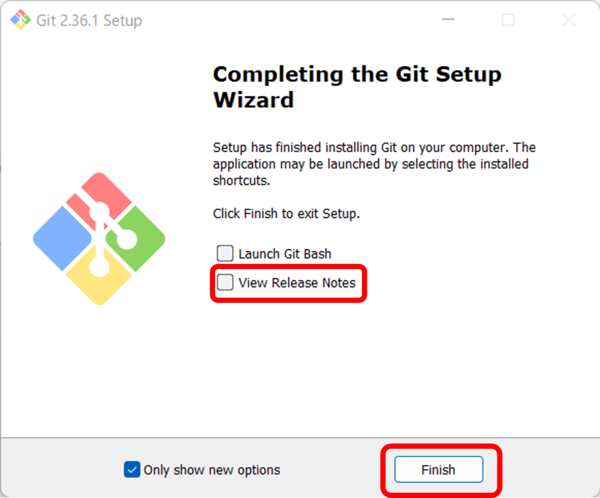  

 

## **2. FlutterSDKのインストール**

 

①公式サイトからFlutterSDKをダウンロード  

https://docs.flutter.dev/get-started/install/windows

 

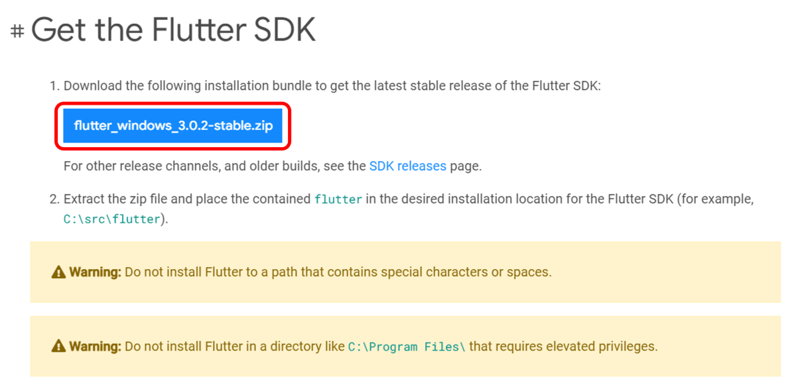  

 

画面右上（または左下）のアイコンでダウンロードの進行状況が確認できます

  

 

ダウンロードの途中でも②に進みましょう

 

②フォルダを作成

Cドライブ直下に「src」　その下に「projects」フォルダを作成する

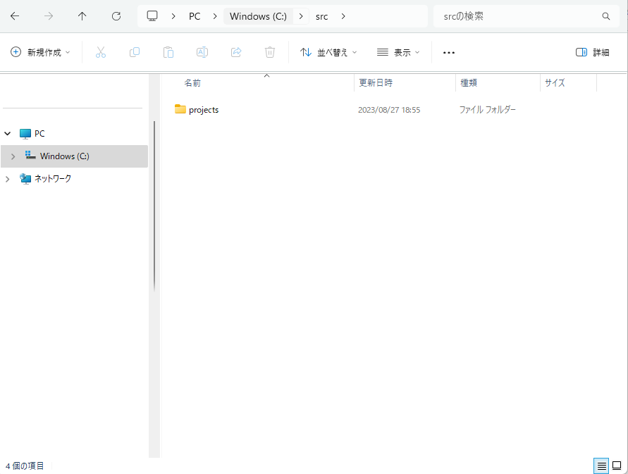

 

③ ①のダウンロード完了後、「ダウンロード」フォルダからzipファイルを右クリック > すべて展開　

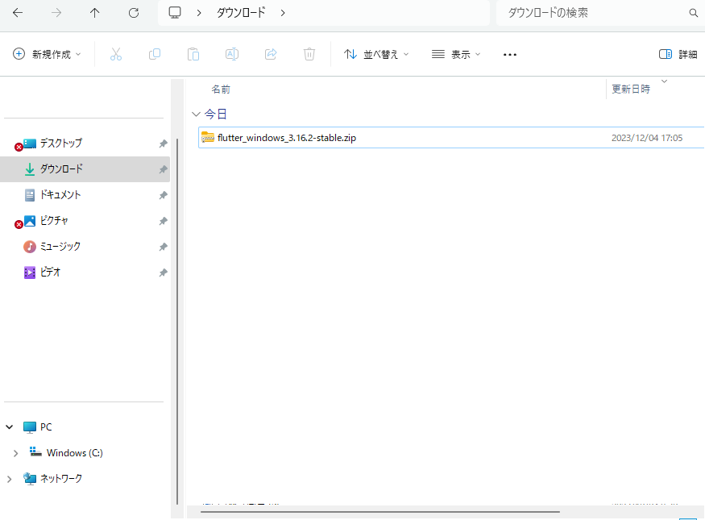

 

---
 

「参照」ボタンをクリックし、Cドライブ＞srcフォルダを選択

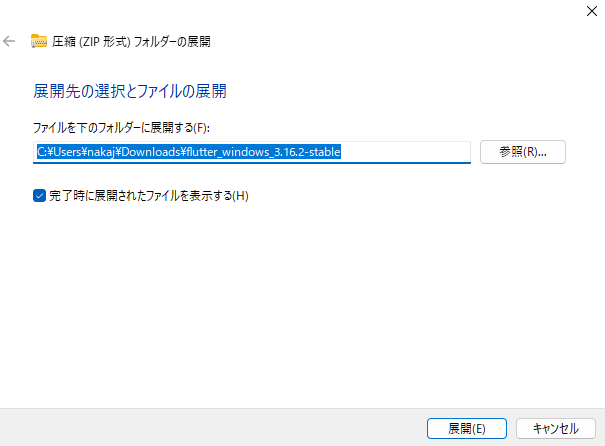

---
 

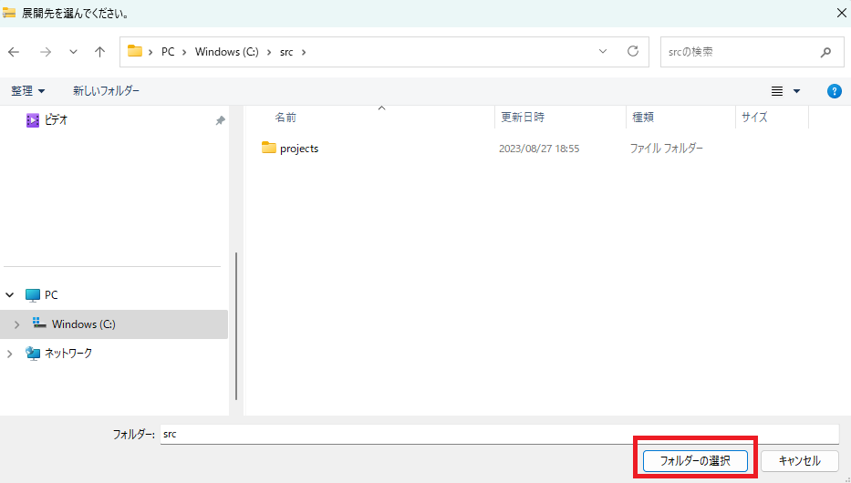

---
 

右下の「展開」ボタンをクリックする。  
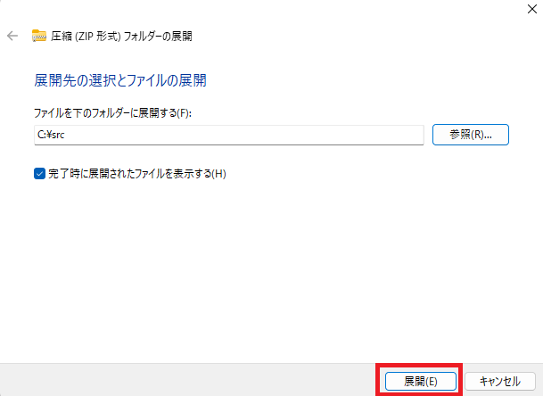

---
 

## **3. PATHを通す**

①src > flutter > bin を開き、アドレスバーのbinの上で右クリック > アドレスとテキストとしてコピー　をクリック

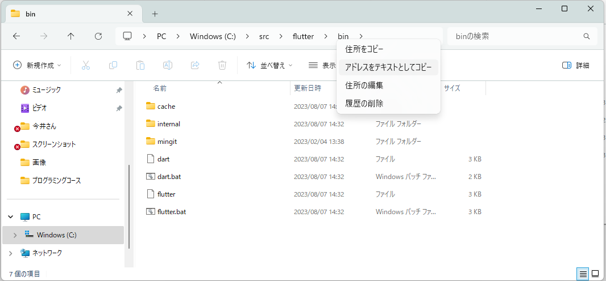

 

②タスクバーの検索に「env」と入力し、「システム環境変数の編集」をクリック

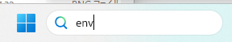

 

 

③「環境変数」をクリック、「Path」を選択し「編集」をクリック

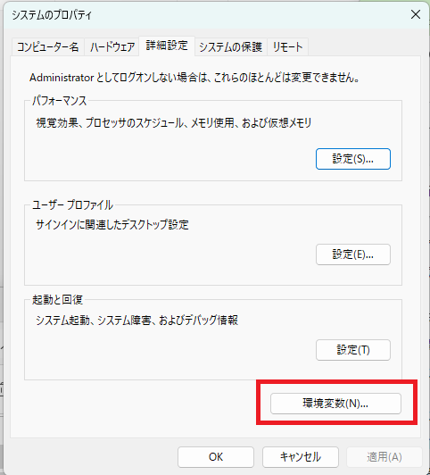

 

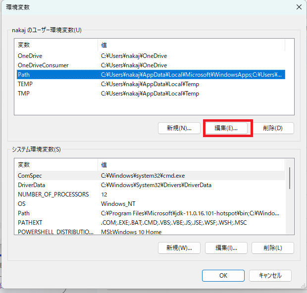

 

④「新規」をクリックし、①でコピーしたアドレスを貼り付けてOKをクリック  
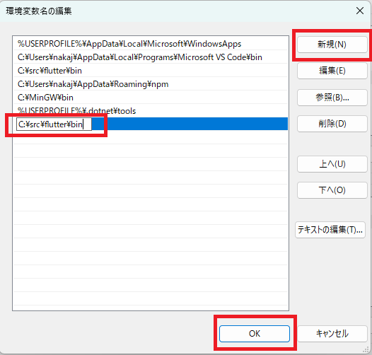

 

## **4. 設定の確認**

①タスクバーの検索に「PowerShell」と入力し「Windows PowerShell」をクリック  

 

 

②「flutter doctor」コマンドを入力し、エンター  

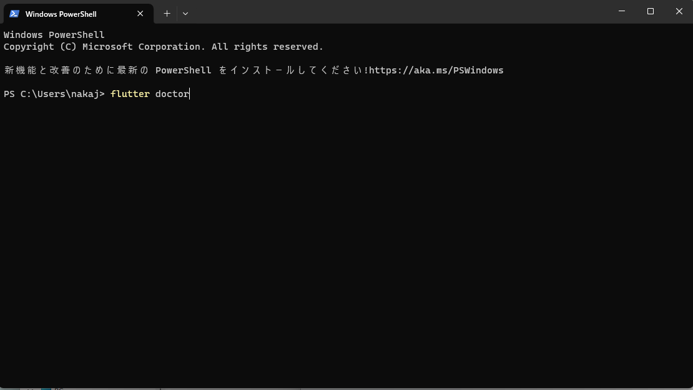

 

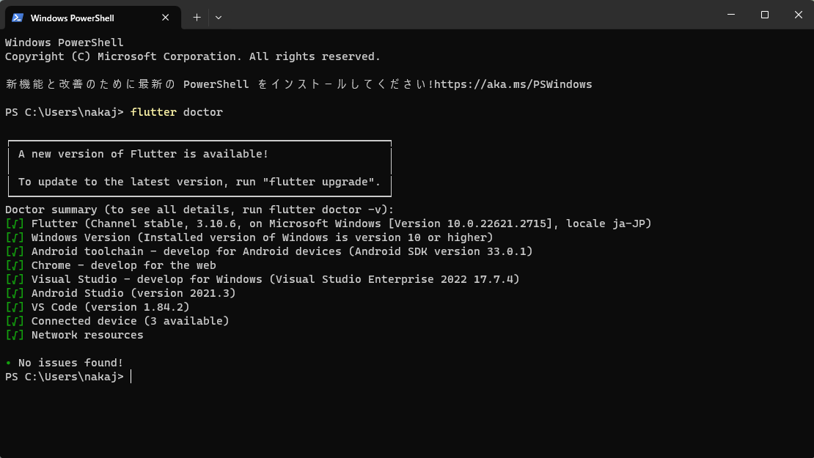

 

下記の項目に緑のチェックがついていればOK

   - Flutter
   - Chrome
   - VS Code

 

## **5. VSCodeの設定**

 

①拡張機能を追加

   - Flutter
   - Flutter Widget Snippets
   - Dart
   - Code runner  

 

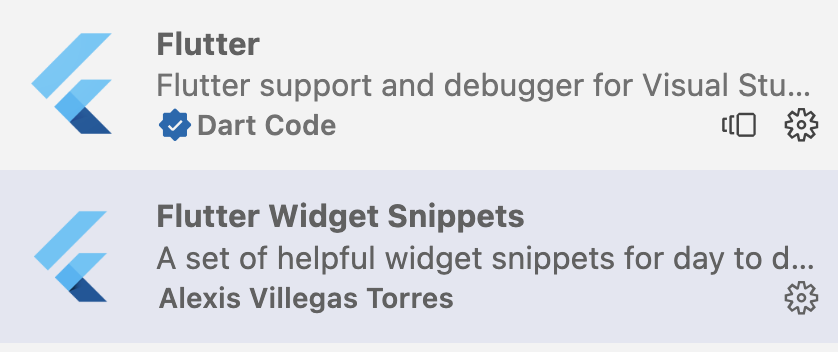
 

 

 

②Code runnerの設定

左下の歯車マークから「設定」を選択、「設定の選択」に「Code runner」と入力、「Run In Terminal」にチェックを入れる  

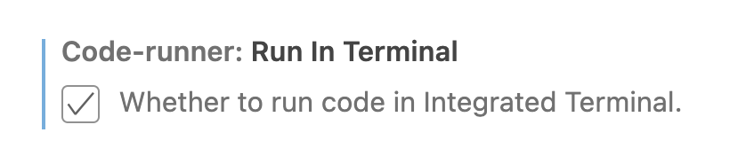  
 
