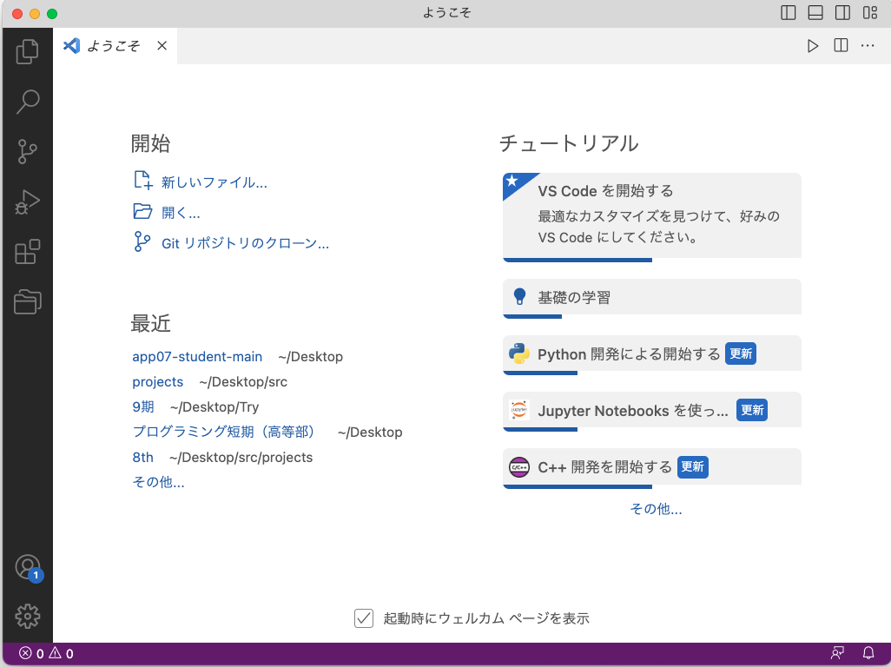
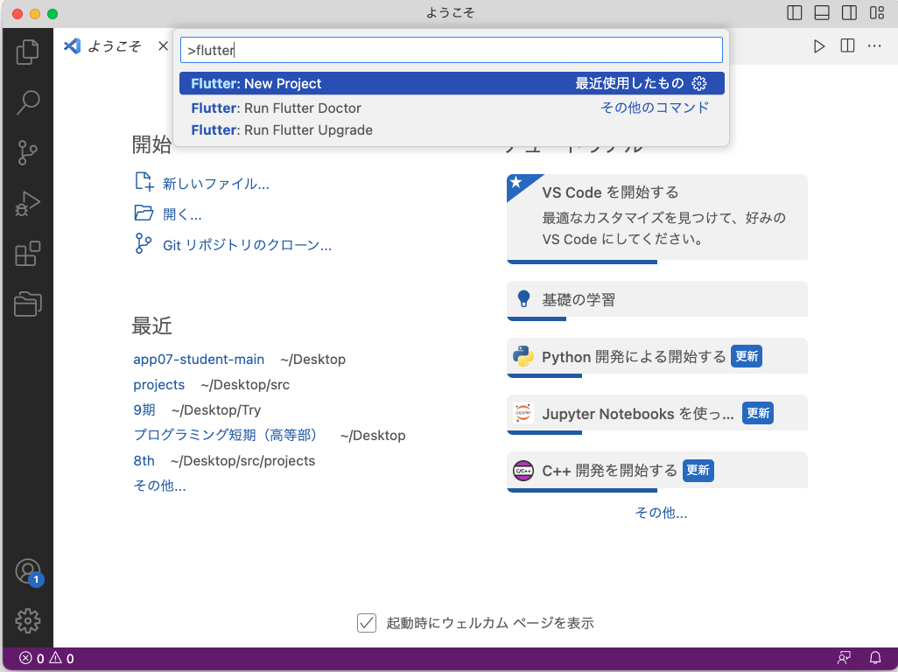
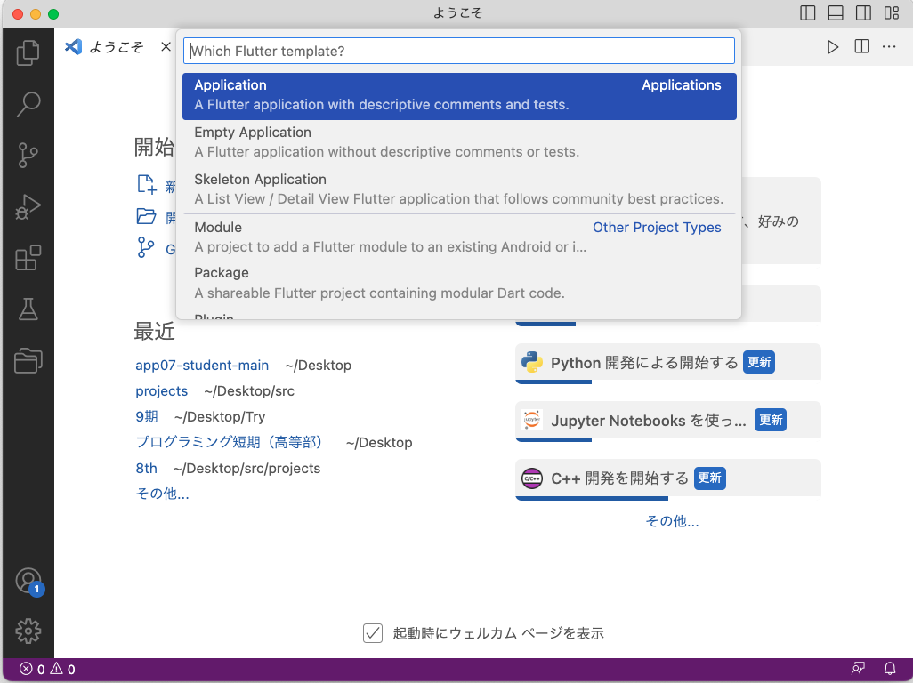
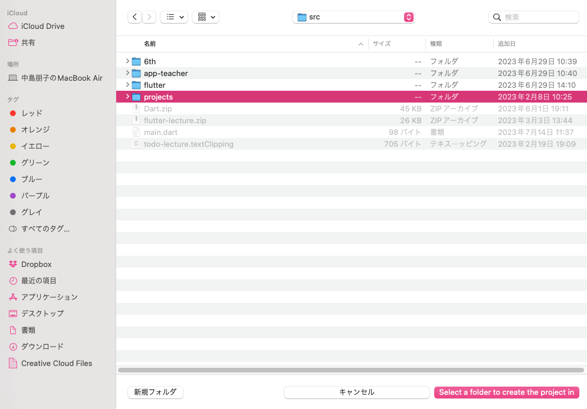
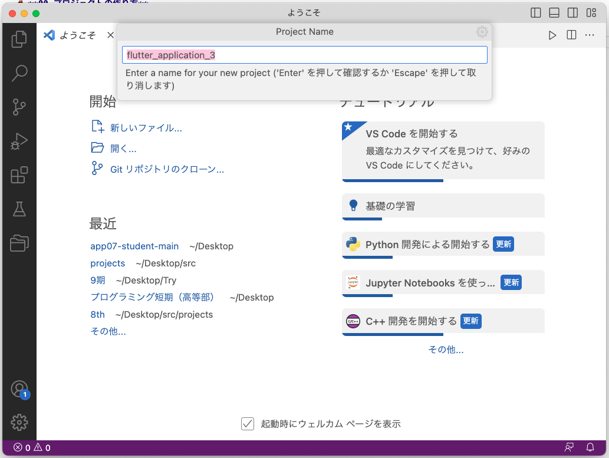
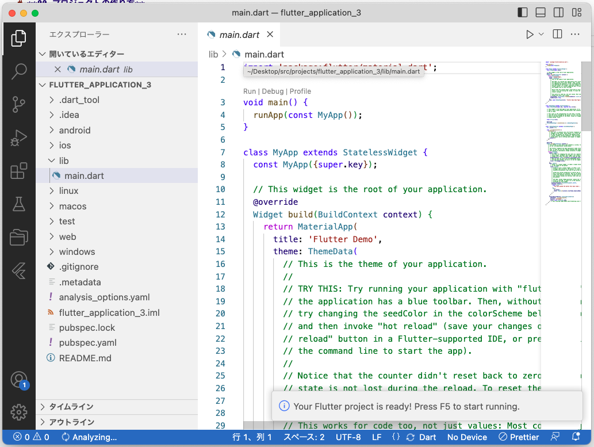
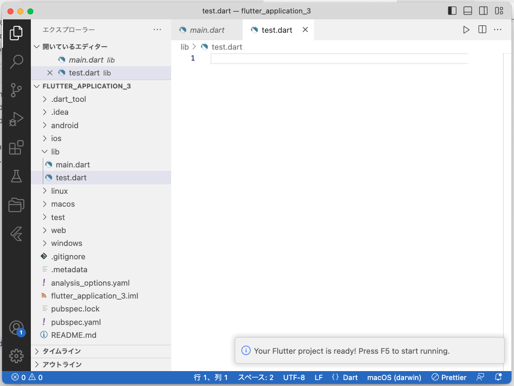

# **00_プロジェクトの作り方**

- VSCode>左下の歯車マーク＞コマンドパレット
- 検索＞flutterと入力＞「Flutter:New Project」＞「Application」
- 保存先を指定　src>projects
- アプリケーションの名前を指定、今回は変えずにエンター
- プロジェクトの完成
- テスト用のDartファイルを作る lib>test.dart

  

## VSCode>左下の歯車マーク＞設定＞コマンドパレット

## 検索＞flutterと入力＞「Flutter:New Project」＞「Application」

## 保存先を指定　src>projects

## アプリケーションの名前を指定、今回は変えずにエンター

## プロジェクトの完成

## テスト用のDartファイルを作る lib>test.dart

