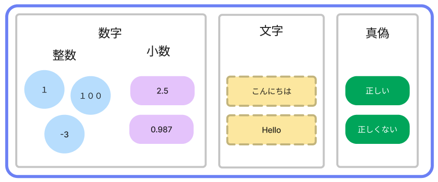
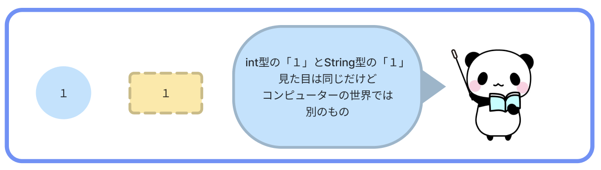
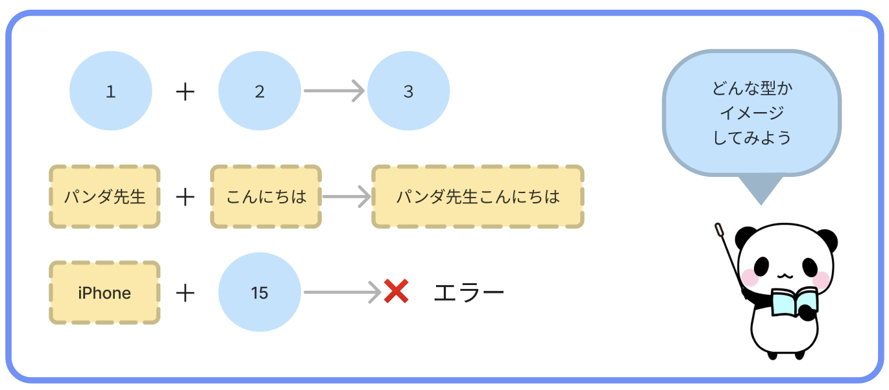

# **02_データの型**

データには「型(type)」と呼ばれる、性質がある  



### **数字**
- **int**(イント)型：整数
  - 1, 238, -3 など
- **double**(ダブル)型：小数
  - 0.1, 9.358 など 

### **文字**
- **String**(ストリング)型：文字列
  - こんにちは！, programming, など

### **真偽**
- **bool**(ブール)型：真偽値
  - true(トゥルー)：正しい
  - false(フォルス)：正しくない
    - bool型は「正しい」「正しくない」の **状態** を表す



**ポイント**  
- 「数字 + 数字」や「文字 + 文字」など、同じ型同士は、計算ができる！
- String型の文字列は `'` で囲う

```dart
void main() {
  print(1 + 1); // ⇦ 数字 + 数字 OK!
  print('トライ' + '3'); // ⇦ 文字 + 文字 OK!
  print('トライ' + 3); // ⇦ 数字 + 文字 エラーが起きちゃう NG...
}
```

```
>> 2
>> トライ3
>> Error: A value of type 'int' can't be assigned to a variable of type 'String'.
  print('トライ' + 3);
                ^
```



<br>

# **確認問題**

## **問題①**
`12` の型はなに？

<br>

## **問題②**
「正しい」という意味のbool値はどっち？  
1.true  
2.false

<br>

## **問題③**

出力結果が、`1 + 2` になるプログラムを書こう！

```
>> 1 + 2
```