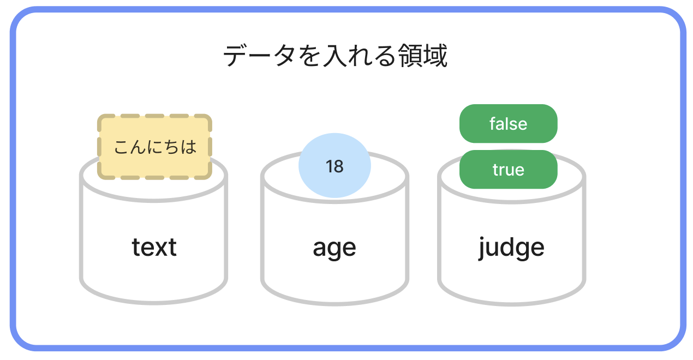
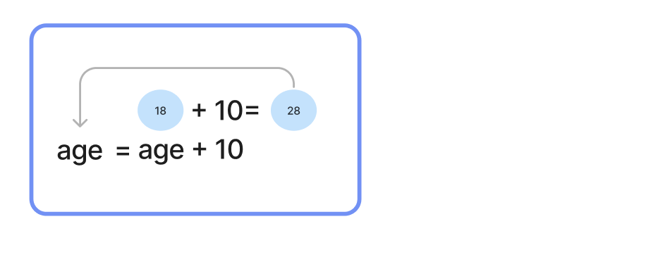
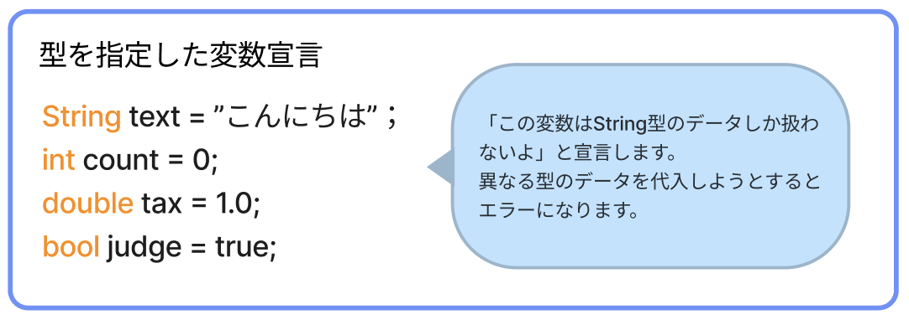

# **03_変数・定数（データを使おう）**




- **変数**：入れたデータを、後で**変えられる**  
- **定数**：入れたデータは、後で**変えられない**

`18` や `823800` などの、意味がわからないデータに  
**age**(年齢)は`18`  
**score**(点数)は`823800`  
と、名前をつけることができる

<br>

## **変数**

### **変数を作って、データを入れる**

`var 名前 = 入れたいデータ;`  

- **変数の宣言**：領域を展開すること `var`
- **変数の定義**：領域に名前をつけること `名前`
- **代入**：データを入れること `= 入れたいデータ`

```dart
void main() {
  var age = 18;
  print(age);
}
```

```
>> 18
```
<br>

### **変数に入ってるデータを、入れ替える**

**再代入** という

```dart
void main() {
  var age = 18;

  // 変数は 値（データ）を 後から入れ替えられる！
  age = 19;
  print(age);
}
```

```
>> 19
```

**ポイント**  
- `=` ⇦このイコールは **代入演算子** と呼ぶ
  - 1 + 2 = 3の比較に使う `=` とは違い、**右にある値を左に入れる** という、←的な意味がある
- **変数の名前**(変数名)は **半角英数字**(a - z, 0 - 9) でつける
  - 日本語はNG(HTMLのclass名を思い出そう)

<br>

### **計算した結果を、再代入する**

```dart
void main() {
  var age = 18;

  age = age + 10;
  print("10年後は$age歳です");
}
```

```
>> 10年後は28歳です
```



**補足**




## **定数**

- `const` は、**定数の定義** と **代入** を**同時**にする
- `final` は、**定数の定義** と **代入** を**別々**に行える

### **const**

```dart
void main() {
  const animal = '猫';
  print(animal);
}
```

```
>> 猫
```

**注意：再代入はできない**


```dart
void main() {
  const animal = '猫';
  print(animal);

  // データの再代入
  animal = '犬'; // エラーが出る
  print(animal); // 実行されない
}
```

```
>> Error: Can't assign to the const variable 'animal'.
    animal = '犬';
    ^^^^^^
```

<br>

### **final**

```dart
void main() {
  final neko; // 定数の宣言・定義だけしておく（空っぽの定数を作る）
  neko = 1; // 後からデータを入れる
  print('猫が$neko匹います'); // $を使い、定数に入ってるデータと文字を組み合わせ出力
}
```

```
>> 猫が1匹います
```
**注意：もちろん、再代入はできない**
```dart
void main() {
  final neko;
  neko = 1;
  print('猫が$neko匹います');

  neko = 2; // エラーが出る
  print('やっぱり、猫は$neko匹います'); // 実行されない
}
```
```
>> Error: Final variable 'neko' might already be assigned at this point.
  neko = 2;
  ^^^^
```

**ポイント**
- `const`や`final`は、**変えたくないデータ**に使う
- 文字と変数・定数を組み合わせて使いたい場合は、`$`（ダラーマーク）を使い `$変数名(定数名)` と書く


<br>

# **確認問題**

## **問題①**
プログラムを書こう!!
- **name** という名前の **定数** を作り、自分の名前を代入
- 出力
```
>> (自分の名前が出力される)
```
<br>

## **問題②**
プログラムを書こう!!
- **level** という名前の **変数** をつくり **1** という整数を代入
- `$level` を使い「レベル1」と出力
- **level** の値を **2** に変更(再代入)
- `$level` を使い「レベルが2に上がった！」と出力
```
>> レベル1
>> レベルが2に上がった！
```
<br>

## **問題③**

このプログラムがエラーを出す理由は何だろう？

```dart
void main() {
  final number = 1;
  number = 2;
  print(number);
}
```