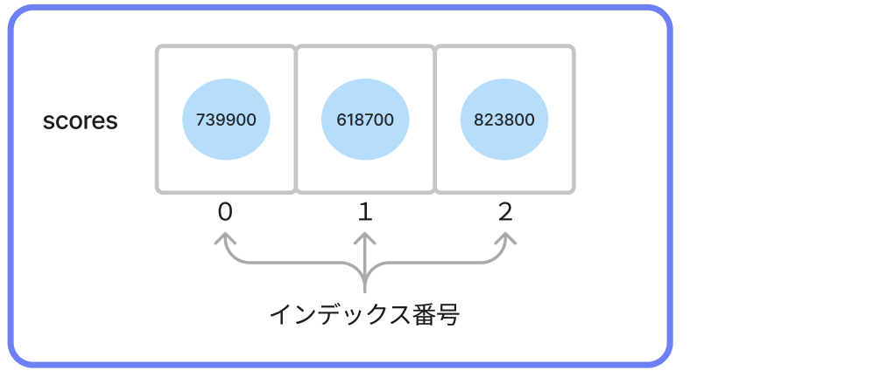

# **04_リスト**

複数のデータを入れるための **†領域†** のこと  
もちろん、名前をつけることができる



<br>

## **リストを作る**

`List 名前 = [1つ目のデータ, 2つ目のデータ, ...];`

```dart
void main() {
  List scores = [739900, 618700, 823800];
  print(scores);
}
```

```
>> [739900, 618700, 823800]
```

<br>

## **リストのデータを、1つ取り出す**

### **インデックス番号**

- 最新のスコアデータ(**3**番目)を取り出したい時は 
`scores[2]` と書く  
- プログラミングの世界では、数える時「0番目、1番目、2番目...」となり **0** から始まる  
- リストの名前[**x**] の **x** に書く **-1** した番号のことを **インデックス番号** と呼ぶ

```dart
void main() {
  List scores = [739900, 618700, 823800];
  print(scores[2]);
}
```

```
>> 823800
```

<br>

## **リストのデータを、書き換える**

変数の再代入と同じ方法でできる

```dart
void main() {
  List scores = [739900, 618700, 823800];
  scores[0] = 0; // 1番目(インデックス番号0)を 0 に
  print(scores[0]);
}
```

```
>> 0
```

<br>

## **リストに、データを追加する**

`配列の名前.add(入れたいデータ);` で、配列の最後にデータを追加できる  
詳しくは「10_メソッド」で説明します

```dart
void main() {
  List scores = [739900, 618700, 823800];
  scores.add(867800); // データを追加
  print(scores);
}
```

```
>> [739900, 618700, 823800, 867800]
```


**ポイント**
- この他にも、データを削除したり、高い順に並び替えたり...いろんなことができる!  
- 気になったら、先生に聞いたり、調べてやってみよう https://blog.flutteruniv.com/flutter-dart-list/


<br>

# **確認問題**

## **問題①**
プログラムを書き換えよう!!
- `add()` を使って、配列に「ハムスター」を追加
- 出力

```dart
void main() {
  List animals = ['犬', '猫'];
  print(animals);
}
```

```
>> [犬, 猫]
>> [犬, 猫, ハムスター]
```

<br>

## **問題②**
プログラムを書こう!!
- カレーの材料を **3つ以上** 考えよう
- **curry** という名前の配列を作り、材料の名前を入れよう
- **2番目のデータだけ** を出力しよう
```
>> (2番目のデータ 例：じゃがいも)
```

<br>

## **問題③**

このプログラムがエラーを出す理由は何だろう？

```dart
void main() {
  List animals = ['犬', '猫'];
  print(animals[2]);
}
```
