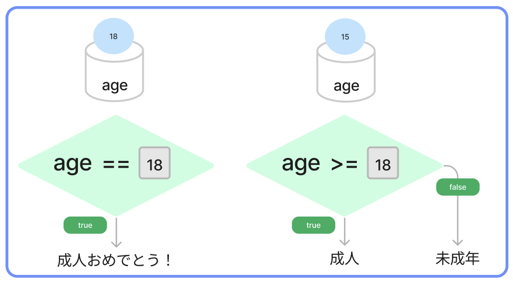
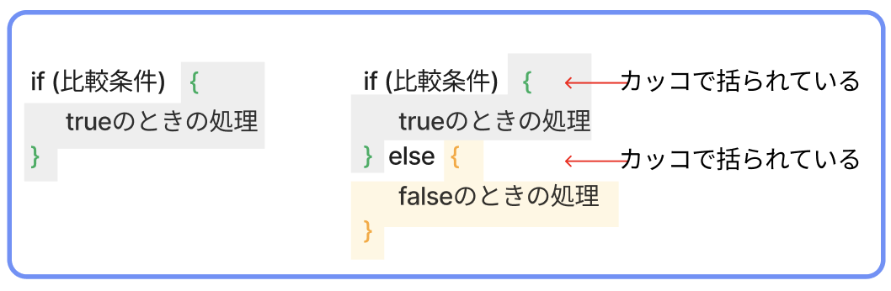
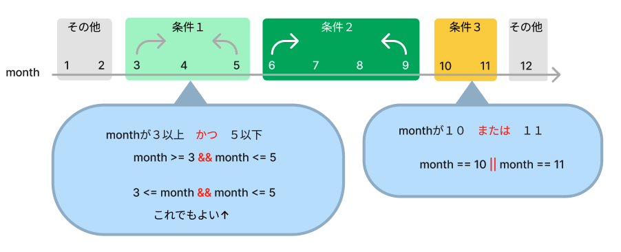

# **06_条件分岐**

`A` と `B` を比べた結果で、処理を分けること  




## **条件分岐の書き方①**

```dart
  if (比べる式 ・ 条件) { // もし〜ならば
    条件が合ってた時の処理;
  }
```

例１： A == B （変数と数値の比較）
- **自分の年齢** と **18**を比べて  

  - true：一致したら「成人おめでとう！」と出力

<br>

```dart
void main() {

  var age = 18;

  if (age == 18) {
    print("成人おめでとう！");
  }

}
```

## **条件分岐の書き方②**

```dart
  if (比べる式 ・ 条件) { // もし〜ならば
    条件が合ってた時の処理;
  } else { // その他
    条件が合ってなかった時の処理;
  }
```

例２：  A >= 数値　（変数と範囲の比較）
- **自分の年齢** が **18以上**
  - true：一致したら「成人」と出力
  - false：一致しなかったら「未成年」と出力

<br>

```dart
void main() {

  var age = 18;

  if (age >= 18) {
    print("成人");
  }else{
    print("未成年");
  }

}
```

## **書き方のコツ**


例３：  A == B　（変数と変数の比較）
- **今の月** と **自分の誕生日月**が
  - true：一致したら「おめでとう」と出力
  - false：一致しなかったら「こんにちは」と出力

```dart
void main() {

  var now_month = 6;  // 今の月 ※ 設定しよう
  var my_birth_month = 2; // 自分の誕生日月 ※ 設定しよう

  if (now_month == my_birth_month) {
    print("おめでとう");
  } else {
    print("こんにちは");
  }

}
```

```
>> こんにちは
```

<br>

## **条件の追加**

- **今の月** と **自分の誕生日月**が
  - 一致したら「おめでとう」と出力
  - 一致はしないが、誕生日月が来月だったら「来月祝うね！」 ⇦ 追加
  - それ以外だったら「こんにちは」と出力

```dart
  if (比べる式 ・ 条件) {
    条件が合ってた時の処理;
  } else if (比べる式 ・ 条件②) { // 追加
    条件が合ってた時の処理;
  } else {
    条件が合ってなかった時の処理;
  }
```

```dart
void main() {

  var now_month = 6;  // 今の月 ※ 設定しよう
  var my_birth_month = 7; // 自分の誕生日月 ※ 設定しよう

  if (now_month == my_birth_month) {
    print("おめでとう");
  } else if (now_month + 1 == my_birth_month) {
    print("来月祝うね！");
  } else {
    print("こんにちは");
  }

}
```

```
>> 来月祝うね！
```

<br>

**ポイント**
- 条件の中で使う、比べるための記号を「比較演算子」という
  - `A`と`B`は同じ？
    - `A == B`
  - `A`と`B`は違う？
    - `A != B`
  - `A`は`B`より大きい？
    - `A > B`
  - `A`は`B`より小さい？
    - `A < B`
  - `A`は`B`以上？
    - `A >= B`
  - `A`は`B`以下？
    - `A <= B`
- 条件分岐を考える3ステップ
  - 「何」と「何」を比べる？
  - 合ってたらどうする？
  - 違っていたらどうする？
    - 違っていたら何もしない、の場合は`else`を省略

<br>

## **範囲指定**

- **3月から5月**　は「春ですね」
- **6月から9月**　は「夏ですね」
- **10月と11月**　は「秋ですね」
- **12月から2月**　は「冬ですね」

と出力するプログラムを考えます.

条件に**3月から5月**といった範囲指定をする場合




```dart
void main() {
  var month = 1;
  
  if (3 <= month && month <= 5) {
    print("春ですね");
  } else if (6 <= month && month <= 9) {
    print("夏ですね");
  } else if (10 == month || month == 11) {
    print("秋ですね");
  } else {
    print("冬ですね");
  }
}
```

条件を組み合わせて範囲指定できます

```dart
var month = 1;
var age = 18;
var address = "東京都";

  // 1月〜3月の期間18歳の人は割引！
  if (month >= 1 && month <= 3 && age == 18) {
    print("割引");
  } else {
    print("対象ではありません");
  }

  // 1月〜3月の期間、静岡県か神奈川県の18歳は割引！
  if (month >= 1 && month <= 3 && age == 18 && (address == "静岡県" || address == "神奈川県")) {
    print("割引");
  } else {
    print("対象ではありません");
  }
```


# **確認問題**

## **問題①**
プログラムを書き換えよう!!  

- **入力したパスワード** と **登録済パスワード** が一緒の時だけ **ログイン成功** と出力
- 違ったら何もしない

```dart
void main() {

  var input_pass = 1234;  // 入力したパスワード
  var entry_pass = 12345; // 登録済パスワード

  print("ログイン成功");

}
```

```
>> ログイン成功
```

<br>

## **問題②**
プログラムを書こう!!

- `year`という変数を作り、自分の生まれた年を西暦で代入
- **2019**年以上なら「令和生まれです」、2019より下なら「平成生まれです」と出力

```
>> (例：平成生まれです)
```

<br>

## **問題③**

このプログラムはエラーが起きるよ  
修正して、エラーをなくそう！

```dart
void main() {

  var level = 1;
  
  if (level > 5) {
    print("上級");
  } else if {
    print("初級");
  }

}
```
