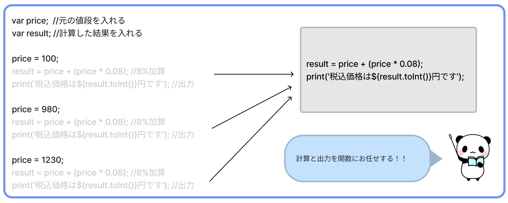
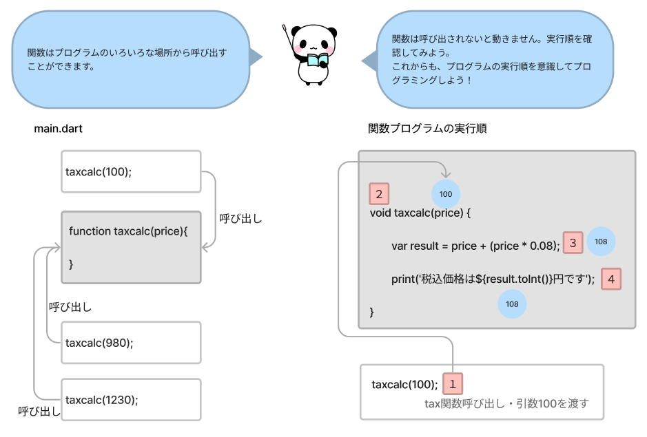
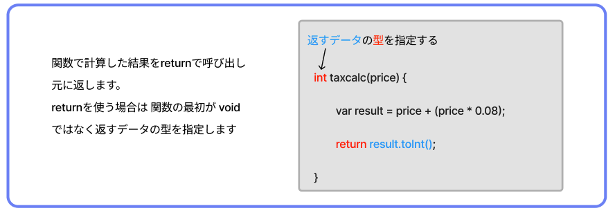
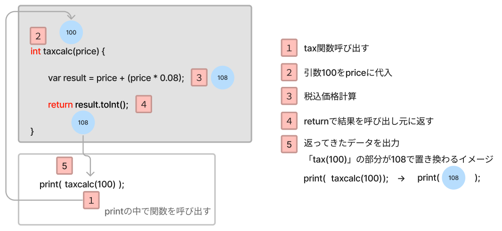

# **08_関数(function)**

処理をひとまとめにしたもの  

税込価格を計算するプログラムを考えてみよう

```dart
  void main() {

    var price;  //元の値段を入れる
    var result; //計算した結果を入れる

    price = 100;
    result = price + (price * 0.08); //8%加算
    print('税込価格は${result.toInt()}円です'); //出力

    price = 980;
    result = price + (price * 0.08); //8%加算
    print('税込価格は${result.toInt()}円です'); //出力

    price = 1230;
    result = price + (price * 0.08); //8%加算
    print('税込価格は${result.toInt()}円です'); //出力

  }
```

<br>

```
>> 税込価格は108円です
>> 税込価格は1058円です
>> 税込価格は1328円です
```

上のプログラムをみると「8%加算」「出力」は全く同じプログラムになっています。  
もし、税率が8％から5%に変更になったら、たくさんプログラムを修正することになりますね・・・  
重複するプログラムは関数にまとめると便利です。



## **functionを作る・使う**


### **作る**

- 関数名
- 引数名：関数の中で使うデータがある場合、名前をつける
- 処理

を設定

```dart
  void 関数名(引数名) {
    処理;
  }
```

### **使う（呼び出す）**

```dart
  関数名(引数);
```

<br>

```dart
void main() {
  // 関数名：taxcalc  引数名：price
  void taxcalc(price) {
    var result = price + (price * 0.08);
    print('税込価格は${result.toInt()}円です');
  }

  // taxcalcを呼び出す
  taxcalc(100);
  taxcalc(980);
  taxcalc(1230);
}
```

`変数.toInt()` で、値を整数に変換する  
詳しくは「10_メソッド」で説明します

```
>> 税込価格は108円です
>> 税込価格は1058円です
>> 税込価格は1328円です
```

税率が8%から5%に変わったら、taxcalc関数内の「0.08」を「0.05」に書き換えるだけでよいですね。

<br><br>

データの流れを確認してみよう



<br>

## **いろいろなfunction**

### **引数を2つ使用**

2023年現在、日本の消費税の計算は食品に分類されるものが8%、それ以外は10%となっています。
前の課題で作った`taxcalc`関数を修正して、指定した税率で計算できるように変更してみよう。

```dart
void main() {
  
  //priceに元の価格を、taxに税率を指定（100分率の計算も関数内で行う）
  void taxcalc(price, tax) {
    var result = price + (price * tax / 100);
    print('税込価格は${result.toInt()}円です');
  }

  // taxcalcを呼び出す 価格と税率（％）
  taxcalc(100, 8);
  taxcalc(980, 10);
  taxcalc(1230, 5);
}
```

もう少し練習してみよう

```dart
void main() {

  // nameに名前を、timeに時間帯を指定
  void greet(name, time) {
    if (time == '夜') {
      print('$nameさん、こんばんは');
    } else {
      print('$nameさん、こんにちは');
    }
  }

  greet('一郎', '朝');
  greet('二郎', '夜');

}

```

```
>> 一郎さん、こんにちは
>> 二郎さん、こんばんは
```

<br>

### **結果を返すfunction**



まずは、書いてみよう

```dart
void main() {
  
  int taxcalc(price) {
    var result = price + (price * 0.08); // 結果を作る式
    return result.toInt(); // resultをお返しする
  }
  
  print(taxcalc(100)); // printの中で関数を呼び出す→関数で計算した結果を出力
  
}

```

```
>> 108
```

<br><br>

データの流れを確認してみよう



<br>

**ポイント**
- `print()` や `void main()` も関数
  - Dartプログラムは、起動したときに`main()`の中身が実行されるようになっている
- 慣れるまでは、とにかく作って動かす！いっぱい聞いて！

<br>

# **確認問題**

## **問題①**

プログラムを書き換えよう!!

- `time`に教室への登校時刻が例で代入されている（10時）
- 今のままだと怒られちゃう… `おはよう!` と出力させるためには、どこを書き換えればいい？

```dart
void main() {
  
  void check(n) {
    if (n < 10) {
      print("おはよう!");
    } else {
      print("次は遅刻に気をつけよう...!");
    }
  }
  
  var time = 10;
  
  check(time);
  
}
```

```
>> 次は遅刻に気をつけよう...!
↑（おはよう! に変更したい）
```

<br>

## **問題②**

プログラムを書き足そう!! 
税込価格を表示する`tax()`プログラムを使おう  
- 100円
- 399円
- 15000円  
  
の税込み価格を出力してね

XXXの部分は正しいコードに書き換えよう

※ `.toInt()` は、小数を整数に変換している

```dart
void main() {
  
  XXX tax(n) {
    double result = n + (n * 0.1);
    return result.toInt();
  }
  
}
```

```
>> 110
>> 438
>> 16500
```

<br>

## **問題③**

遅刻防止に、今の時刻を入力すると、1時間早い時間を知らせてくれるプログラムを作った！  
しかし、エラーが起きてしまう…
`void fake_timer() {〜}` の中身を修正して、エラーをなくそう！

```dart
void main() {
  
  void fake_timer(n) {
    n = n - 1;
    print(今は${n}時です);
  }

  fake_timer(10);
  
}
```

```
>> 今は9時です（と、出力したら成功！）
```
