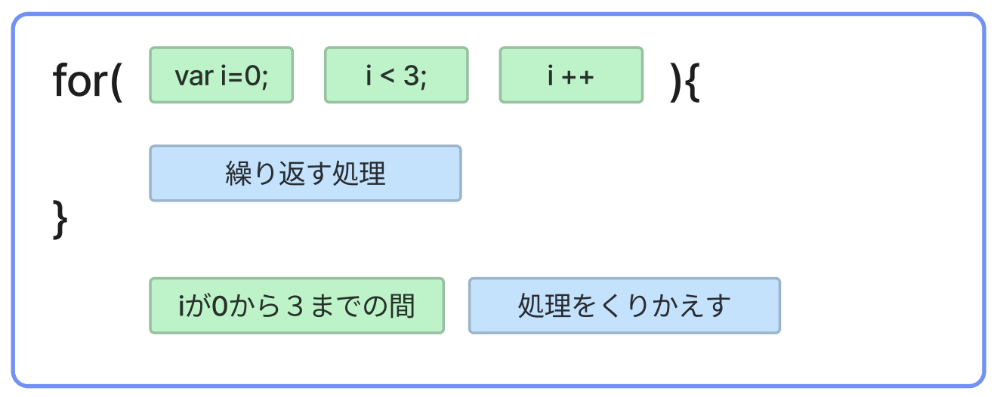

# **10_繰り返し（for文）**

同じ処理を繰り返す

例：  
「生麦生米生卵」を3回表示するプログラムを考える  

```dart
  void main() {
    print("生麦生米生卵");
    print("生麦生米生卵");
    print("生麦生米生卵");
  }
```

printを3回書けば出力できるけど　もし100回に増えたら・・・  
繰り返し文を使って出力してみよう

<br>

## **繰り返し文の書き方**

```dart
  for (①初期化; ②繰り返し条件; ③後処理) {
    繰り返す処理
  } 
```

```dart
void main() {

  for (var i = 0; i < 3; i++) {
    print("生麦生米生卵");
  }

}
```

  変数 **i** の値が **0 から 3 より小さい間**  　{}内の処理を繰り返す

  


**①初期化**  
変数iの宣言と初期値を代入  
```
var i = 0;
```

**②繰り返し条件**  
  条件結果がtrueのとき {} の中の処理を実行する  
```
i < 3;
```

**③後処理**

- {}の中の処理が実行された後 **i** に **1** を加算する
- **++** は1を足すこと　インクリメントと呼ぶ
- 2を足したい場合　**i = i + 2** と書く

```
i++
```

<br>

### **iの値の変化と処理の流れをみてみよう**

|  処理回数  |  iの値  |  判定(i<3)  |  表示  |  i++  |
| :----: | :----: | :----: | :----: | :----: |
|  1回目の処理  |  0  |  0<3<br>true  | 生麦生米生卵 | 1 |
|  2回目の処理  |  1  |  1<3<br>true  | 生麦生米生卵 | 2 |
|  3回目の処理  |  2  |  2<3<br>true  | 生麦生米生卵 | 3 |
|  4回目の処理  |  3  |  3<3<br>`false`  |`{}の中は実行されない`| - |

<br>

## **for文のいろいろな使い方**

<br>

### **① 10から1まで表示する**

```dart
void main() {

  for (var count = 10; count > 0; count--) {
    print(count);
  }
  
}
```

```
>> 10
>> 9
>> 8
>> 7
>> 6
>> 5
>> 4
>> 3
>> 2
>> 1
```

**ポイント**

- 「初期値」「繰り返し条件」「後処理」が逆になる
- 特に「繰り返し条件」の符号の向きに注意
- **count--** は **count** から **1** を引くこと

<br>

### **② 0から10までの`偶数`を表示する**

```dart
void main() {

  for (var j = 0; j <= 10; j = j + 2) {
    print(j);
  }

}
```

```
>> 0
>> 2
>> 4
>> 6
>> 8
>> 10
```

**ポイント**

- **j = j + 2**の計算　**j+2** の結果を **j** に再代入する  

<br>

### **③ for文の中でif文を使う**
**0から10までの`偶数`を表示する**

```dart
void main() {

  for (var i = 0; i <= 10; i++) {
    if (i % 2 == 0) { //２で割った余りが０のときだけprint処理
      print(i);
    }
  }

}
```

```
>> 0
>> 2
>> 4
>> 6
>> 8
>> 10
```

**ポイント**

- **for文** の中に **if文** を入れて、ある条件のときだけ処理をする

<br>

### **④ リストのデータをfor文で出力**

`animal.length` はリスト`animal`のデータ数を取ってくる  
`animal.length` は `4`

```dart
void main() {

  List animal = ['犬', '猫', 'うさぎ', 'ハムスター'];

  for (var i = 0; i < animal.length; i++) {
    print(animal[i]);
  }

}
```

```
>> 犬
>> 猫
>> うさぎ
>> ハムスター
```

# **確認問題**

## **問題①**

10から0まで表示するプログラムを考える  
このプログラムは繰り返し処理が終わらない「無限ループ」になります  
無限ループになる理由を考えよう  
`※注意※　このプログラムは実行しないでください！！`

```dart
void main() {

  for (var i = 10; i > 0; i++) {
    print(i);
  }

}
```

## **問題②**

for文を使って下の結果となるプログラムを書こう!!　`無限ループに注意`

```
>> 0 4 8 12 16 20
```

<br>

## **問題③**

リストのデータをfor文を使って出力しよう　`無限ループに注意`


```dart
void main() {

  var sushi = ['まぐろ','サーモン','たまご','えび','えんがわ','いくら'];

  // for文で続きを書こう
}
```

```
>> まぐろ
>> サーモン
>> たまご
>> えび
>> えんがわ
>> いくら
```

<br>

# **回答**

## **問題①**

このプログラムは繰り返し処理が終わらない「無限ループ」になります  
無限ループになる理由を考えよう  

```dart
// 繰り返し条件が常にtrueになるから
// i++ → i--
```

## **問題②**

for文を使って下の結果となるプログラムを書こう!!　`無限ループに注意`

```
>> 0 4 8 12 16 20
```

```dart
void main() {

  for (var i = 0; i <= 20; i = i + 4) {
    print(i);
  }

}
```

```dart
void main() {

  for (var i = 0; i <= 20; i++) {
    if (i % 4 == 0) {
      print(i);
    }
  }

}
```

<br>

## **問題③**

リストのデータをfor文を使って出力しよう　`無限ループに注意`


```dart
void main() {

  var sushi = ['まぐろ', 'サーモン', 'たまご', 'えび', 'えんがわ', 'いくら'];

  for (var i = 0; i < sushi.length; i++) {
    print(sushi[i]);
  }
}
```
