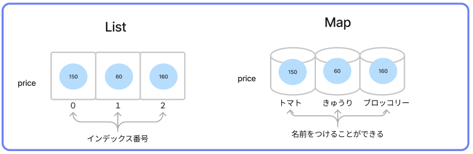
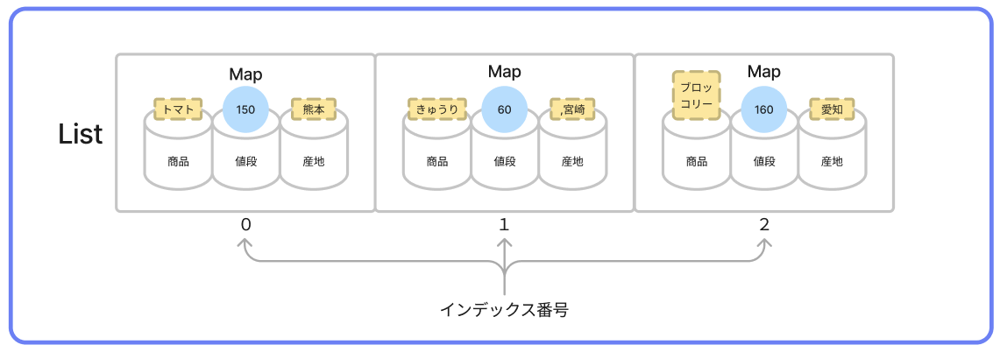

# **12_オブジェクト（map）**

リストの値ひとつひとつに、名前（キー）をつけられるデータ構造

<br>

次のリストを考える
```dart
void main() {

  List price = [100,60,160];
  print(price);

}
```

何の数字だろう・・・？？  
データに名前をつけてみよう



## **マップを作る**

`Map 変数名 = {名前(key)：データ, 名前(key)：データ, ...};`


```dart
void main() {
  Map price = {'トマト':100, 'きゅうり':60, 'ブロッコリー':160};

  print(price);
}
```

```
>> {トマト: 100, きゅうり: 60, ブロッコリー: 160}
```

<br>

## **マップのデータを、1つ取り出す**

### **keyを指定**

- 名前(key)を指定してデータを取り出す
- トマトの値段を取りたい場合は  `price["トマト"]` と書く  

```dart
void main() {
  Map price = {'トマト':100, 'きゅうり':60, 'ブロッコリー':160};

  print("トマトの値段は${price["トマト"]}円です");
  //print("トマトの値段は" + price["トマト"].toString() + "円です");
}
```

```
>>  トマトの値段は100円です
```

<br>

## **マップのデータを、書き換える**

変数の再代入と同じ方法でできる

```dart
void main() {
  Map price = {'トマト':100, 'きゅうり':60, 'ブロッコリー':160};
  price['トマト'] = 110;
  print("トマトの値段は${price["トマト"]}円です");
  //print("トマトの値段は" + price["トマト"].toString() + "円です");　
}
```

```
>> トマトの値段は110円です
```

<br>

## **マップに、データを追加する**

`　変数名[入れたいkey名]=入れたいデータ;` で、マップの最後にデータを追加できる

```dart
void main() {
  Map price = {'トマト':100, 'きゅうり':60, 'ブロッコリー':160};
  price['鶏肉'] = 350;  //keyを指定してデータを代入
  print(price);
}
```

```
>> {トマト: 100, きゅうり: 60, ブロッコリー: 160, 鶏肉: 350}
```

<br>

## **リストとマップを組み合わせる　Map型List**

`List 変数名 = [{Map①},{Map②},{Map③}・・・];`



## **Map型Listをつくる**

Listの中にMapを入れる

```dart
void main() {
  List items = [
    {'商品': 'トマト', '値段': 100, '産地': '熊本'},//Map①
    {'商品': 'きゅうり', '値段': 60, '産地': '宮崎'},//Map②
    {'商品': 'ブロッコリー', '値段': 160, '産地': '愛知'}//Map③
  ];

  print(items);
}
```

```
>> [{商品: トマト, 値段: 100, 産地: 熊本}, {商品: きゅうり, 値段: 60, 産地: 宮崎}, {商品: ブロッコリー, 値段: 160, 産地: 愛知}]
```

## **Map型Listから　データを取る**

```dart
void main() {

  List items = [
    {'商品': 'トマト', '値段': 100, '産地': '熊本'}, 
    {'商品': 'きゅうり', '値段': 60, '産地': '宮崎'}, 
    {'商品': 'ブロッコリー', '値段': 160, '産地': '愛知'} 
  ];

  print(items[0]['商品']); //itemsのMap①の「商品」データ
  print(items[0]['値段']); //itemsのMap①の「値段」データ
  print(items[0]['産地']); //itemsのMap①の「産地」データ
  print(items[1]['商品']); //itemsのMap②の「商品」データ
  print(items[1]['値段']); //itemsのMap②の「値段」データ
  print(items[1]['産地']); //itemsのMap②の「産地」データ
  print(items[2]['商品']); //itemsのMap③の「商品」データ
  print(items[2]['値段']); //itemsのMap③の「値段」データ
  print(items[2]['産地']); //itemsのMap③の「産地」データ

}
```

```
>> トマト
>> 100
>> 熊本
>> きゅうり
>> 60
>> 宮崎
>> ブロッコリー
>> 160
>> 愛知
```

## **Map型Listから　for文を使ってデータを取る**

```dart
void main() {

  List items = [
    {'商品': 'トマト', '値段': 100, '産地': '熊本県'},//①
    {'商品': 'きゅうり', '値段': 60, '産地': '宮崎県'},//②
    {'商品': 'ブロッコリー', '値段': 160, '産地': '愛知県'}//③
  ];

  // iが0からリストのデータ数まで繰り返す（リストの中にMapが3個入っている）
  for (var i = 0; i < items.length; i++) {
    print("---${items[i]['商品']}---");
    print("${items[i]['値段']}円");
    print("${items[i]['産地']}産");
    //print("---" + items[i]['商品'] + "---");
    //print(items[i]['値段'].toString() + "円");  
    //print(items[i]['産地'] + "産");
  }
}
```

`.toString()`をつけると文字列型に変換できる
詳しくは「10_メソッド」で説明します

```
>> ---トマト---
>> 100円
>> 熊本県産
>> ---きゅうり---
>> 60円
>> 宮崎県産
>> ---ブロッコリー---
>> 160円
>> 愛知県産
```


# **確認問題**

## **問題①**

- Map型の変数`baseball`に下記データを作成
- 出力結果となるプログラムを考えよう

|  名前  |  所属  |  出身  |  好き  |
| :----: | :----: | :----: | :----: |
|  イチロー  |  元オリックス  |  愛知  | カレー |
  
<br>

```
>> イチローはカレーが好きです
```

## **問題②**

- Map型Listの変数`baseball`に下記データを作成
- 次の結果となるプログラムを考えよう

|  名前  |  所属  |  出身  |  好き  |
| :----: | :----: | :----: | :----: |
|  イチロー  |  元オリックス  |  愛知  | カレー |
|  大谷  |  エンゼルス  |  岩手  | 漫画 |
|  佐々木  |  ロッテ  |  岩手  | あいみょん |

```
>> 愛知出身、元オリックスのイチローはカレーが好きです
>> 岩手出身、エンゼルスの大谷は漫画が好きです
>> 岩手出身、ロッテの佐々木はあいみょんが好きです
```

<br>

# **解答例**

## **問題①**

- Map型の変数`baseball`に下記データを作成
- 出力結果となるプログラムを考えよう

|  名前  |  所属  |  出身  |  好き  |
| :----: | :----: | :----: | :----: |
|  イチロー  |  元オリックス  |  愛知  | カレー |
  
<br>

```dart
void main(){
  Map baseball = {'名前': 'イチロー', '所属': '元オリックス', '出身': '愛知', '好き': 'カレー'};

  print("${baseball['名前']}は${baseball['好き']}が好きです");
}
```

```
>> イチローはカレーが好きです
```

## **問題②**

- Map型Listの変数`baseball`に下記データを作成
- 出力結果となるプログラムを考えよう

|  名前  |  所属  |  出身  |  好き  |
| :----: | :----: | :----: | :----: |
|  イチロー  |  元オリックス  |  愛知  | カレー |
|  大谷  |  エンゼルス  |  岩手  | 漫画 |
|  佐々木  |  ロッテ  |  岩手  | あいみょん |

```dart
void main(){
  List baseball = [
    {'名前': 'イチロー', '所属': '元オリックス', '出身': '愛知', '好き': 'カレー'},
    {'名前': '大谷', '所属': 'エンゼルス', '出身': '岩手', '好き': '漫画'},
    {'名前': '佐々木', '所属': 'ロッテ', '出身': '岩手', '好き': 'あいみょん'},
  ];

  for (var i = 0; i < baseball.length; i++) {
    print('${baseball[i]["出身"]}出身、${baseball[i]["所属"]}の${baseball[i]["名前"]}は${baseball[i]["好き"]}が好きです');
  }
}
```

```
>> 愛知出身、元オリックスのイチローはカレーが好きです
>> 岩手出身、エンゼルスの大谷は漫画が好きです
>> 岩手出身、ロッテの佐々木はあいみょんが好きです
```
