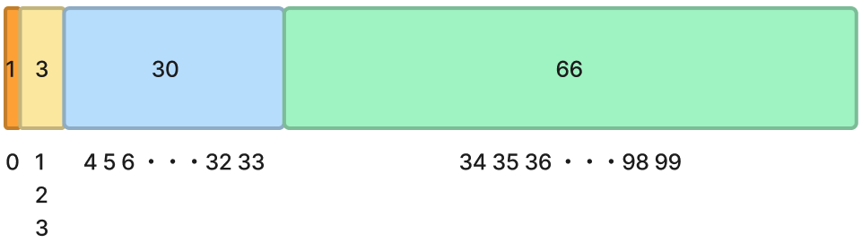

# **14_ライブラリ関数**

## **ライブラリ関数**

06_関数では、自分で関数を作りました。  
Dartには自分で作る関数だけでなく、標準で多くの関数が用意されています。  
（Dart以外のプログラミング言語にも基本的に標準関数が含まれています）  

例えば、結果を出力するときに使ってきたprint()もすでに用意されている関数です。  
ここでは、アプリ開発でよく使うrandom関数を紹介します。

## **random関数**  

「乱数」を生成する関数

「乱数」とは・・・ランダムな数のことでプログラムを実行するたびに結果が変わる値のことです。ランダムとは規則性がなく予測が不可能な状態のことです。  

random関数：指定した範囲内の数をランダムに生成して返す  
実際に動かして確認してみよう。何度か実行して結果が違うことを確認してみよう。

<br>

```dart
//mathライブラリをインポート
import 'dart:math';

void main(){

  //0~9の整数がランダムに作られる
  var num = Random().nextInt(10);
  print(num);

}

```

### **ランダム関数使用の具体例**

RPGなどのゲームでガチャを回して、アイテムが貰えることがありますね。  
よく出るアイテムもあれば、滅多に出てこないアイテムもあります。  
アイテムによって出現確率が設定されていて、レアなアイテムは確率が低く設定されています。

星５アイテム　：　1%  
星４アイテム　：　3%  
星３アイテム　： 30%  
星２アイテム　： 66%  

これをプログラムで実現するときに一般的に乱数を使用すると簡単です。  

0~99までの整数をランダムに取得  

星５アイテム　：　0の時（100分の1の確率）  
星４アイテム　：　1〜3の時（100分の3の確率）  
星３アイテム　：　4〜33の時（100分の30の確率）  
星２アイテム　：　34〜99の時（100分の66の確率）  



<br>

```dart
import 'dart:math';

void main() {
  var num = Random().nextInt(100);
  print(num);

  if (num == 0) {
    print("星５キャラゲット！");
  } else if (1 <= num && num <= 3) {
    print("星４キャラゲット！");
  } else if (4 <= num && num <= 33) {
    print("星３キャラゲット！");
  } else {
    print("星２キャラゲット！");
  }
}

```

小数の乱数やbool型の乱数も試してみよう

```dart
import 'dart:math';

void main() {
  // >=0.0 and <1.0 の乱数
  var doubleValue = Random().nextDouble();
  print(doubleValue);

  // true or false
  var boolValue = Random().nextBool();
  print(boolValue);

}

```
