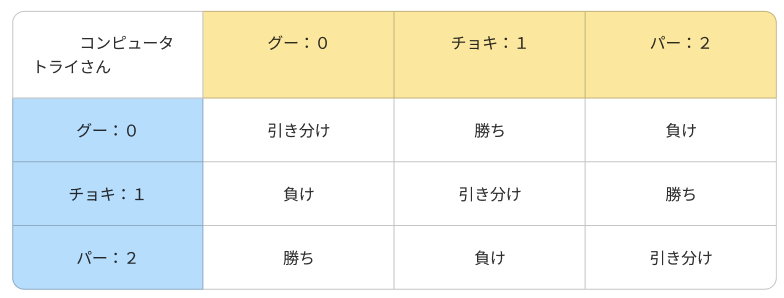

# **16_チャレンジ課題2**

## **じゃんけんゲームに挑戦**

「トライさん」と「コンピューター」がじゃんけんをします  
「トライさん」の対戦結果を出力するプログラムを考えよう

<br>

### **レベル3**

<br>

|    |  ルール説明  |
| :----: | :---- |
|  1  | １回勝負します |
|  2  | 出す手は両者ともランダムで決定します  |
|  3  | 出した手と、結果（勝ち・負け・引き分け）を出力  |

<br>

### **出力例**  

```dart
トライさんはパーを出しました
コンピューターはぐーを出しました
勝ち

トライさんはパーを出しました
コンピューターはパーを出しました
引き分け

トライさんはチョキを出しました
コンピューターはぐーを出しました
負け
```

<br>

自分で考えたい人はヒントを見ないでやってみよう  
レベル4,5,6と続きます
難しい場合は下の手順で考えてみよう

<br><br><br><br>

### **ヒント**  

出す手のパターンを整理する  
データに置き換えて考える  



- ①グー、チョキ、パーの変数を作成
- ②それぞれの変数に数値を入れて区別する
- ③コンピューターが出す手をランダムに取得
- ④トライさんが出す手をランダムに取得

<br><br><br>


  
```dart

//①②
var gu = 0;
var cho = 1;
var pa = 2;

//③④
var computer = Random().nextInt(3);
var trysan = Random().nextInt(3);

```
=====================================
- ⑤「トライさん」「コンピューター」が出した手を出力
- ⑥勝ち負け引き分けの判定を行う
※上の表を見て考えてみよう

<br><br><br>


```dart

var gu = 0;
var cho = 1;
var pa = 2;

var computer = Random().nextInt(3);
var trysan = Random().nextInt(3);

//⑤
if (trysan == gu) {
    print("トライさんはグーを出しました");
} else if (trysan == cho) {
    print("トライさんはチョキを出しました");
} else {
    print("トライさんはパーを出しました");
}

if (computer == gu) {
    print("コンピューターはグーを出しました");
} else if (computer == cho) {
    print("コンピューターはチョキを出しました");
} else {
    print("コンピューターはパーを出しました");
}

//⑥
if (trysan == computer) {
    print("引き分け");
} else if (trysan == gu && computer == cho ||
    trysan == cho && computer == pa ||
    trysan == pa && computer == gu) {
    print("勝ち");
} else {
    print("負け");
}
```
⑥のif文をこんな書き方にすることもできます

```dart
if (computer == trysan) {
    print('引き分け');
} else if (computer < trysan) {
    if (computer == 0 && trysan == 2) {
        print('負け');
    } else {
        print("勝ち");
    }
} else if (computer > trysan) {
    if (computer == 2 && trysan == 0) {
        print("勝ち");
    } else {
        print('負け');
    }
}
```

### **レベル4**

- ⑦「トライさん」「コンピューター」が出した手の判定を関数にしよう

```dart

var gu = 0;
var cho = 1;
var pa = 2;

var computer = Random().nextInt(3);
var trysan = Random().nextInt(3);

//⑦グーチョキパー判定
String jyanken(hand) {
    var result = "";
    if (hand == gu) {
        result = "グー";
    } else if (hand == cho) {
        result = "チョキ";
    } else {
        result = "パー";
    }

    return result;
}

//⑦呼び出して戻り値で出力
print("トライさんは${jyanken(trysan)}を出しました");
print("コンピューターは${jyanken(computer)}を出しました");


if (trysan == computer) {
    print("引き分け");
} else if (trysan == gu && computer == cho ||
    trysan == cho && computer == pa ||
    trysan == pa && computer == gu) {
    print("勝ち");
} else {
    print("負け");
}
```

### **レベル5**

- ⑧結果判定を関数にしよう

```dart

var gu = 0;
var cho = 1;
var pa = 2;

var computer = Random().nextInt(3);
var trysan = Random().nextInt(3);

//グーチョキパー判定
String jyanken(hand) {
    var result = "";
    if (hand == gu) {
        result = "グー";
    } else if (hand == cho) {
        result = "チョキ";
    } else {
        result = "パー";
    }

    return result;
}

//⑧勝ち負け引き分け判定
String judge(trysan, computer) {
    var result = "";
    if (trysan == computer) {
        result = "引き分け";
    } else if (trysan == gu && computer == cho ||
        trysan == cho && computer == pa ||
        trysan == pa && computer == gu) {
        result = "勝ち";
    } else {
        result = "負け";
    }
    return result;
}

print("トライさんは${jyanken(trysan)}を出しました");
print("コンピューターは${jyanken(computer)}を出しました");

//⑧関数呼び出し、引数はトライさんとコンピューター
print(judge(trysan, computer));

```

### **レベル6**

- ⑨10回勝負しよう


```dart
var gu = 0;
var cho = 1;
var pa = 2;

//⑨下に移動
//var computer = Random().nextInt(3);
//var trysan = Random().nextInt(3);

String jyanken(hand) {
    if (hand == gu) {
        return "グー";
    } else if (hand == cho) {
        return "チョキ";
    } else {
        return "パー";
    }
}

String judge(trysan, computer) {
    var result = "";
    if (trysan == computer) {
        result = "引き分け";
    } else if (trysan == gu && computer == cho ||
        trysan == cho && computer == pa ||
        trysan == pa && computer == gu) {
        result = "勝ち";
    } else {
        result = "負け";
    }
    return result;
}

//⑨10回繰り返す
for (var i = 0; i < 10; i++) {
    var trysan = Random().nextInt(3);
    var computer = Random().nextInt(3);
    print("トライさんは${jyanken(trysan)}を出しました");
    print("コンピューターは${jyanken(computer)}を出しました");

    print(judge(trysan, computer));
}

```
