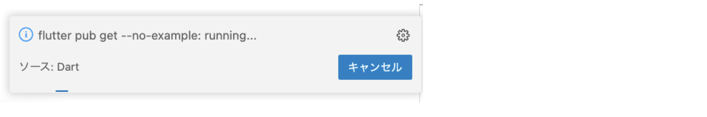
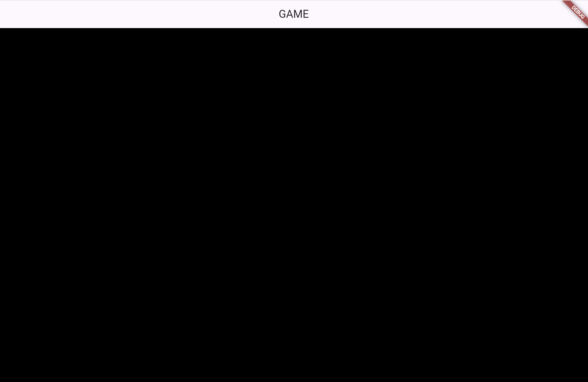

# **02_flameのベースを作る**

Flutter Flameにはゲーム制作のために必要な描画や動作を制御するコンポーネントが用意されています

（参考）https://flame.tnantoka.com/examples/hello/#hello

## **パッケージのインポート**

### **【pubspec.yaml】**

バージョンは調べて最新版を設定しよう  
https://pub.dev/packages/flame

```dart

dependencies:
  flutter:
    sdk: flutter
  flame: ^1.23.0　//←これを追加

```

`Ctrl + S`で保存すると、VSCodeの右に「flutter pub get」が実行されます  



実行されない場合は、VSCodeのターミナルに打って実行しよう

```dart

flutter pub add flame
flutter pub upgrade flame

```

### **【main.dart】**

①flameが使えるようにパッケージをインポートする  
②bodyの部分に`GameWidget`を追加  
③game.dartをインポートする

```dart

import 'package:flutter/material.dart';
import 'package:flame/game.dart'; //①追加
import 'game.dart';//③追加

//省略

class _MyHomePageState extends State<MyHomePage> {
  @override
  Widget build(BuildContext context) {
    return Scaffold(
        appBar: AppBar(
          title: Text('GAME'),
        ),
        // ②GameWidgetでゲームを動かす
        body: GameWidget(game: MainGame(context))
    );
  }
}

```

### **【game.dart】**

④game.dartを作る

```dart

import 'package:flame/game.dart';
import 'package:flutter/material.dart';

class MainGame extends FlameGame {
  final BuildContext context;
  MainGame(this.context);
  
  //ここにゲームの画面を作っていく

}


```

実行してみよう

