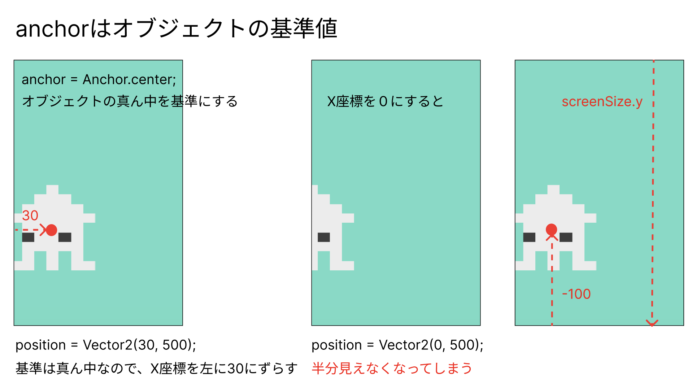

# **04_オブジェクトの追加**

## **この単元でやること**

1. 背景を追加
2. プレーヤーの追加
3. 敵の追加
4. 敵の動き
5. プレーヤーの動き
6. コンポーネントの種類


### **オブジェクトを追加しよう**

オブジェクトとは、ゲームで使用するパーツ全般  
コンポーネントという機能を使用して追加します

### **オブジェクト専用のファイルを作成**

**【object.dart】を新規作成**

```dart

import 'package:flutter/material.dart';
import 'package:flame/components.dart';
import 'game.dart';

```

### **①背景を追加（RectangleComponent）**

１つ１つのオブジェクトはクラスで管理する  

**【object.dart】**

```dart

class BackScreen extends RectangleComponent with HasGameRef<MainGame>{
  @override
  Future<void> onLoad() async {
    position = Vector2(0, 0);
    size = Vector2(screenSize.x, screenSize.y);
    paint = Paint()..color = Color.fromARGB(255, 110, 219, 197);
  }

  @override
  Future<void> render(Canvas canvas) async {
    super.render(canvas);
  }
}

```

**画面サイズの取得と方向**


**オブジェクトのクラスを呼び出して描画**

**【game.dart】**

- object.dartをgame.dartに紐づける

```dart
import 'package:flame/game.dart';
import 'package:flutter/material.dart';
import 'object.dart'; //⭐️追加

//省略

@override
  Future<void> onLoad() async {
    super.onLoad();

    print("onLoad呼び出し");

    await add(BackScreen()); //⭐️追加
    
  }

```


### **②プレーヤーの追加（SpriteComponent）**


スプライト画像の追加

**【pubspec.yaml】**


**画像を入れるフォルダを作成**  

`game` > `assets` > `images`フォルダを作成


**画像を保存**

下のサイトから好きな画像をダウンロードして、`images`フォルダに入れる

https://dotown.maeda-design-room.net/

`02_widget_flame` > `演習画像`フォルダの中にもサンプル画像があるので使用してもよいです

**【object.dart】**

```dart

class Player extends SpriteComponent with HasGameRef<MainGame> {
  @override
  Future<void> onLoad() async {
    sprite = await gameRef.loadSprite("ika.png");//画像のファイル名
    size = Vector2(60, 60);
    position = Vector2(30, screenSize.y - 100);
    anchor = Anchor.center;

    await super.onLoad();
  }

  // 常に動いている
  @override
  void update(double dt) {
    super.update(dt);
  }
}


```

**【game.dart】**

```dart

@override
  Future<void> onLoad() async {
    super.onLoad();

    print("onLoad呼び出し");

    await add(BackScreen());
    await add(Player()); //⭐️追加
  }

```

|  プロパティ  |  説明  | 使用方法  |
| :---- | :---- | ---- |
|  sprite  |  画像をロード  |  sprite = await <gameReg.>loadSprite('<画像ファイル名>');  |
|  size  |  画像のサイズ（x,y）  |  size = Vector2(<幅>, <高さ>);  |
|  position  |  表示位置（x,y）  |  position = Vector2(<X座標>, <Y座標>);  |
|  anchor  |  画像の基準位置  |  anchor = Anchor.center;<br>anchor = Anchor.topLeft;<br>anchor = Anchor.bottomLeft;<br>など |

**gameRefとは**


別のdartファイルからスプライト指定する場合は`gameRef`が必要

**anchorとは**


### **③敵の追加**

**【object.dart】**

```dart
class Teki extends SpriteComponent with HasGameRef<MainGame> {
  @override
  Future<void> onLoad() async {
    sprite = await gameRef.loadSprite("tako.png");
    size = Vector2(60, 60);
    position = Vector2(screenSize.x - 60, screenSize.y - 100);
    anchor = Anchor.center;

    await super.onLoad();
  }

  // 常に動いている
  @override
  void update(double dt) {
    super.update(dt);
  }
}

```

**【game.dart】**

```dart

@override
  Future<void> onLoad() async {
    super.onLoad();

    print("onLoad呼び出し");

    await add(BackScreen());
    await add(Player()); 
    await add(Teki()); //⭐️追加
  }

```


### **④敵の動き（自動で動く）**

- 速度を追加  
- update関数でpositionを変える

**【object.dart】**

```dart
class Teki extends SpriteComponent with HasGameRef<MainGame> {

  // ⭐️速度の変数を宣言
  Vector2 velocity = Vector2.zero();

  @override
  Future<void> onLoad() async {
    sprite = await gameRef.loadSprite("tako.png");
    size = Vector2(60, 60);
    position = Vector2(screenSize.x - 60, screenSize.y - 100);
    anchor = Anchor.center;

    velocity.x = -200; //⭐️追加

    await super.onLoad();
  }

  // 常に動いている
  @override
  void update(double dt) {
    super.update(dt);

    position += velocity * dt; //⭐️追加
  }
}

```


### **⑤プレーヤーの動き（キーボード操作）**

- キーボード操作を有効にする
  
←矢印キー：左に進む  
→矢印キー：右に進む  
spaceキー：ジャンプ

**【game.dart】**

```dart

import 'package:flame/game.dart';
import 'package:flutter/material.dart';
import 'package:flame/input.dart'; //⭐️①キーボード使うためのコンポーネント
import 'object.dart';

//⭐️　with HasKeyboardHandlerComponentsを追加
class MainGame extends FlameGame  with HasKeyboardHandlerComponents {

  //省略

```

**【object.dart】**

```dart

import 'package:flutter/material.dart';
import 'package:flame/components.dart';
import 'package:flutter/services.dart'; //⭐️①キーボード使うためのコンポーネント
import 'game.dart';

//⭐️ with KeyboardHandlerを追加
class Player extends SpriteComponent
    with HasGameRef<MainGame>,KeyboardHandler {

  // ⭐️
  Vector2 velocity = Vector2.zero();

  @override
  Future<void> onLoad() async {
    sprite = await gameRef.loadSprite("ika.png");
    size = Vector2(60, 60);
    position = Vector2(30, screenSize.y - 100);
    anchor = Anchor.center;

    await super.onLoad();
  }

  // ⭐️キーボード操作
  @override
  bool onKeyEvent(
    KeyEvent event,
    Set<LogicalKeyboardKey> keysPressed,
  ) {
    if (event is KeyDownEvent) {
      // キーが押された時
      if (keysPressed.contains(LogicalKeyboardKey.arrowLeft)) {
        velocity.x = -100;
      } else if (keysPressed.contains(LogicalKeyboardKey.arrowRight)) {
        velocity.x = 100;
      } else if (keysPressed.contains(LogicalKeyboardKey.space)) {
        velocity.y = -1000;
      }
    } else if (event is KeyUpEvent) {
      // キーが上がった時
      velocity.x = 0;
      velocity.y = 0;
    }
    return true;
  }

  @override
  void update(double dt) {
    super.update(dt);

    position += velocity * dt;　// ⭐️追加
  }


```

### **⑥コンポーネントの種類**

追加するオブジェクトによって、使用するコンポーネントが変わります


|  コンポーネント  |  説明  | 使用方法  |
| :---- | :---- | ---- |
|  SpriteComponent  |  画像（スプライト）を表示  |  キャラクターや背景の画像の描画  |
|  RectangleComponent  |  四角形を描画<br>頂点の座標を指定して多角形を描画することもできる  |  特定の色で背景や枠を表示や障害物の描画  |
|  TextComponent  |  テキストを描画  |  スコアー、ゲームオーバーなどのメッセージ表示  |
|  AnimationComponent  |  アニメーション用  |  連続的に画像を切り替えてアニメーションを表現  |
|  CircleComponent  |  円形を描画  |  障害物の描やエフェクトに使える  |
|  ParallaxComponent  |  背景が異なる速度でスクロールする効果  |  奥行きのある背景を表現できる  |
|  ParticleComponent  |  パーティクルエフェクトを作成  |  爆発や煙、光の効果  |

