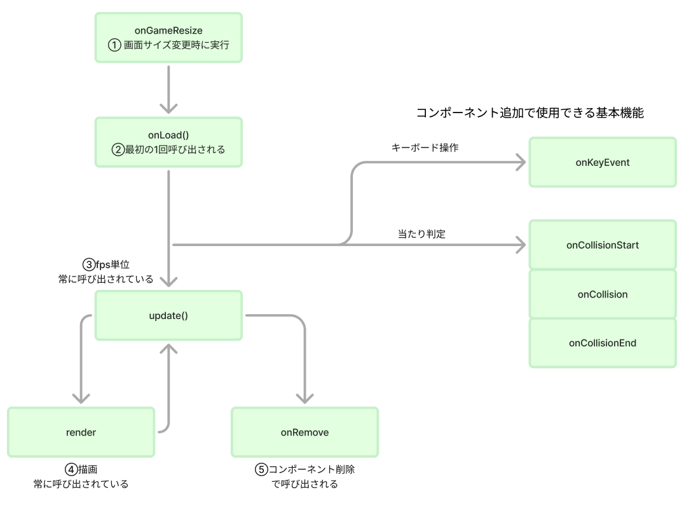

# **03_flameの基本サイクル**

## **基本の動きを確認**

あらかじめ用意されている関数を使ってゲーム全体を動かしています  

基本関数① 画面サイズが変更されると呼び出される  
基本関数② 最初に1回だけ呼び出される関数  
基本関数③ 常に動いている（キャラクターの動きなどに使う）  
基本関数④ 常に動いている（描画に使う）  
基本関数⑤ コンポーネントが削除された時に呼び出せれる



### **基本サイクルを動かしてみよう**

**基本関数①onGameResize**

画面サイズが変更されると呼び出される


```dart

class MainGame extends FlameGame {
  final BuildContext context;
  MainGame(this.context);

  @override
  void onGameResize(Vector2 size) {
    super.onGameResize(size);

    // ブラウザのサイズを変数に代入
    screenSize = size;

    print(screenSize.x);
    print(screenSize.y);
  }
}


```

**基本関数②onLoad**

最初に1回だけ呼び出される関数

onGameResize関数の下に追加しよう

```dart

  @override
  Future<void> onLoad() async {
    super.onLoad();

    print("onLoad呼び出し");

  }

```

**基本関数③update**

常に動いている（キャラクターの動きなどに使う）

下に追加しよう

```dart

  @override
  void update(double dt) {
    super.update(dt);
    // dt：自分のPCのフレームレート
    print(dt);
  }

```

**基本関数④render**

常に動いている（描画に使う）

下に追加しよう

```dart

  @override
  Future<void> render(Canvas canvas) async {
    super.render(canvas);
    print("render");
  }

```

**基本関数⑤onRemove**

コンポーネントが削除された時に呼び出せれる

下に追加しよう

```dart

  @override
  Future<void> onRemove() async {
    super.onRemove();
  }

```