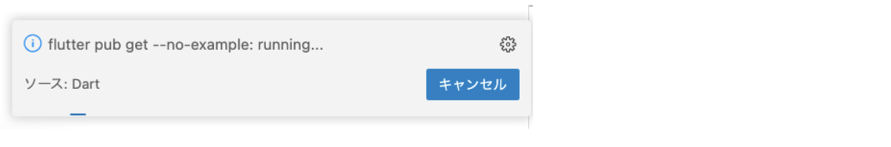
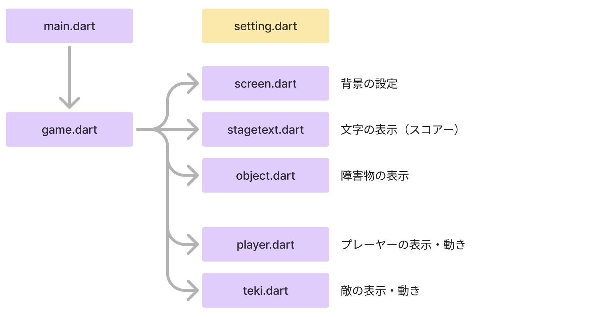
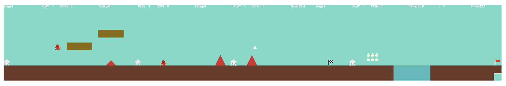

# **01_flameのベース**

## **この単元でやること**

1. プロジェクト作成、設定、ベース作成
2. ゲームの構成

## **1. プロジェクトを作る（復習）**

- VSCode>左下の歯車マーク＞コマンドパレット
- 検索＞flutterと入力＞「Flutter:New Project」＞「Application」
- 保存先を指定　src>projects
- アプリケーションの名前を「platformer」に変更
- プロジェクトの完成
- lib>main.dartの中を全て削除　「Ctrl+A」の後、「backspace」

## **パッケージのインポート**

### **【pubspec.yaml】**

バージョンは調べて最新版を設定しよう  
https://pub.dev/packages/flame

```dart

dependencies:
  flutter:
    sdk: flutter
  flame: ^1.23.0　//←これを追加

```

`Ctrl + S`で保存すると、VSCodeの右に「flutter pub get」が実行されます  



実行されない場合は、VSCodeのターミナルに打って実行しよう

```dart

flutter pub add flame
flutter pub upgrade flame

```

**【main.dart】**

```dart
// flutterパッケージを読み込み
import 'package:flutter/material.dart';
import 'package:flame/game.dart';
import 'game.dart';

// アプリを起動
void main() => runApp(MyApp());

// アプリ全体の設定
class MyApp extends StatelessWidget {
  @override
  Widget build(BuildContext context) {
    return MaterialApp(
      //③アプリタイトルを設定
      title: 'タイトル',
      theme: ThemeData(primarySwatch: Colors.blue),
      home: MyHomePage(),
    );
  }
}

// ページの設定
class MyHomePage extends StatefulWidget {
  MyHomePage({Key? key}) : super(key: key);
  @override
  _MyHomePageState createState() => _MyHomePageState();
}

// ページの中身を入れるclass
class _MyHomePageState extends State<MyHomePage> {
  @override
  Widget build(BuildContext context) {
    return Scaffold(
        appBar: AppBar(
          title: Text('GAME'),
        ),
        body: GameWidget(game: MainGame(context))   
    );
  }
}

```

### **【game.dart】**

game.dartを作る

```dart

import 'package:flame/game.dart';
import 'package:flutter/material.dart';

class MainGame extends FlameGame {
  final BuildContext context;
  MainGame(this.context);
  
  //ここにゲームの画面を作っていく

}

```

実行してみよう


## **2. ゲームの構成**

**ゲームマップ**



**ワイヤーフレーム・デザイン**

