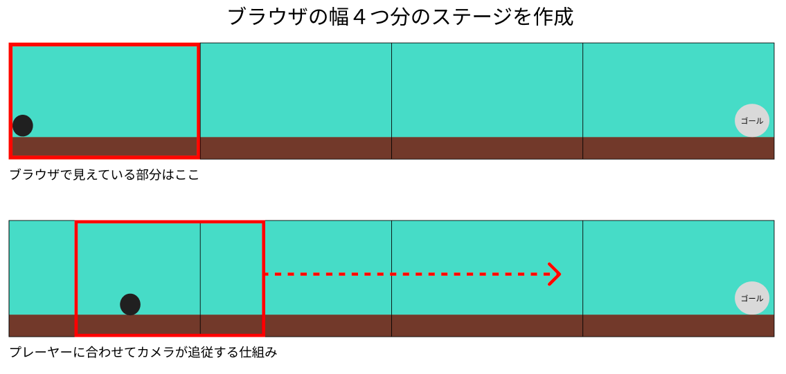

# **02_背景の設定**

## **この単元でやること**

1. 基本関数を追加
2. 背景と地面を追加(screen.dart)、設定ファイルを作る(setting.dart)
3. フィールドの大きさ
4. インスタンスの考え方

## **1. 基本関数を追加**

【game.dart】

①onGameResize  
②onLoad  
③update  

```dart

import 'package:flame/game.dart';
import 'package:flutter/material.dart';

// ⭐️①スクリーンサイズを保持する変数
late Vector2 screenSize;

class MainGame extends FlameGame {
  final BuildContext context;
  MainGame(this.context);

  // ⭐️①
  @override
  void onGameResize(Vector2 size) {
    super.onGameResize(size);
    screenSize = size;
  }

  // ⭐️②
  @override
  Future<void> onLoad() async {
    super.onLoad();
  }

  // ⭐️③
  @override
  void update(double dt) {
    super.update(dt);
  }
}

```

## **2. 背景と地面を追加ー設定ファイルを作る**

①背景用のファイルと設定ファイルを新規作成  
②背景オブジェクトの追加  
③地面オブジェクトの追加

### ①背景用のファイルと設定ファイルを新規作成

`screen.dart`を作成  
`setting.dart`を作成

### ②背景オブジェクトの追加



****【game.dart】ゲームのメインファイル****

onLoad関数からオブジェクト作成用の関数を作る

```dart

@override
  Future<void> onLoad() async {
    super.onLoad();

    //⭐️
    await objectRemove();
    
  }

  //⭐️
  Future<void> objectRemove() async {
    // ここで画面に表示するオブジェクトを呼び出す
  }


```

onLoadでオブジェクトを呼び出さな理由
onLoadは最初の１回しか実行されない。複数回呼び出す可能性がある場合は、新しく関数を作りそこからオブジェクトを呼び出すようにする。


**【setting.dart】設定ファイル**

サイズを変数に設定する  
定数を使うことで設定を変更しやすいようにします

```dart

import 'package:flutter/material.dart';
import 'game.dart';

//スクリーンサイズ４つ分
final FIELD_SIZE_X = screenSize.x * 4;
//スクリーンの高さと同じ
final FIELD_SIZE_Y = screenSize.y;

//地面の位置をスクリーンの高さの80%の位置にする
final Y_GROUND_POSITION = screenSize.y * 0.8;


```

**【screen.dart】背景用ファイル**

**<背景を表示>CameraBackScreen**

``` dart

import 'package:flutter/material.dart';
import 'package:flame/components.dart';
import 'game.dart';
import 'setting.dart';

class CameraBackScreen extends RectangleComponent with HasGameRef<MainGame> {
  @override
  Future<void> onLoad() async {
    position = Vector2(0, 0);
    size = Vector2(FIELD_SIZE_X, FIELD_SIZE_Y);
    paint = Paint()..color = Color.fromARGB(255, 110, 219, 197);
  }

  @override
  Future<void> render(Canvas canvas) async {
    super.render(canvas);
  }
}

```

**<地面を表示>Cameraground**

```dart

class Cameraground extends RectangleComponent with HasGameRef<MainGame> {
  @override
  Future<void> onLoad() async {
    position = Vector2(0, Y_GROUND_POSITION);
    size = Vector2(FIELD_SIZE_X, FIELD_SIZE_Y - Y_GROUND_POSITION);
    paint = Paint()..color = Color.fromARGB(255, 106, 59, 40);
  }

  @override
  Future<void> render(Canvas canvas) async {
    super.render(canvas);
  }
}

```

**【game.dart】**

- screen.dartのクラスを呼び出し

```dart
import 'package:flame/game.dart';
import 'package:flutter/material.dart';
import 'screen.dart'; //⭐️追加

Future<void> objectRemove() async {
    // ⭐️背景インスタンス作成
    CameraBackScreen backscreen = CameraBackScreen();
    await add(backscreen);
    // ⭐️地面インスタンス作成
    Cameraground ground = Cameraground();
    await add(ground);
  }


```

### インスタンスについては、次の「03_player」で詳しく説明します


