# **03_プレイヤーの表示**

## **この単元でやること**

1. プレイヤーの表示
2. プレイヤーの動き（キーボード操作）
3. ジャンプ（重力をかける）、壁との当たり判定（左の壁）
4. プレイヤーのアニメーション

## **1. プレイヤーの表示**

①player.dartを新規作成  
②Playerクラスを作成  
③setting.dartの設定  
④game.dartから呼び出し

**【player.dart】**

SpriteComponentを使ってプレーヤーを表示  
サイズやポジションは変数で指定

```dart

import 'package:flame/components.dart';
import 'game.dart';
import 'setting.dart';

class Player extends SpriteComponent with HasGameRef<MainGame> {
  @override
  Future<void> onLoad() async {
    sprite = await Sprite.load('ika2.png');
    size = Vector2(PLAYER_SIZE_X, PLAYER_SIZE_Y);
    position =
        Vector2(PLAYER_SIZE_X / 2, Y_GROUND_POSITION - PLAYER_SIZE_Y / 2);
    anchor = Anchor.center;
    priority = 10;
  }

  @override
  void update(double dt) {
    super.update(dt);
  }
}


```

**【setting.dart】**

プレーヤーのサイズを設定

```dart

final PLAYER_SIZE_X = 60.0;
final PLAYER_SIZE_Y = 60.0;

```

**【game.dart】**

```dart

import 'package:flame/game.dart';
import 'package:flutter/material.dart';
import 'package:flame/input.dart';
import 'screen.dart';
import 'player.dart';  //⭐️追加

//省略

  Future<void> objectRemove() async {
    // 背景
    CameraBackScreen backscreen = CameraBackScreen();
    await add(backscreen);
    // 地面
    Cameraground ground = Cameraground();
    await add(ground);
    // ⭐️プレーヤー呼び出し
    Player player = Player();
    await add(player);
  }


```

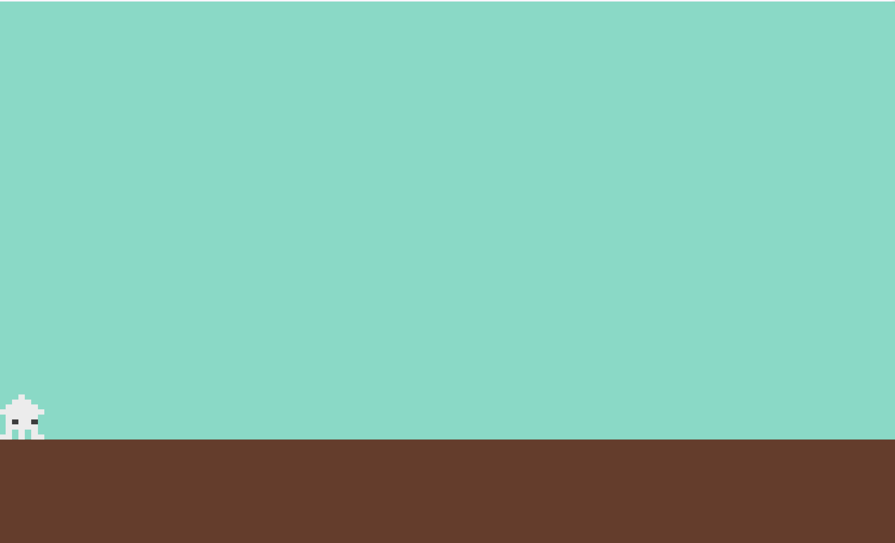

## **2. プレイヤーの動き（キーボード操作）**

①キーボードコンポーネントを追加  
②キーイベント

**【game.dart】**

`HasKeyboardHandlerComponents`をミックインする
ミックスインとは・・・クラスに 「追加の機能」 を付け加えること  
`with`の後ろにコンポーネントを追加することができます


```dart
import 'package:flame/game.dart';
import 'package:flutter/material.dart';
import 'package:flame/input.dart'; //⭐️追加
import 'screen.dart';
import 'player.dart';

//⭐️ HasKeyboardHandlerComponentsを追加
class MainGame extends FlameGame with HasKeyboardHandlerComponents {
  final BuildContext context;
  MainGame(this.context);

  //省略

```

**【player.dart】**

プレーヤーの移動速度、ジャンプ力を指定

```dart

import 'package:flame/components.dart';
import 'package:flutter/services.dart'; //⭐️追加
import 'game.dart';
import 'setting.dart';

//⭐️ KeyboardHandlerを追加
class Player extends SpriteComponent
    with HasGameRef<MainGame>, KeyboardHandler {
  //⭐️ 速度の指定
  Vector2 velocity = Vector2.zero();
  //⭐️ 移動速度
  double moveSpeed = 200;
  //⭐️ ジャンプ力
  double jumpForce = 300;

@override
  Future<void> onLoad() async {
    sprite = await Sprite.load('ika2.png');
    size = Vector2(PLAYER_SIZE_X, PLAYER_SIZE_Y);
    position =
        Vector2(PLAYER_SIZE_X / 2, Y_GROUND_POSITION - PLAYER_SIZE_Y / 2);
    anchor = Anchor.center;
    priority = 10;
  }

  //⭐️ ここから ↓
  //キーボード操作
  @override
  bool onKeyEvent(
    KeyEvent event,
    Set<LogicalKeyboardKey> keysPressed,
  ) {
    if (event is KeyDownEvent) {
      //左矢印押した時
      if (keysPressed.contains(LogicalKeyboardKey.arrowLeft)) {
        moveLeft();
        //スペースキー押した時
        if (keysPressed.contains(LogicalKeyboardKey.space)) {
          jump();
        }
      //右矢印押した時
      } else if (keysPressed.contains(LogicalKeyboardKey.arrowRight)) {
        moveRight();
        // スペースキー押した時
        if (keysPressed.contains(LogicalKeyboardKey.space)) {
          jump();
        }
      //スペースキー押した時
      } else if (keysPressed.contains(LogicalKeyboardKey.space)) {
        jump();
      }
    } else if (event is KeyUpEvent) {
      stopMovement();
    }
    return true;
  }

  // 左移動
  void moveLeft() {
    velocity.x = -moveSpeed;
  }

  // 右移動
  void moveRight() {
    velocity.x = moveSpeed;
  }

  // ストップ
  void stopMovement() {
    velocity.x = 0;
  }

  // ジャンプ
  void jump() {
    velocity.y = -jumpForce;
  }
  //⭐️ここまで↑

  @override
  void update(double dt) {
    super.update(dt);

    //⭐️ポジションを変える
    position += velocity * dt;
  }
}

```

**ジャンプすると枠外に消えていく・・・**

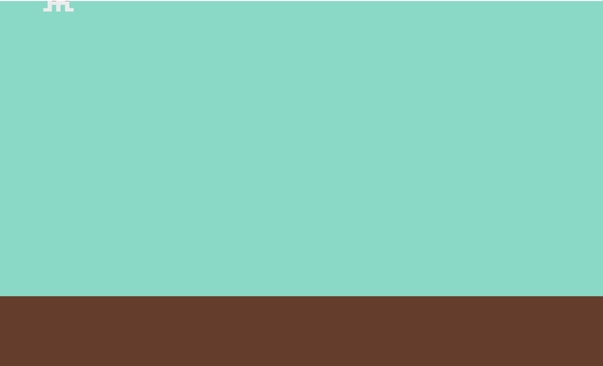

## **3. ジャンプ（重力をかける）、壁との当たり判定（左の壁）**

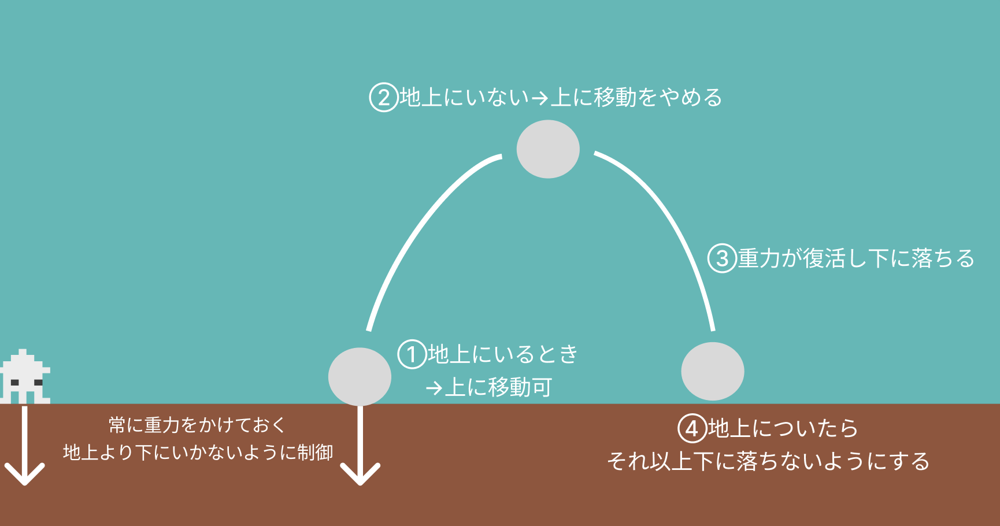

①重力をかける  
②地面にいるかどうかの判定
③左の壁より先に進めない、地上にいる時だけジャンプ

**【player.dart】**

### **①重力をかける**

```dart

class Player extends SpriteComponent
    with HasGameRef<MainGame>, KeyboardHandler {
  // 速度の指定
  Vector2 velocity = Vector2.zero();
  // 移動速度
  double moveSpeed = 200;
  // ジャンプ力
  double jumpForce = 300;
  //⭐️  重力
  double gravity = 800;
  //⭐️ 地面にいるかの判定
  bool isOnGround = false;

  //省略

  @override
  void update(double dt) {
    super.update(dt);

    //⭐️ 重力をかける
    applyGravity(dt, gravity);

    position += velocity * dt;
  }

  //⭐️ 常に重力をかける
  void applyGravity(double dt, double gravity) {
    
    velocity.y += gravity * dt; // 速度に重力を適用して下降
    
    position += velocity * dt; // 速度に基づいてキャラクターの位置を更新（下に移動する）
  }


```

**実行してみよう**  
ジャンプをすると上がりきったところで落ちてくる  
重力がかかるようになったが、地面より下に落ちてしまう

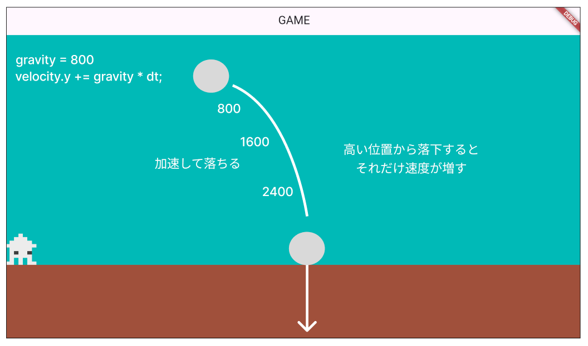

<br><br>

### **②地面より下にいかないようにする**

```dart
class Player extends SpriteComponent
    with HasGameRef<MainGame>, KeyboardHandler {
  // 速度の指定
  Vector2 velocity = Vector2.zero();
  // 移動速度
  double moveSpeed = 200;
  // ジャンプ力
  double jumpForce = 300;
  // 重力
  double gravity = 800;
  //⭐️ 地面にいるかの判定
  bool isOnGround = false;

  //省略

@override
  void update(double dt) {
    super.update(dt);

    applyGravity(dt, gravity);
    //⭐️ 地面との衝突を確認
    checkGroundCollision();

    position += velocity * dt;
  }

  void applyGravity(double dt, double gravity) {
    // 地上にいない時だけ重力をかける
    
    velocity.y += gravity * dt; // 速度に重力を適用して下降
    
    position += velocity * dt; // 速度に基づいてキャラクターの位置を更新（下に移動する）
  }

  //⭐️ 地面との接触
  void checkGroundCollision() {
    // 地面より下には行かないようにする
    if (position.y >= Y_GROUND_POSITION - size.y / 2) {
      //地上にいるフラグ
      isOnGround = true;
      //常に地面の上にいるようにする
      position.y = Y_GROUND_POSITION - size.y / 2;
      //速度は0
      velocity.y = 0;
    } else {
      //地上にいないフラグ（空中）
      isOnGround = false;
    }
  }

```

**実行してみよう**  
地面より下にいかなくなった


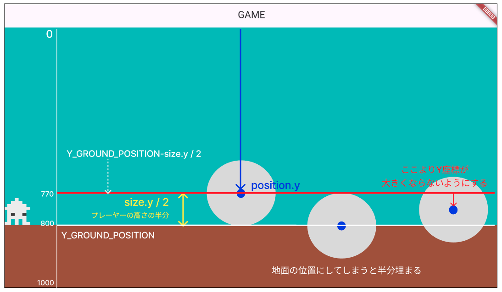
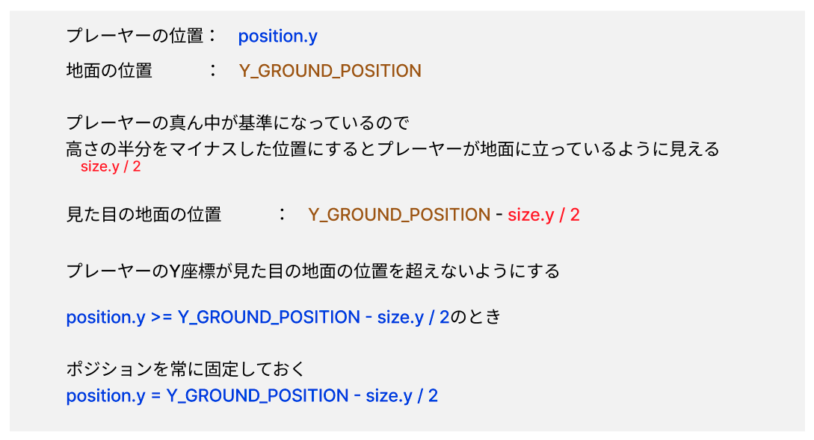

<br><br>

### **③左の壁より先に進めない、地上にいる時だけジャンプ**

ジャンプ中もジャンプできてしまうので地上にいる時だけジャンプできるようにする

```dart

// ジャンプ
void jump() {
  //⭐️ 地上にいるときだけジャンプできる
  if (isOnGround) {
    velocity.y = -jumpForce;
    //ジャンプしたらfalse（地上にいない）にする
    isOnGround = false;
  }
}

  @override
  void update(double dt) {
    super.update(dt);

    applyGravity(dt, gravity);
    checkGroundCollision();
    //⭐️ 左の壁より先に行けない
    if (position.x < size.x / 2) {
      position.x = size.x / 2;
    }

    position += velocity * dt;
  }

  void applyGravity(double dt, double gravity) {
    //⭐️ 地上にいない時だけ重力をかける
    if (!isOnGround) {
      velocity.y += gravity * dt; // 速度に重力を適用して下降
    }
    position += velocity * dt; // 速度に基づいてキャラクターの位置を更新（下に移動する）
  }

```

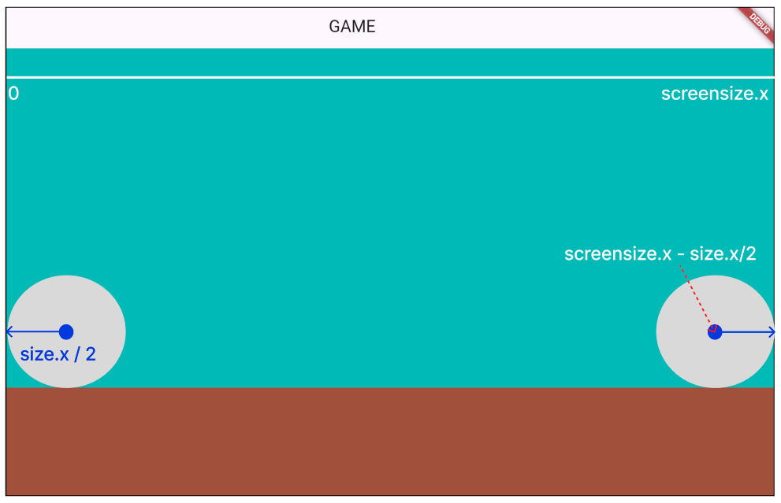

## **4. プレイヤーのアニメーション**

プレーヤーの向きや動きによってアニメーションさせる

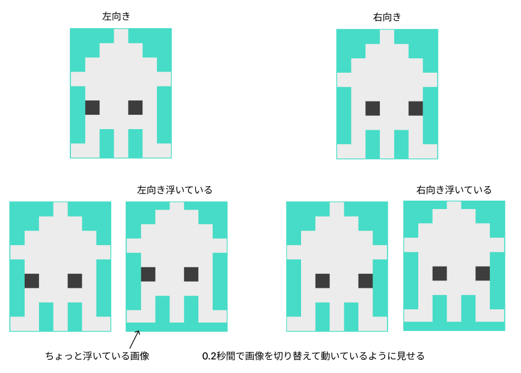

**【player.dart】**

①SpriteAnimationComponentに変更

```dart

// ⭐️ SpriteComponent→SpriteAnimationComponentに変更
class Player extends SpriteAnimationComponent
    with HasGameRef<MainGame>, KeyboardHandler {

// 速度の指定
  Vector2 velocity = Vector2.zero();
  // 移動速度
  double moveSpeed = 200;
  // ジャンプ力
  double jumpForce = 300;
  // 重力
  double gravity = 800;
  // 地面にいるかの判定
  bool isOnGround = false;

  //⭐️ 各方向のスプライト
  late SpriteAnimation leftAnimation;
  late SpriteAnimation rightAnimation;
  late SpriteAnimation stop_leftAnimation;
  late SpriteAnimation stop_rightAnimation;


  //⭐️ 方向フラグ（どちらを向いているか）
  bool leftflg = false;
  bool rightflg = false;

  @override
  Future<void> onLoad() async {
    // ⭐️コメントアウト
    // sprite = await Sprite.load('ika2.png');

    // ⭐️ スプライトロード
    final leftSprites = [
      await gameRef.loadSprite('ika.png'),
    ];
    final rightSprites = [
      await gameRef.loadSprite('ika2.png'),
    ];
    final stop_leftSprites = [
      await gameRef.loadSprite('ika.png'),
      await gameRef.loadSprite('ika_up.png'),
    ];
    final stop_rightSprites = [
      await gameRef.loadSprite('ika2.png'),
      await gameRef.loadSprite('ika2_up.png'),
    ];

    // ⭐️ アニメーション（画像切り替え）
    leftAnimation = SpriteAnimation.spriteList(leftSprites, stepTime: 0.2);
    rightAnimation = SpriteAnimation.spriteList(rightSprites, stepTime: 0.2);

    stop_leftAnimation =
        SpriteAnimation.spriteList(stop_leftSprites, stepTime: 0.2);
    stop_rightAnimation =
        SpriteAnimation.spriteList(stop_rightSprites, stepTime: 0.2);

    // ⭐️最初に表示するアニメーション
    animation = stop_rightAnimation;


    size = Vector2(PLAYER_SIZE_X, PLAYER_SIZE_Y);
    position =
        Vector2(PLAYER_SIZE_X / 2, Y_GROUND_POSITION - PLAYER_SIZE_Y / 2);
    anchor = Anchor.center;
    priority = 10;
  }

  @override
  bool onKeyEvent(
    KeyEvent event,
    Set<LogicalKeyboardKey> keysPressed,
  ) {
    if (event is KeyDownEvent) {
      //⭐️ どっちを向いているかフラグ
      leftflg = false;
      rightflg = false;

      if (keysPressed.contains(LogicalKeyboardKey.arrowLeft)) {
        //⭐️
        leftflg = true;
        moveLeft();
        if (keysPressed.contains(LogicalKeyboardKey.space)) {
          jump();
        }
      } else if (keysPressed.contains(LogicalKeyboardKey.arrowRight)) {
        //⭐️
        rightflg = true;
        moveRight();
        if (keysPressed.contains(LogicalKeyboardKey.space)) {
          jump();
        }
      } else if (keysPressed.contains(LogicalKeyboardKey.space)) {
        jump();
      }
    } else if (event is KeyUpEvent) {
      stopMovement();
    }
    return true;
  }

  // 左移動
  void moveLeft() {
    velocity.x = -moveSpeed;
    //⭐️
    if (animation != leftAnimation) {
      animation = leftAnimation;
    }
  }

  // 右移動
  void moveRight() {
    velocity.x = moveSpeed;
    //⭐️
    if (animation != rightAnimation) {
      animation = rightAnimation;
    }
  }

  // ストップ
  void stopMovement() {
    velocity.x = 0;
    //⭐️　どちら向きで止まっているか
    if (leftflg) {
      animation = stop_leftAnimation;
    }
    if (rightflg) {
      animation = stop_rightAnimation;
    }
  }


```

## **5. ピクセル画像の作り方**

Webサイト上でピクセルが画像を作る方法を紹介します  

https://www.piskelapp.com/

### **①左右反転**

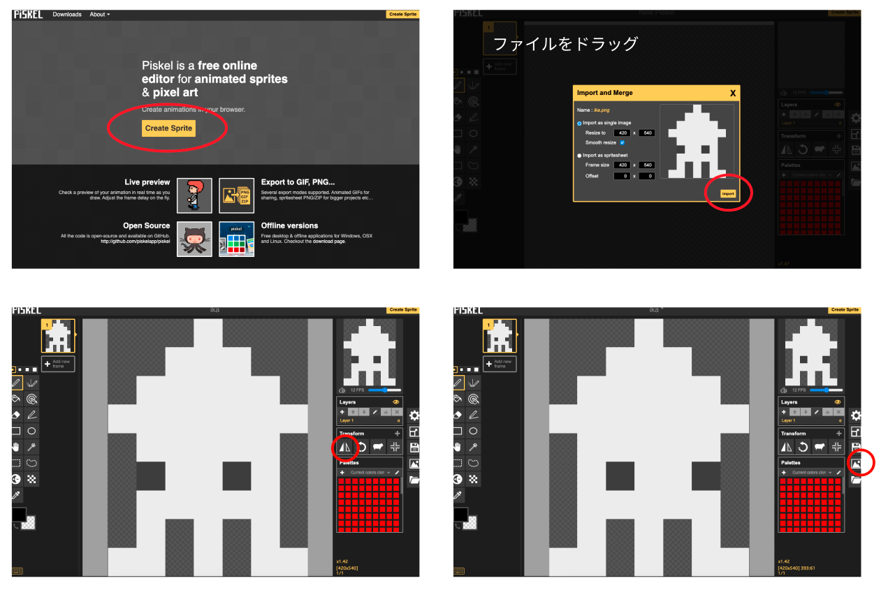

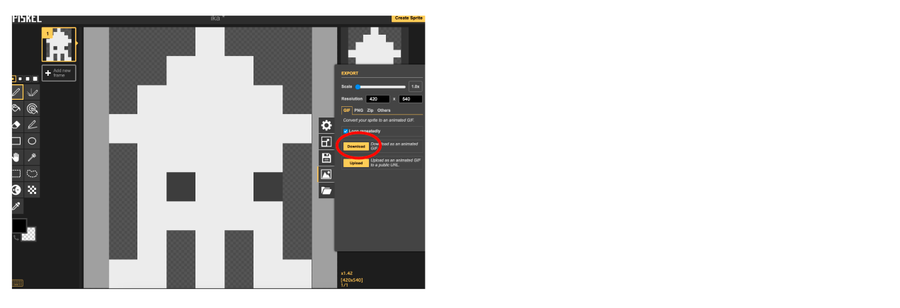

### **②削除、移動**

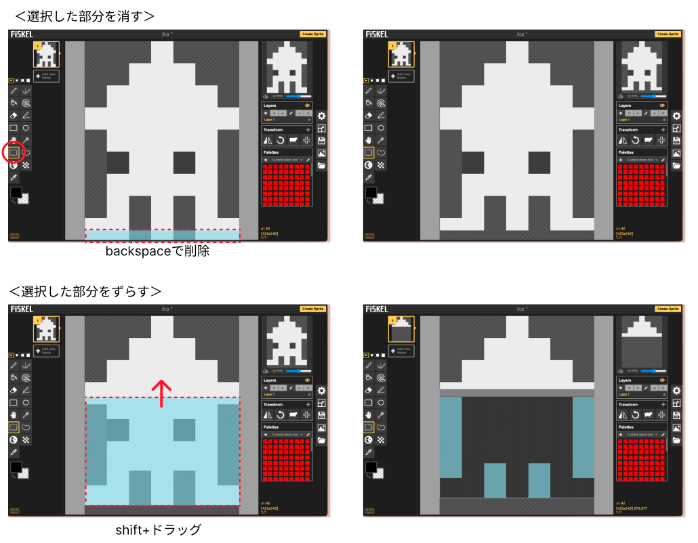
