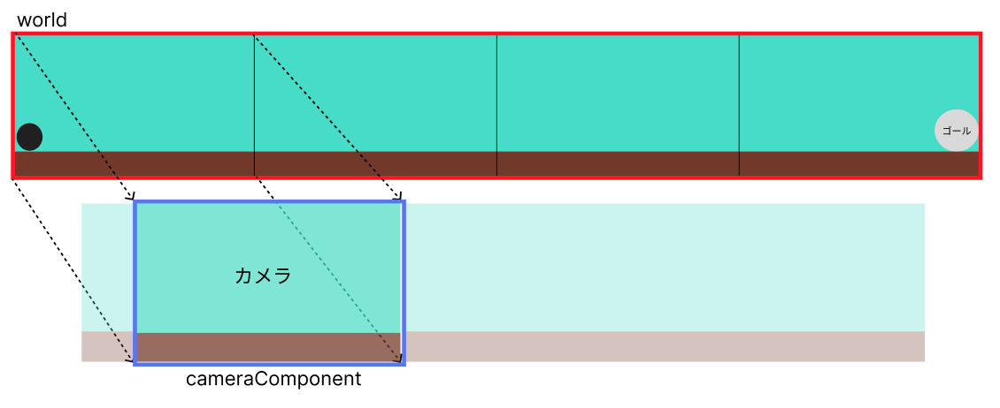
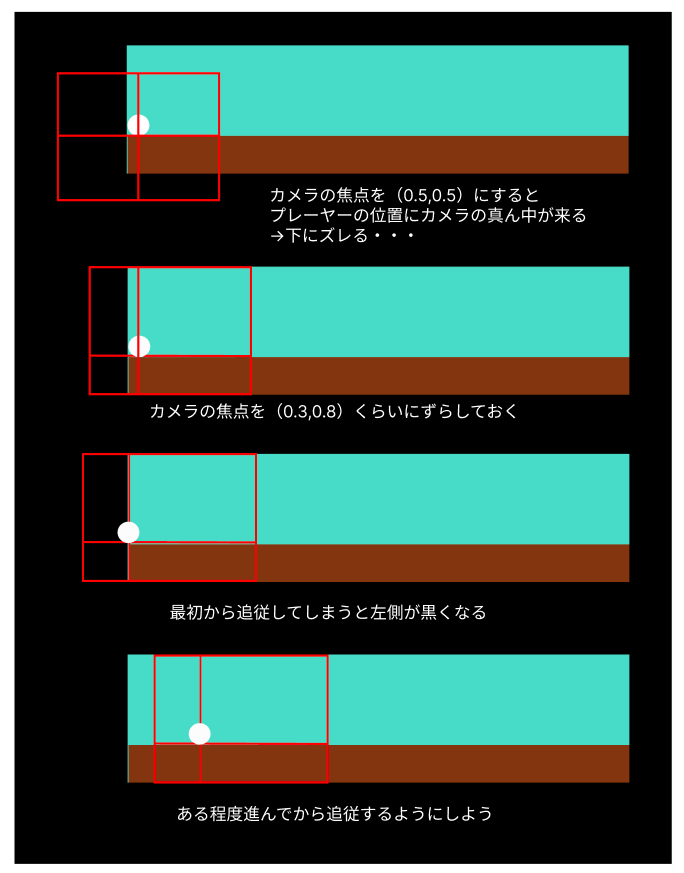
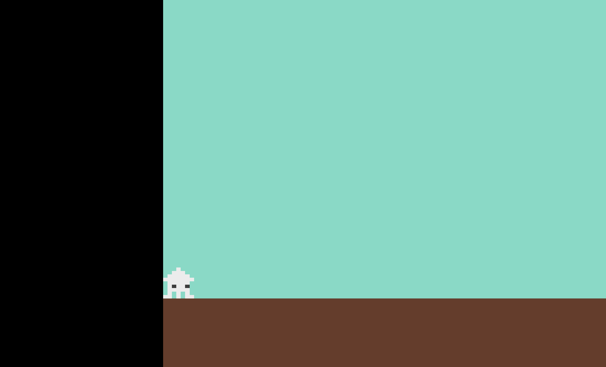
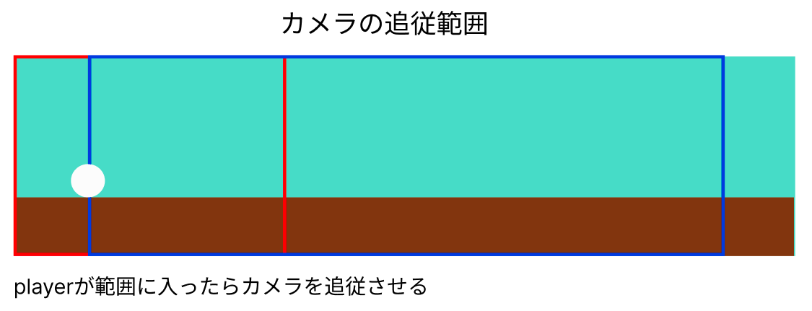

# **04_カメラの追従**

## **この単元でやること**

1. カメラコンポーネントの追加
2. 追従位置の調整

## **1. カメラコンポーネントの追加**

worldの一部を切り抜いてカメラに映すイメージ  
カメラのサイズ、基準値、追従などを設定できる



**①カメラコンポーネントの設定**

**【game.dart】**

```dart

import 'package:flame/game.dart';
import 'package:flutter/material.dart';
import 'package:flame/input.dart';
import 'package:flame/camera.dart'; //⭐️追加
import 'package:flame/components.dart'; //⭐️追加
import 'screen.dart';
import 'player.dart';

class MainGame extends FlameGame with HasKeyboardHandlerComponents {
  final BuildContext context;
  MainGame(this.context);

  // カメラコンポーネントの追加
  late final CameraComponent cameraComponent; //⭐️追加
  Player player = Player(); //⭐️追加

  @override
  void onGameResize(Vector2 size) {
    super.onGameResize(size);
    screenSize = size;
  }


@override
  Future<void> onLoad() async {
    super.onLoad();

    //⭐️ worldを作る
    world = World();
    add(world);

    //⭐️ カメラコンポーネントを作る
    cameraComponent = CameraComponent.withFixedResolution(
      width: screenSize.x,
      height: screenSize.y,
    );

    //⭐️ worldの一部を切り取ってカメラに表示する
    cameraComponent.world = world;

    //⭐️ デフォルトのカメラをcameraComponentに置き換える
    camera = cameraComponent;

    //⭐️
    await add(cameraComponent);

    await objectRemove();
  }

```

**②worldにオブジェクトをaddするように変更**

オブジェクトをaddするフィールドをworldに指定する  
worldの上にカメラフィールドが重なったため、どこにaddするか指定する必要がある

※フィールドが１つの場合はworldを省略できる

**【game.dart】**

```dart

  // オブジェクトを作る関数
  Future<void> objectRemove() async {
    // ⭐️カメラの初期値設定（関数呼び出し）
    await CameraRemove();

    //⭐️ 背景（worldを追加）
    CameraBackScreen backscreen = CameraBackScreen();
    await world.add(backscreen);
    //⭐️  地面（worldを追加）
    Cameraground ground = Cameraground();
    await world.add(ground);
    //⭐️ プレイヤー（インスタンスをグローバルに設定）
    player = Player();
    await world.add(player);
  }

```

**③カメラの追従と基準値の考え方**



|  プロパティ  |  説明  | 使用方法  |
| :---- | :---- | ---- |
| viewfinder.anchor | カメラの中心位置 | 追従するオブジェクトを表示させたい場所に指定
| viewfinder.position | どの位置を追従するか |  Playerのpositionに指定


追従するオブジェクトをカメラのどの位置に表示するか指定する

**【setting.dart】**

```dart

final CAMERA_POSITION_X = 0.3; //⭐️追加
final CAMERA_POSITION_Y = 0.8; //⭐️追加

```

**【game.dart】**

objectRemove()の下に追加

```dart
import 'package:flame/game.dart';
import 'package:flutter/material.dart';
import 'package:flame/input.dart';
import 'package:flame/camera.dart';
import 'package:flame/components.dart';
import 'screen.dart';
import 'player.dart';
import 'setting.dart'; //⭐️追加

//省略

//⭐️ カメラの設定位置（objectRemove()関数の下に追加）
Future<void> CameraRemove() async {
cameraComponent.viewfinder.anchor =
    Anchor(CAMERA_POSITION_X, CAMERA_POSITION_Y);
cameraComponent.viewfinder.position = Vector2.zero();
cameraComponent.viewfinder.zoom = 1.0;
}

@override
  void update(double dt) {
    super.update(dt);

    //⭐️カメラの追従
    cameraComponent.viewfinder.position =
        Vector2(player.position.x, Y_GROUND_POSITION);
    //⭐️
    cameraComponent.update(dt);
  }


```




## **2. 追従位置の調整**

カメラの追従範囲に入ってから追従させる




**【setting.dart】**

```dart

final VIEW_X_START = screenSize.x * CAMERA_POSITION_X;
final VIEW_X_END = FIELD_SIZE_X - screenSize.x * (1 - CAMERA_POSITION_X);


```

**【game.dart】**

```dart

if (player.position.x > VIEW_X_START && player.position.x < VIEW_X_END) {
      //プレイヤーに追従する
      cameraComponent.viewfinder.position =
          Vector2(player.position.x, Y_GROUND_POSITION);
    } else {
      if (player.position.x > VIEW_X_END) {
        // 範囲外になったら追従しない
        cameraComponent.viewfinder.position =
            Vector2(VIEW_X_END, Y_GROUND_POSITION);
      } else {
        // 範囲まで追従しない
        cameraComponent.viewfinder.position =
            Vector2(VIEW_X_START, Y_GROUND_POSITION);
      }
    }


```

実行してプレーヤーを右に動かそう  
途中から動いているように見えない・・・

**背景をグラデーションにして動いていることを確認**

**【screen.dart】**

```dart

class CameraBackScreen extends RectangleComponent with HasGameRef<MainGame> {

  //省略

  @override
  void render(Canvas canvas) {
      super.render(canvas);

      final rect = Rect.fromLTWH(0, 0, size.x, size.y);
      final paint = Paint()
      ..shader = LinearGradient(
      begin: Alignment.topLeft,
      end: Alignment.bottomRight,
      colors: [
          Color.fromARGB(255, 0, 149, 119),
          Color.fromARGB(255, 203, 249, 240)
      ], // 好きな色に変更
      ).createShader(rect);

      canvas.drawRect(rect, paint);
  }
}

```

<br><br><br>

### **【ここまでのソースコード】**

**【game.dart】**

```dart

import 'package:flame/game.dart';
import 'package:flutter/material.dart';
import 'package:flame/input.dart';
import 'package:flame/camera.dart';
import 'package:flame/components.dart';
import 'screen.dart';
import 'player.dart';
import 'setting.dart';

late Vector2 screenSize;

class MainGame extends FlameGame with HasKeyboardHandlerComponents {
  final BuildContext context;
  MainGame(this.context);

  // カメラコンポーネントの追加
  late final CameraComponent cameraComponent;
  Player player = Player();

  @override
  void onGameResize(Vector2 size) {
    super.onGameResize(size);
    screenSize = size;
  }

  @override
  Future<void> onLoad() async {
    super.onLoad();
    screenSize = size;

    //worldを作る
    world = World();
    add(world);

    //カメラコンポーネントを作る
    cameraComponent = CameraComponent.withFixedResolution(
      width: screenSize.x,
      height: screenSize.y,
    );

    //worldの一部を切り取ってカメラに表示する
    cameraComponent.world = world;

    //デフォルトのカメラをcameraComponentに置き換える
    camera = cameraComponent;

    //コンポーネント追加
    await add(cameraComponent);

    await objectRemove();
  }

  Future<void> objectRemove() async {
    //カメラの初期値設定（関数呼び出し）
    await CameraRemove();

    CameraBackScreen backscreen = CameraBackScreen();
    await world.add(backscreen);

    Cameraground ground = Cameraground();
    await world.add(ground);

    player = Player();
    await world.add(player);
  }

  Future<void> CameraRemove() async {
    cameraComponent.viewfinder.anchor =
        Anchor(CAMERA_POSITION_X, CAMERA_POSITION_Y);
    cameraComponent.viewfinder.position = Vector2.zero();
    cameraComponent.viewfinder.zoom = 1.0;
  }

  @override
  void update(double dt) {
    super.update(dt);

    if (player.position.x > VIEW_X_START && player.position.x < VIEW_X_END) {
      //プレイヤーに追従する
      cameraComponent.viewfinder.position =
          Vector2(player.position.x, Y_GROUND_POSITION);
    } else {
      if (player.position.x > VIEW_X_END) {
        // 範囲外になったら追従しない
        cameraComponent.viewfinder.position =
            Vector2(VIEW_X_END, Y_GROUND_POSITION);
      } else {
        // 範囲まで追従しない
        cameraComponent.viewfinder.position =
            Vector2(VIEW_X_START, Y_GROUND_POSITION);
      }
    }
    cameraComponent.update(dt);
  }
}


```

**【player.dart】**

```dart

import 'package:flame/components.dart';
import 'package:flutter/services.dart';
import 'game.dart';
import 'setting.dart';

class Player extends SpriteAnimationComponent
    with HasGameRef<MainGame>, KeyboardHandler {
  //速度の指定
  Vector2 velocity = Vector2.zero();
  //移動速度
  double moveSpeed = 200;
  //ジャンプ力
  double jumpForce = 500;
  //重力
  double gravity = 800;
  //地面にいるかの判定
  bool isOnGround = false;

  //各方向のスプライト
  late SpriteAnimation leftAnimation;
  late SpriteAnimation rightAnimation;
  late SpriteAnimation stop_leftAnimation;
  late SpriteAnimation stop_rightAnimation;

  //方向フラグ（どちらを向いているか）
  bool leftflg = false;
  bool rightflg = false;

  @override
  Future<void> onLoad() async {
    // sprite = await Sprite.load('ika2.png');

    //スプライトロード
    final leftSprites = [
      await gameRef.loadSprite('ika.png'),
    ];
    final rightSprites = [
      await gameRef.loadSprite('ika2.png'),
    ];
    final stop_leftSprites = [
      await gameRef.loadSprite('ika.png'),
      await gameRef.loadSprite('ika_up.png'),
    ];
    final stop_rightSprites = [
      await gameRef.loadSprite('ika2.png'),
      await gameRef.loadSprite('ika2_up.png'),
    ];

    //アニメーション（画像切り替え）
    leftAnimation = SpriteAnimation.spriteList(leftSprites, stepTime: 0.2);
    rightAnimation = SpriteAnimation.spriteList(rightSprites, stepTime: 0.2);

    stop_leftAnimation =
        SpriteAnimation.spriteList(stop_leftSprites, stepTime: 0.2);
    stop_rightAnimation =
        SpriteAnimation.spriteList(stop_rightSprites, stepTime: 0.2);

    //最初に表示するアニメーション
    animation = stop_rightAnimation;

    size = Vector2(PLAYER_SIZE_X, PLAYER_SIZE_Y);
    position =
        Vector2(PLAYER_SIZE_X / 2, Y_GROUND_POSITION - PLAYER_SIZE_Y / 2);
    anchor = Anchor.center;
    priority = 10;
  }

  //キーボード操作
  @override
  bool onKeyEvent(
    KeyEvent event,
    Set<LogicalKeyboardKey> keysPressed,
  ) {
    if (event is KeyDownEvent) {
      leftflg = false;
      rightflg = false;

      //左矢印押した時
      if (keysPressed.contains(LogicalKeyboardKey.arrowLeft)) {
        leftflg = true;
        moveLeft();
        //スペースキー押した時
        if (keysPressed.contains(LogicalKeyboardKey.space)) {
          jump();
        }
        //右矢印押した時
      } else if (keysPressed.contains(LogicalKeyboardKey.arrowRight)) {
        rightflg = true;
        moveRight();
        // スペースキー押した時
        if (keysPressed.contains(LogicalKeyboardKey.space)) {
          jump();
        }
        //スペースキー押した時
      } else if (keysPressed.contains(LogicalKeyboardKey.space)) {
        jump();
      }
    } else if (event is KeyUpEvent) {
      stopMovement();
    }
    return true;
  }

  // 左移動
  void moveLeft() {
    velocity.x = -moveSpeed;
    if (animation != leftAnimation) {
      animation = leftAnimation;
    }
  }

  // 右移動
  void moveRight() {
    velocity.x = moveSpeed;
    if (animation != rightAnimation) {
      animation = rightAnimation;
    }
  }

  // ストップ
  void stopMovement() {
    velocity.x = 0;
    if (leftflg) {
      animation = stop_leftAnimation;
    }
    if (rightflg) {
      animation = stop_rightAnimation;
    }
  }

  // ジャンプ
  void jump() {
    if (isOnGround) {
      velocity.y = -jumpForce;
      isOnGround = false;
    }
  }

  @override
  void update(double dt) {
    super.update(dt);

    //重力をかける
    applyGravity(dt, gravity);
    //地面との衝突を確認
    checkGroundCollision();

    if (position.x < size.x / 2) {
      position.x = size.x / 2;
    }

    //ポジションを変える
    position += velocity * dt;
  }

  void applyGravity(double dt, double gravity) {
    if (!isOnGround) {
      velocity.y += gravity * dt; // 速度に重力を適用して下降
    }

    position += velocity * dt; // 速度に基づいてキャラクターの位置を更新（下に移動する）
  }

  void checkGroundCollision() {
    // 地面より下には行かないようにする
    if (position.y >= Y_GROUND_POSITION - size.y / 2) {
      //地上にいるフラグ
      isOnGround = true;
      //常に地面の上にいるようにする
      position.y = Y_GROUND_POSITION - size.y / 2;
      //速度は0
      velocity.y = 0;
    } else {
      //地上にいないフラグ（空中）
      isOnGround = false;
    }
  }
}


```

**【screen.dart】**

```dart

import 'package:flutter/material.dart';
import 'package:flame/components.dart';
import 'game.dart';
import 'setting.dart';

class CameraBackScreen extends RectangleComponent with HasGameRef<MainGame> {
  @override
  Future<void> onLoad() async {
    position = Vector2(0, 0);
    size = Vector2(FIELD_SIZE_X, FIELD_SIZE_Y);
    paint = Paint()..color = Color.fromARGB(255, 110, 219, 197);
  }

  @override
  Future<void> render(Canvas canvas) async {
    super.render(canvas);

    final rect = Rect.fromLTWH(0, 0, size.x, size.y);
    final paint = Paint()
      ..shader = LinearGradient(
        begin: Alignment.topLeft,
        end: Alignment.bottomRight,
        colors: [
          Color.fromARGB(255, 0, 149, 119),
          Color.fromARGB(255, 203, 249, 240)
        ], // 好きな色に変更
      ).createShader(rect);

    canvas.drawRect(rect, paint);
  }
}

class Cameraground extends RectangleComponent with HasGameRef<MainGame> {
  @override
  Future<void> onLoad() async {
    position = Vector2(0, Y_GROUND_POSITION);
    size = Vector2(FIELD_SIZE_X, FIELD_SIZE_Y - Y_GROUND_POSITION);
    paint = Paint()..color = Color.fromARGB(255, 106, 59, 40);
  }

  @override
  Future<void> render(Canvas canvas) async {
    super.render(canvas);
  }
}


```

**【setting.dart】**

```dart

import 'package:flutter/material.dart';
import 'game.dart';

//スクリーンサイズ４つ分
final FIELD_SIZE_X = screenSize.x * 4;
//スクリーンの高さと同じ
final FIELD_SIZE_Y = screenSize.y;

//地面の位置をスクリーンの高さの80%の位置にする
final Y_GROUND_POSITION = screenSize.y * 0.8;

final PLAYER_SIZE_X = 60.0;
final PLAYER_SIZE_Y = 60.0;

final CAMERA_POSITION_X = 0.3;
final CAMERA_POSITION_Y = 0.8;

final VIEW_X_START = screenSize.x * CAMERA_POSITION_X;
final VIEW_X_END = FIELD_SIZE_X - screenSize.x * (1 - CAMERA_POSITION_X);


```
