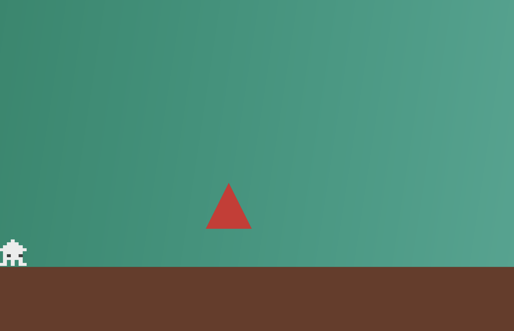
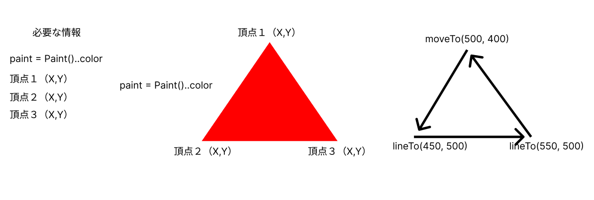
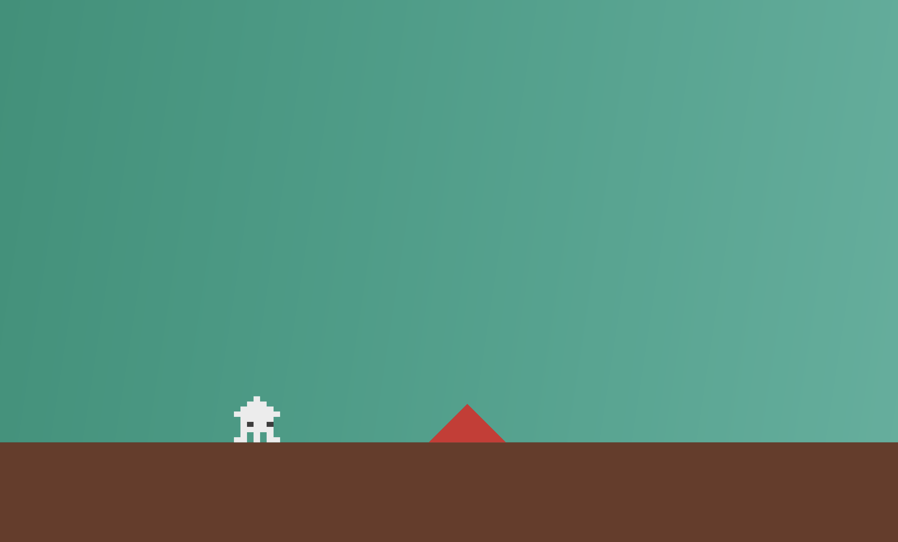
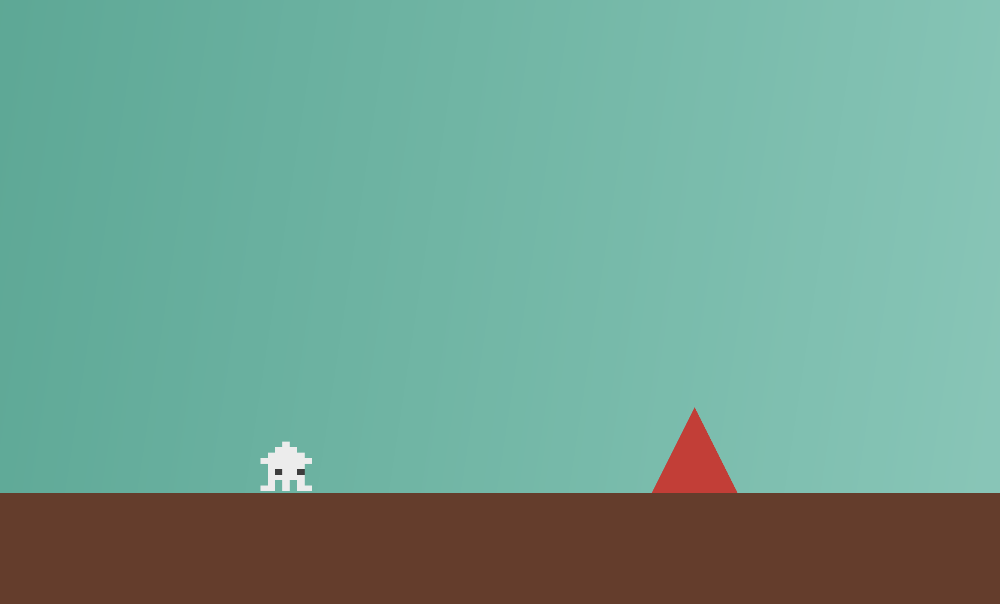
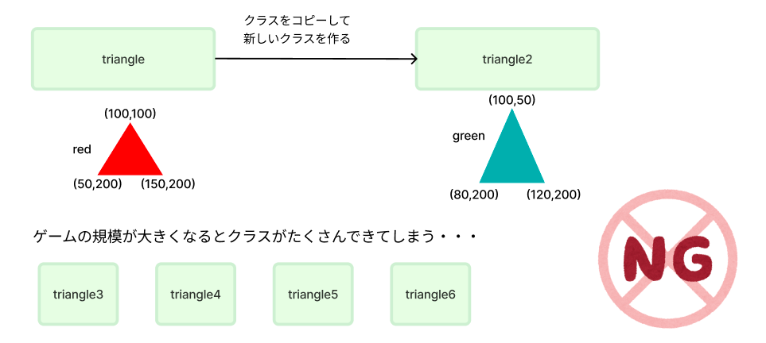
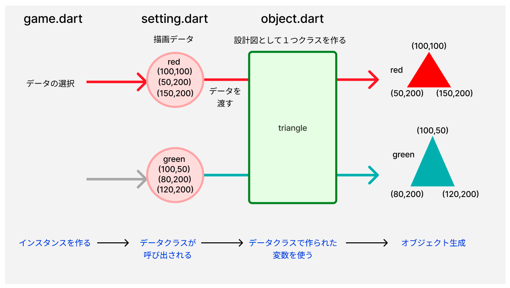
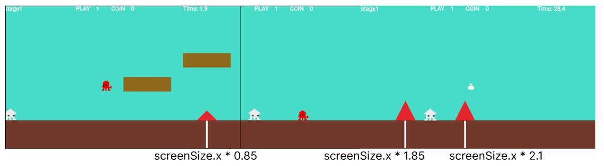
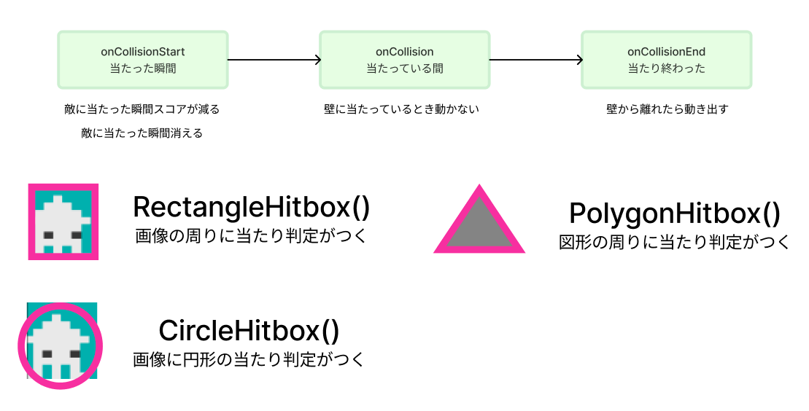
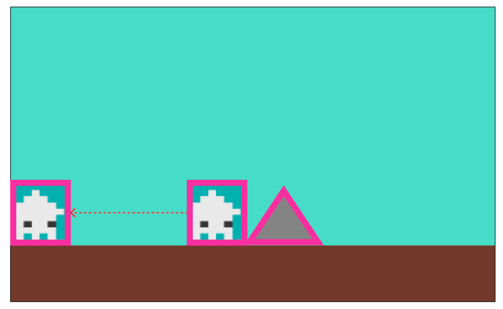
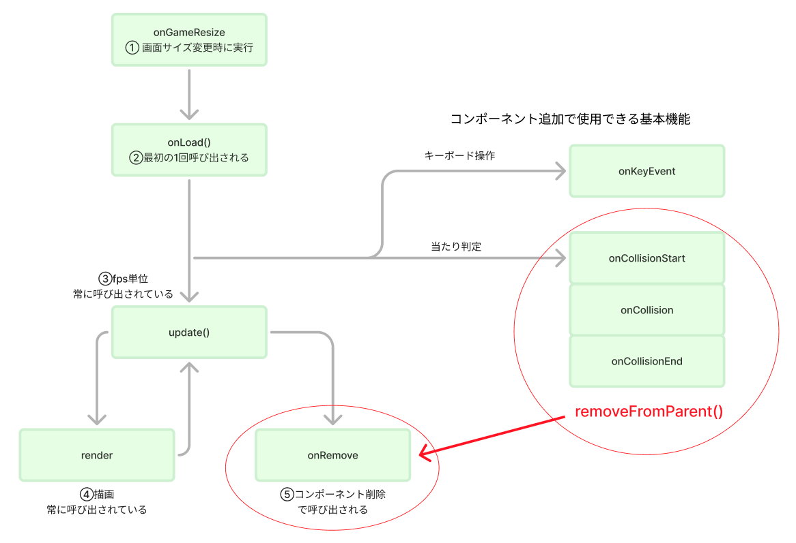

# **05_障害物を追加（図形を描画）**

## **この単元でやること**

1. 図形を描画してみよう
2. 複数のオブジェクトを作る
3. 当たり判定（オブジェクトを消す）ヒットボックス
4. オブジェクトをリセット

## **1. 図形を描画しよう**



**【object.dart】**

object.dartを新規作成

```dart

import 'package:flutter/material.dart';
import 'package:flame/components.dart';
import 'game.dart';

class triangle extends RectangleComponent with HasGameRef<MainGame> {
  @override
  Future<void> onLoad() async {
    // print("triangle");
    paint = Paint()..color = Color.fromARGB(255, 211, 46, 46);

    anchor = Anchor.topCenter;
  }

  @override
  Future<void> render(Canvas canvas) async {
    super.render(canvas);
    final path = Path();
    path.moveTo(500, 400);
    path.lineTo(450, 500);
    path.lineTo(550, 500);
    path.close();
    canvas.drawPath(path, paint);

    // パスをキャンバスに描画
    canvas.drawPath(path, paint);
  }
}

```

**【game.dart】**

```dart

import 'package:flame/game.dart';
import 'package:flutter/material.dart';
import 'package:flame/input.dart';
import 'package:flame/camera.dart';
import 'package:flame/components.dart';
import 'screen.dart';
import 'player.dart';
import 'setting.dart';
import 'object.dart'; //⭐️追加

Future<void> objectRemove() async {
    await CameraRemove();

    //背景（worldを追加）
    CameraBackScreen backscreen = CameraBackScreen();
    await world.add(backscreen);
    //地面（worldを追加）
    Cameraground ground = Cameraground();
    await world.add(ground);
    //プレイヤー（インスタンスをグローバルに設定）
    player = Player();
    await world.add(player);

    //⭐️追加
    triangle _triangle = triangle();
    await world.add(_triangle);
}

```




## **2. 複数のオブジェクトを作る**






１で作った三角形のオブジェクトは頂点の値がtriangleで指定されています  
同じような三角形を作る時、classを何個も作るのは大変



<br><br><br>

**ベースになる設計図(class)を作成、描画データを設計図に渡し、オブジェクトを作成する**




<br><br>

### **①データの設計図を作る**

**【setting.dart】**

三角形を作るためのデータ設計図（データクラス）

```dart

//コンストラクタ
class TriangleData {
  final int idx;
  final Color color;
  final double pos_x1;
  final double pos_y1;
  final double pos_x2;
  final double pos_y2;
  final double pos_x3;
  final double pos_y3;

  TriangleData({
    required this.idx,
    required this.color,
    required this.pos_x1,
    required this.pos_y1,
    required this.pos_x2,
    required this.pos_y2,
    required this.pos_x3,
    required this.pos_y3,
  });
}

//イニシャライザ
List<TriangleData> triangleList = [
  TriangleData(
    idx: 0,
    color: Color.fromARGB(255, 211, 46, 46),
    pos_x1: screenSize.x * 0.85,
    pos_y1: Y_GROUND_POSITION - 50,
    pos_x2: screenSize.x * 0.85 - 50,
    pos_y2: Y_GROUND_POSITION,
    pos_x3: screenSize.x * 0.85 + 50,
    pos_y3: Y_GROUND_POSITION,
  ),
  TriangleData(
    idx: 1,
    color: Color.fromARGB(255, 211, 46, 46),
    pos_x1: screenSize.x * 1.85,
    pos_y1: Y_GROUND_POSITION - 100,
    pos_x2: screenSize.x * 1.85 - 50,
    pos_y2: Y_GROUND_POSITION,
    pos_x3: screenSize.x * 1.85 + 50,
    pos_y3: Y_GROUND_POSITION,
  ),
  TriangleData(
    idx: 2,
    color: Color.fromARGB(255, 211, 46, 46),
    pos_x1: screenSize.x * 2.1,
    pos_y1: Y_GROUND_POSITION - 100,
    pos_x2: screenSize.x * 2.1 - 50,
    pos_y2: Y_GROUND_POSITION,
    pos_x3: screenSize.x * 2.1 + 50,
    pos_y3: Y_GROUND_POSITION,
  ),
];

```



### **②オブジェクトを作る　データを引数で渡す**

**【game.dart】**

作りたいオブジェクトのインデックス番号を指定する

```dart

//⭐️　引数にデータを渡す
triangle _triangle = triangle(triangleList[0]);
    await world.add(_triangle);

//⭐️ もう一つ作る
triangle _triangle1 = triangle(triangleList[1]);
    await world.add(_triangle1);

triangle _triangle2 = triangle(triangleList[2]);
    await world.add(_triangle2);
```

### **③受け取ったデータを元にオブジェクトを作る**

**【object.dart】**

```dart

import 'package:flutter/material.dart';
import 'package:flame/components.dart';
import 'game.dart';
import 'setting.dart'; //⭐️追加

class triangle extends RectangleComponent with HasGameRef<MainGame> {
    //⭐️　データ受け取り
  triangle(this.data);
  final TriangleData data;

  @override
  Future<void> onLoad() async {
    // print("triangle");
    //⭐️ dataに置き換える
    paint = Paint()..color = data.color;

    anchor = Anchor.topCenter;
  }

  @override
  Future<void> render(Canvas canvas) async {
    super.render(canvas);
    final path = Path();
    //⭐️ dataに置き換える
    path.moveTo(data.pos_x1, data.pos_y1);
    path.lineTo(data.pos_x2, data.pos_y2);
    path.lineTo(data.pos_x3, data.pos_y3);
    path.close();
    canvas.drawPath(path, paint);

    // パスをキャンバスに描画
    canvas.drawPath(path, paint);
  }
}

```

<br><br>

## **3.当たり判定**

プレーヤーとオブジェクトが当たったらプレーヤーを先頭に戻す

<br><br>

**onCollision関数の流れと当たり判定の範囲Hitbox**



<br><br>



**【game.dart】**

```dart

// ⭐️HasCollisionDetectionをミックスイン
class MainGame extends FlameGame
    with HasKeyboardHandlerComponents, HasCollisionDetection {


```

**【player.dart】**

```dart

import 'package:flame/components.dart';
import 'package:flutter/services.dart';
import 'package:flame/collisions.dart'; //⭐️追加
import 'game.dart';
import 'setting.dart';
import 'object.dart'; //⭐️追加

//⭐️CollisionCallbacksを追加
class Player extends SpriteAnimationComponent
    with HasGameRef<MainGame>, KeyboardHandler, CollisionCallbacks {

    //省略

    @override
    Future<void> onLoad() async {
        //省略
    
        //⭐️あたり判定範囲
        add(RectangleHitbox());
    }

    //⭐️追加（update関数の上に追加）
    @override
    // 当たった瞬間の処理（敵に当たった瞬間消える、スコアが減るなど）
    void onCollisionStart(
        Set<Vector2> intersectionPoints,
        PositionComponent other,
    ) {
        // 障害物に当たったら
        if (other is triangle) {
        // プレーヤーを消す→onRemove()関数が呼び出される
        removeFromParent();
        }
    }

    @override
    // 当たっている間の処理（壁に当たっている間動かないなど）
    void onCollision(Set<Vector2> intersectionPoints, PositionComponent other) {}

    @override
    // 当たり終わった時の処理
    void onCollisionEnd(PositionComponent other) {}
    //⭐️ここまで

    //省略

    //⭐️一番下に追加
    // 消えた時の処理
    @override
    Future<void> onRemove() async {
        // もう一回表示
        await gameRef.objectRemove();

        super.onRemove();
    }

}

```



**【object.dart】**

```dart

import 'package:flutter/material.dart';
import 'package:flame/components.dart';
import 'package:flame/collisions.dart';//⭐️追加
import 'game.dart';
import 'setting.dart';

//⭐️CollisionCallbacksをミックスイン
class triangle extends RectangleComponent
    with HasGameRef<MainGame>, CollisionCallbacks {
        triangle(this.data);
  final TriangleData data;

  @override
  Future<void> onLoad() async {
    // print("triangle");
    //settingデータを設定
    paint = Paint()..color = data.color;

    anchor = Anchor.topCenter;
    
    // ⭐️当たり判定用範囲
    add(PolygonHitbox([
      Vector2(data.pos_x1, data.pos_y1),
      Vector2(data.pos_x2, data.pos_y2),
      Vector2(data.pos_x3, data.pos_y3),
    ])
      ..collisionType = CollisionType.passive);
  }

    //省略

}

```

オブジェクトに当たるとすぐに先頭に戻ってしまう・・・

### **時間差で戻る演出**

**【player.dart】**

```dart
@override
  Future<void> onLoad() async {
    //省略


    size = Vector2(PLAYER_SIZE_X, PLAYER_SIZE_Y);
    //⭐️　PLAYER_SIZE_Y / 2　→　100に変更
    position =
        Vector2(PLAYER_SIZE_X / 2, Y_GROUND_POSITION - 100);
    anchor = Anchor.center;
    priority = 10;
    add(RectangleHitbox());
  }
```

## **4. オブジェクトをリセット**

一度addしたオブジェクトは削除しないかぎりコンピューター上の保存されている  
プレーヤーが先頭に戻った時、表示していたオブジェクトをずべて削除してリセットする必要がある

**【game.dart】**

```dart

Future<void> objectRemove() async {
    //⭐️コンポーネントを全部削除する（worldにaddしたデータを一つずつ削除）
    final List<Component> childrenToRemove = world.children.toList();
    for (var child in childrenToRemove) {
      child.removeFromParent();
    }

    await CameraRemove();

    //背景
    CameraBackScreen backscreen = CameraBackScreen();
    await world.add(backscreen);
    //地面
    Cameraground ground = Cameraground();
    await world.add(ground);
    //プレイヤー
    player = Player();
    await world.add(player);
    //障害物
    triangle _triangle = triangle(triangleList[0]);
    await world.add(_triangle);
  }

```

<br><br><br>


### **【ここまでのソースコード】**

**【game.dart】**

```dart

import 'package:flame/game.dart';
import 'package:flutter/material.dart';
import 'package:flame/input.dart';
import 'package:flame/camera.dart';
import 'package:flame/components.dart';
import 'screen.dart';
import 'player.dart';
import 'setting.dart';
import 'object.dart';

late Vector2 screenSize;

class MainGame extends FlameGame
    with HasKeyboardHandlerComponents, HasCollisionDetection {
  final BuildContext context;
  MainGame(this.context);

  // カメラコンポーネントの追加
  late final CameraComponent cameraComponent;
  Player player = Player();

  @override
  void onGameResize(Vector2 size) {
    super.onGameResize(size);
    screenSize = size;
  }

  @override
  Future<void> onLoad() async {
    super.onLoad();
    screenSize = size;

    //worldを作る
    world = World();
    add(world);

    //カメラコンポーネントを作る
    cameraComponent = CameraComponent.withFixedResolution(
      width: screenSize.x,
      height: screenSize.y,
    );

    //worldの一部を切り取ってカメラに表示する
    cameraComponent.world = world;

    //デフォルトのカメラをcameraComponentに置き換える
    camera = cameraComponent;

    //コンポーネント追加
    await add(cameraComponent);

    await objectRemove();
  }

  Future<void> objectRemove() async {
    final List<Component> childrenToRemove = world.children.toList();
    for (var child in childrenToRemove) {
      child.removeFromParent();
    }

    //カメラの初期値設定（関数呼び出し）
    await CameraRemove();

    CameraBackScreen backscreen = CameraBackScreen();
    await world.add(backscreen);

    Cameraground ground = Cameraground();
    await world.add(ground);

    player = Player();
    await world.add(player);

    triangle _triangle = triangle(triangleList[0]);
    await world.add(_triangle);

    triangle _triangle1 = triangle(triangleList[1]);
    await world.add(_triangle1);

    triangle _triangle2 = triangle(triangleList[2]);
    await world.add(_triangle2);
  }

  Future<void> CameraRemove() async {
    cameraComponent.viewfinder.anchor =
        Anchor(CAMERA_POSITION_X, CAMERA_POSITION_Y);
    cameraComponent.viewfinder.position = Vector2.zero();
    cameraComponent.viewfinder.zoom = 1.0;
  }

  @override
  void update(double dt) {
    super.update(dt);

    if (player.position.x > VIEW_X_START && player.position.x < VIEW_X_END) {
      //プレイヤーに追従する
      cameraComponent.viewfinder.position =
          Vector2(player.position.x, Y_GROUND_POSITION);
    } else {
      if (player.position.x > VIEW_X_END) {
        // 範囲外になったら追従しない
        cameraComponent.viewfinder.position =
            Vector2(VIEW_X_END, Y_GROUND_POSITION);
      } else {
        // 範囲まで追従しない
        cameraComponent.viewfinder.position =
            Vector2(VIEW_X_START, Y_GROUND_POSITION);
      }
    }
    cameraComponent.update(dt);
  }
}


```


**【player.dart】**

```dart

import 'package:flame/components.dart';
import 'package:flutter/services.dart';
import 'package:flame/collisions.dart';
import 'game.dart';
import 'setting.dart';
import 'object.dart';

class Player extends SpriteAnimationComponent
    with HasGameRef<MainGame>, KeyboardHandler, CollisionCallbacks {
  //速度の指定
  Vector2 velocity = Vector2.zero();
  //移動速度
  double moveSpeed = 200;
  //ジャンプ力
  double jumpForce = 500;
  //重力
  double gravity = 800;
  //地面にいるかの判定
  bool isOnGround = false;

  //各方向のスプライト
  late SpriteAnimation leftAnimation;
  late SpriteAnimation rightAnimation;
  late SpriteAnimation stop_leftAnimation;
  late SpriteAnimation stop_rightAnimation;

  //方向フラグ（どちらを向いているか）
  bool leftflg = false;
  bool rightflg = false;

  @override
  Future<void> onLoad() async {
    // sprite = await Sprite.load('ika2.png');

    //スプライトロード
    final leftSprites = [
      await gameRef.loadSprite('ika.png'),
    ];
    final rightSprites = [
      await gameRef.loadSprite('ika2.png'),
    ];
    final stop_leftSprites = [
      await gameRef.loadSprite('ika.png'),
      await gameRef.loadSprite('ika_up.png'),
    ];
    final stop_rightSprites = [
      await gameRef.loadSprite('ika2.png'),
      await gameRef.loadSprite('ika2_up.png'),
    ];

    //アニメーション（画像切り替え）
    leftAnimation = SpriteAnimation.spriteList(leftSprites, stepTime: 0.2);
    rightAnimation = SpriteAnimation.spriteList(rightSprites, stepTime: 0.2);

    stop_leftAnimation =
        SpriteAnimation.spriteList(stop_leftSprites, stepTime: 0.2);
    stop_rightAnimation =
        SpriteAnimation.spriteList(stop_rightSprites, stepTime: 0.2);

    //最初に表示するアニメーション
    animation = stop_rightAnimation;

    size = Vector2(PLAYER_SIZE_X, PLAYER_SIZE_Y);
    position = Vector2(PLAYER_SIZE_X / 2, Y_GROUND_POSITION - 100);
    anchor = Anchor.center;
    priority = 10;
    add(RectangleHitbox());
  }

  //キーボード操作
  @override
  bool onKeyEvent(
    KeyEvent event,
    Set<LogicalKeyboardKey> keysPressed,
  ) {
    if (event is KeyDownEvent) {
      leftflg = false;
      rightflg = false;

      //左矢印押した時
      if (keysPressed.contains(LogicalKeyboardKey.arrowLeft)) {
        leftflg = true;
        moveLeft();
        //スペースキー押した時
        if (keysPressed.contains(LogicalKeyboardKey.space)) {
          jump();
        }
        //右矢印押した時
      } else if (keysPressed.contains(LogicalKeyboardKey.arrowRight)) {
        rightflg = true;
        moveRight();
        // スペースキー押した時
        if (keysPressed.contains(LogicalKeyboardKey.space)) {
          jump();
        }
        //スペースキー押した時
      } else if (keysPressed.contains(LogicalKeyboardKey.space)) {
        jump();
      }
    } else if (event is KeyUpEvent) {
      stopMovement();
    }
    return true;
  }

  // 左移動
  void moveLeft() {
    velocity.x = -moveSpeed;
    if (animation != leftAnimation) {
      animation = leftAnimation;
    }
  }

  // 右移動
  void moveRight() {
    velocity.x = moveSpeed;
    if (animation != rightAnimation) {
      animation = rightAnimation;
    }
  }

  // ストップ
  void stopMovement() {
    velocity.x = 0;
    if (leftflg) {
      animation = stop_leftAnimation;
    }
    if (rightflg) {
      animation = stop_rightAnimation;
    }
  }

  // ジャンプ
  void jump() {
    if (isOnGround) {
      velocity.y = -jumpForce;
      isOnGround = false;
    }
  }

  @override
  // 当たった瞬間の処理（敵に当たった瞬間消える、スコアが減るなど）
  void onCollisionStart(
    Set<Vector2> intersectionPoints,
    PositionComponent other,
  ) {
    // 障害物に当たったら
    if (other is triangle) {
      // プレーヤーを消す→onRemove()関数が呼び出される
      removeFromParent();
    }
  }

  @override
  // 当たっている間の処理（壁に当たっている間動かないなど）
  void onCollision(Set<Vector2> intersectionPoints, PositionComponent other) {}

  @override
  // 当たり終わった時の処理
  void onCollisionEnd(PositionComponent other) {}

  @override
  void update(double dt) {
    super.update(dt);

    //重力をかける
    applyGravity(dt, gravity);
    //地面との衝突を確認
    checkGroundCollision();

    if (position.x < size.x / 2) {
      position.x = size.x / 2;
    }

    //ポジションを変える
    position += velocity * dt;
  }

  void applyGravity(double dt, double gravity) {
    if (!isOnGround) {
      velocity.y += gravity * dt; // 速度に重力を適用して下降
    }

    position += velocity * dt; // 速度に基づいてキャラクターの位置を更新（下に移動する）
  }

  void checkGroundCollision() {
    // 地面より下には行かないようにする
    if (position.y >= Y_GROUND_POSITION - size.y / 2) {
      //地上にいるフラグ
      isOnGround = true;
      //常に地面の上にいるようにする
      position.y = Y_GROUND_POSITION - size.y / 2;
      //速度は0
      velocity.y = 0;
    } else {
      //地上にいないフラグ（空中）
      isOnGround = false;
    }
  }

  @override
  Future<void> onRemove() async {
    // もう一回表示
    await gameRef.objectRemove();

    super.onRemove();
  }
}


```


**【object.dart】**

```dart

import 'package:flutter/material.dart';
import 'package:flame/components.dart';
import 'package:flame/collisions.dart';
import 'game.dart';
import 'setting.dart';

class triangle extends RectangleComponent
    with HasGameRef<MainGame>, CollisionCallbacks {
  triangle(this.data);
  final TriangleData data;

  @override
  Future<void> onLoad() async {
    // print("triangle");
    paint = Paint()..color = data.color;

    anchor = Anchor.topCenter;

    add(PolygonHitbox([
      Vector2(data.pos_x1, data.pos_y1),
      Vector2(data.pos_x2, data.pos_y2),
      Vector2(data.pos_x3, data.pos_y3),
    ])
      ..collisionType = CollisionType.passive);
  }

  @override
  Future<void> render(Canvas canvas) async {
    super.render(canvas);
    final path = Path();
    path.moveTo(data.pos_x1, data.pos_y1);
    path.lineTo(data.pos_x2, data.pos_y2);
    path.lineTo(data.pos_x3, data.pos_y3);
    path.close();
    canvas.drawPath(path, paint);

    // パスをキャンバスに描画
    canvas.drawPath(path, paint);
  }
}


```

**【setting.dart】**

```dart

import 'package:flutter/material.dart';
import 'game.dart';

//スクリーンサイズ４つ分
final FIELD_SIZE_X = screenSize.x * 4;
//スクリーンの高さと同じ
final FIELD_SIZE_Y = screenSize.y;

//地面の位置をスクリーンの高さの80%の位置にする
final Y_GROUND_POSITION = screenSize.y * 0.8;

final PLAYER_SIZE_X = 60.0;
final PLAYER_SIZE_Y = 60.0;

final CAMERA_POSITION_X = 0.3;
final CAMERA_POSITION_Y = 0.8;

final VIEW_X_START = screenSize.x * CAMERA_POSITION_X;
final VIEW_X_END = FIELD_SIZE_X - screenSize.x * (1 - CAMERA_POSITION_X);

//コンストラクタ
class TriangleData {
  final int idx;
  final Color color;
  final double pos_x1;
  final double pos_y1;
  final double pos_x2;
  final double pos_y2;
  final double pos_x3;
  final double pos_y3;

  TriangleData({
    required this.idx,
    required this.color,
    required this.pos_x1,
    required this.pos_y1,
    required this.pos_x2,
    required this.pos_y2,
    required this.pos_x3,
    required this.pos_y3,
  });
}

//イニシャライザ
List<TriangleData> triangleList = [
  TriangleData(
    idx: 0,
    color: Color.fromARGB(255, 211, 46, 46),
    pos_x1: screenSize.x * 0.85,
    pos_y1: Y_GROUND_POSITION - 50,
    pos_x2: screenSize.x * 0.85 - 50,
    pos_y2: Y_GROUND_POSITION,
    pos_x3: screenSize.x * 0.85 + 50,
    pos_y3: Y_GROUND_POSITION,
  ),
  TriangleData(
    idx: 1,
    color: Color.fromARGB(255, 211, 46, 46),
    pos_x1: screenSize.x * 1.85,
    pos_y1: Y_GROUND_POSITION - 100,
    pos_x2: screenSize.x * 1.85 - 50,
    pos_y2: Y_GROUND_POSITION,
    pos_x3: screenSize.x * 1.85 + 50,
    pos_y3: Y_GROUND_POSITION,
  ),
  TriangleData(
    idx: 2,
    color: Color.fromARGB(255, 211, 46, 46),
    pos_x1: screenSize.x * 2.1,
    pos_y1: Y_GROUND_POSITION - 100,
    pos_x2: screenSize.x * 2.1 - 50,
    pos_y2: Y_GROUND_POSITION,
    pos_x3: screenSize.x * 2.1 + 50,
    pos_y3: Y_GROUND_POSITION,
  ),
];


```
