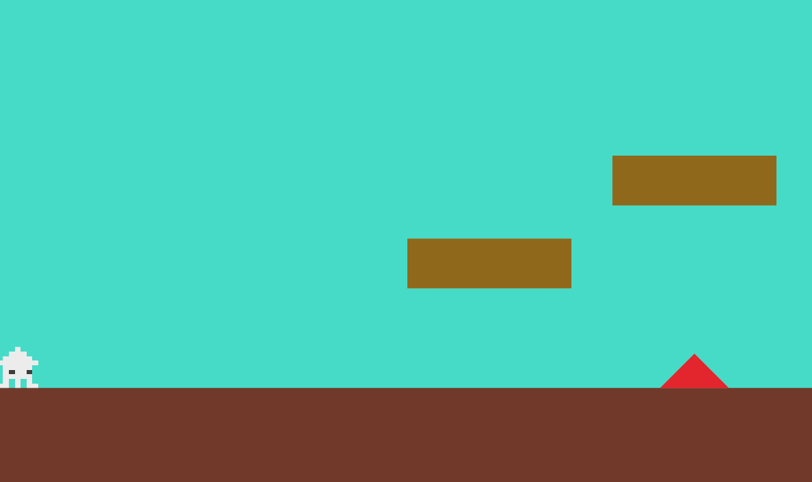

# **06_障害物とプレヤーの位置**

## **この単元でやること**

1. 四角形を描画
2. オブジェクトの上に乗る（当たり判定）
3. オブジェクトを追加してみよう

## **1. 四角形を描画**


### **①データ作成**

**【setting.dart】**

```dart

class StepData {
  final int idx;
  final Color color;
  final double size_x;
  final double size_y;
  final double pos_x;
  final double pos_y;
  final double start_pos_x;
  final double start_pos_y;
  final double end_pos_x;
  final double end_pos_y;

  StepData({
    required this.idx,
    required this.color,
    required this.size_x,
    required this.size_y,
    required this.pos_x,
    required this.pos_y,
    required this.start_pos_x,
    required this.start_pos_y,
    required this.end_pos_x,
    required this.end_pos_y,
  });
}

List<StepData> steplist = [
  StepData(
    idx: 0,
    color: Color.fromARGB(255, 136, 107, 0),
    size_x: screenSize.x * 0.2,
    size_y: screenSize.y * 0.1,
    pos_x: screenSize.x / 2,
    pos_y: screenSize.y / 2,
    start_pos_x: screenSize.x / 2 - PLAYER_SIZE_X / 2,
    start_pos_y: screenSize.y / 2 - PLAYER_SIZE_Y / 2,
    end_pos_x: screenSize.x / 2 + screenSize.x * 0.2 + PLAYER_SIZE_X / 2,
    end_pos_y: screenSize.y / 2 + screenSize.y * 0.1 + PLAYER_SIZE_Y / 2,
  ),
];

```

### **②class呼び出し**

**【game.dart】**

```dart

Future<void> objectRemove() async {
    //省略

    //⭐️追加
    step _step = step(steplist[0]);
    await world.add(_step);

}


```

この時点では、class「step」が作られていないのでエラーになります。

### **③オブジェクトを作る**

**【object.dart】**

```dart

class step extends RectangleComponent with HasGameRef<MainGame> {
  step(this.data);
  final StepData data;

  @override
  Future<void> onLoad() async {
    paint = Paint()..color = data.color;
    position = Vector2(data.pos_x, data.pos_y);
    size = Vector2(data.size_x, data.size_y);
    anchor = Anchor.topLeft;
    add(RectangleHitbox());
  }

  @override
  Future<void> render(Canvas canvas) async {
    super.render(canvas);
  }
}


```

## **2. オブジェクトの上に乗る（当たり判定）**

上に当たったら登れる
下に当たったら跳ね返る

onCollision関数の中に書く

### **オブジェクトのどの位置に当たったかの判定**  

onCollisionでオブジェクトに当たったかどうか検知することができるが 
どの部分に当たったかは座標位置でしか判定することができない  

**①各辺（上下左右）との距離を測る**


<br><br>

**②一番距離が短い辺が当たった場所**


<br><br>

**③当たった場所により処理を変える**


<br><br>

**【player.dart】**

```dart

void onCollision(Set<Vector2> intersectionPoints, PositionComponent other) {
    
    if (other is step) {
      // プレーヤーの各辺と障害物の各辺の位置を取得
      final playerRight = this.x + this.width;
      final playerLeft = this.x;
      final playerBottom = this.y + this.height;
      final playerTop = this.y;

      final obstacleRight = other.x + other.width + this.width;
      final obstacleLeft = other.x;
      final obstacleBottom = other.y + other.height;
      final obstacleTop = other.y;

      // 各方向の距離を計算
      final double rightDistance = (playerRight - obstacleLeft).abs();
      final double leftDistance = (playerLeft - obstacleRight).abs();
      final double bottomDistance = (playerBottom - obstacleTop).abs();
      final double topDistance = (playerTop - obstacleBottom).abs();

      // 最小の距離に基づいて衝突方向を判定
      double minDistance = [
        rightDistance,
        leftDistance,
        bottomDistance,
        topDistance
      ].reduce((a, b) => a < b ? a : b);

      if (minDistance == rightDistance) {
        //左から当たった
        position.x = other.x - this.width / 2;
      } else if (minDistance == leftDistance) {
        //右から当たった
        position.x = other.x + other.width + this.width / 2;
      } else if (minDistance == bottomDistance) {
        //上から当たった
        position.y = other.y - this.height / 2;
        velocity.y = 0;
        isOnGround = true;
      } else if (minDistance == topDistance) {
        //下から当たった
        velocity.y += gravity;
      }
    }
  }

```

thisは`player`、otherは`step`を指している


### **【解説】**

```dart
double minDistance = [
          rightDistance,
          leftDistance,
          bottomDistance,
          topDistance
        ].reduce((a, b) => a < b ? a : b);
```

**reduce メソッド**  
- リストの要素を順に 2 つずつ比較して、1 つの結果にまとめる

**ラムダ式 (a, b) => a < b ? a : b**  
- a < b ? a : b は、a と b を比較して、小さい方の値を返す
- reduce はリストの先頭から順番に 2 つの要素を取り出し、このラムダ式で比較し、小さい方を次の要素と再び比較

<br><br>

## **3. オブジェクトを追加してみよう**



**【setting.dart】**

```dart

List<StepData> steplist = [
  StepData(
    idx: 0,
    color: Color.fromARGB(255, 136, 107, 0),
    size_x: screenSize.x * 0.2,
    size_y: screenSize.y * 0.1,
    pos_x: screenSize.x / 2,
    pos_y: screenSize.y / 2,
    start_pos_x: screenSize.x / 2 - PLAYER_SIZE_X / 2,
    start_pos_y: screenSize.y / 2 - PLAYER_SIZE_Y / 2,
    end_pos_x: screenSize.x / 2 + 200 + PLAYER_SIZE_X / 2,
    end_pos_y: screenSize.y / 2 + PLAYER_SIZE_Y / 2,
  ),
  //⭐️追加
  StepData(
    idx: 1,
    color: Color.fromARGB(255, 136, 107, 0),
    size_x: screenSize.x * 0.2,
    size_y: screenSize.y * 0.1,
    pos_x: screenSize.x * 3 / 4,
    pos_y: screenSize.y * 1 / 3,
    start_pos_x: screenSize.x * 3 / 4 - PLAYER_SIZE_X / 2,
    start_pos_y: screenSize.y * 1 / 3 - PLAYER_SIZE_Y / 2,
    end_pos_x: screenSize.x * 3 / 4 + 200 + PLAYER_SIZE_X / 2,
    end_pos_y: screenSize.y * 1 / 3 + PLAYER_SIZE_Y / 2,
  ),
];

```

**【game.dart】**

```dart

Future<void> objectRemove() async {
    //省略

    //⭐️追加
    step _step1 = step(steplist[1]);
    await world.add(_step1);
  }

```
