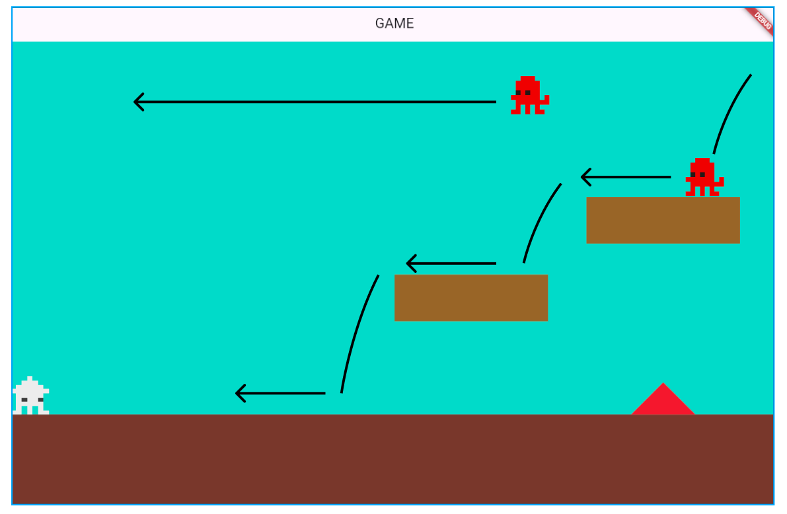
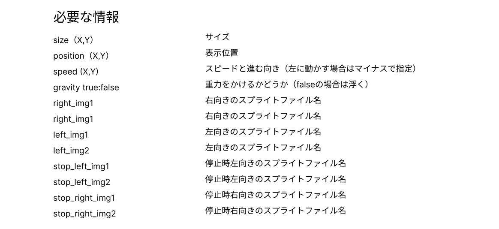
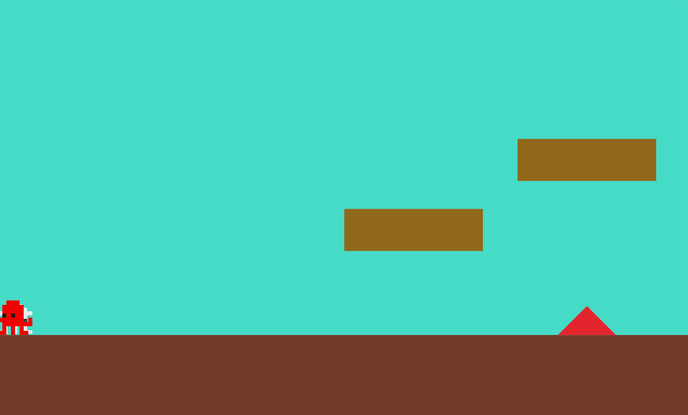
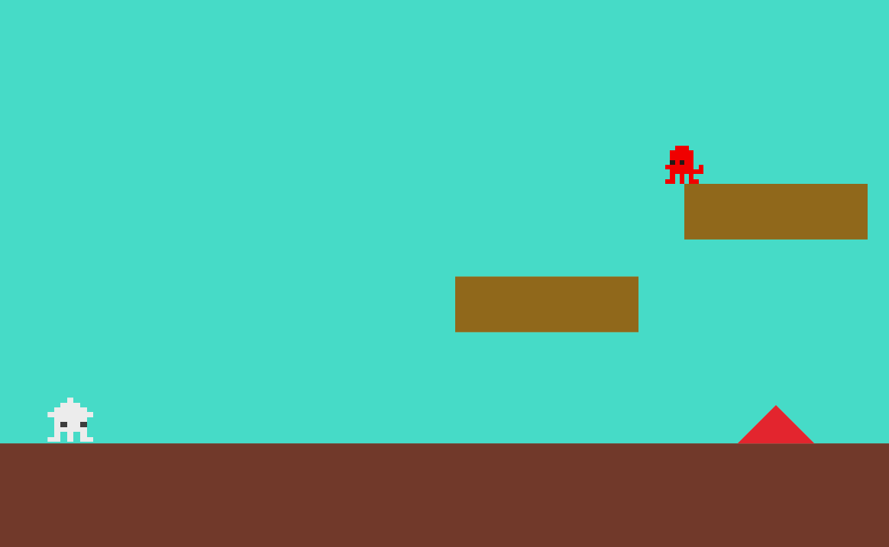
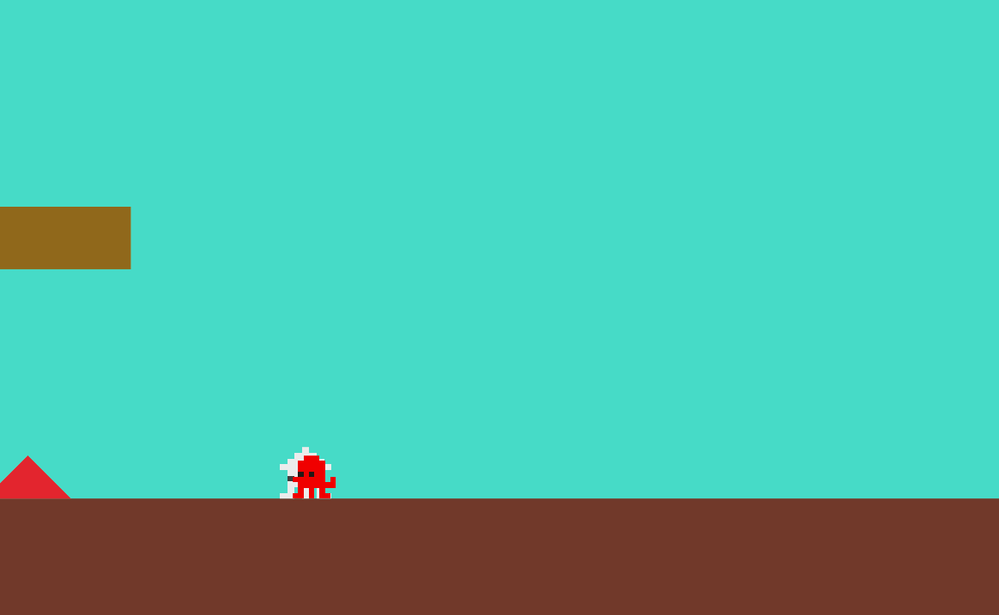
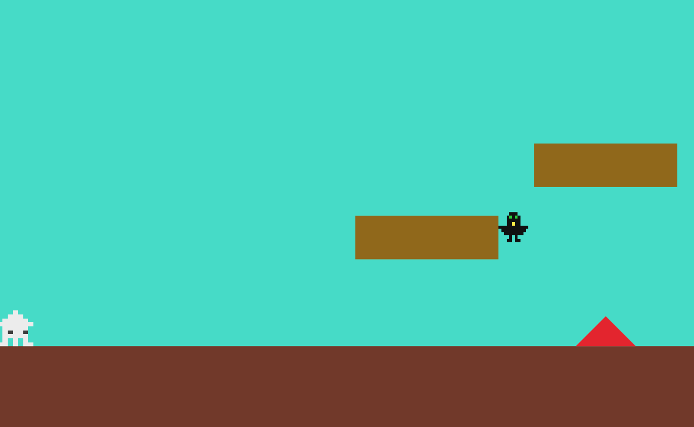
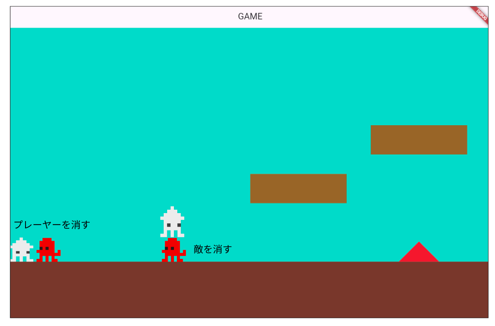
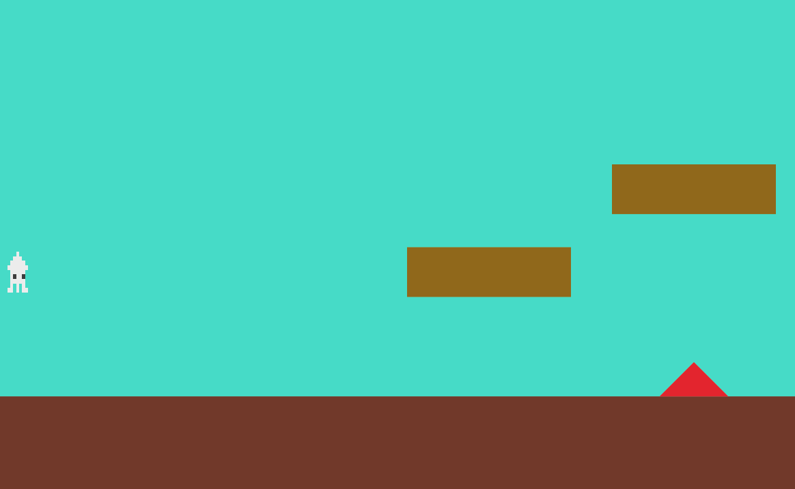
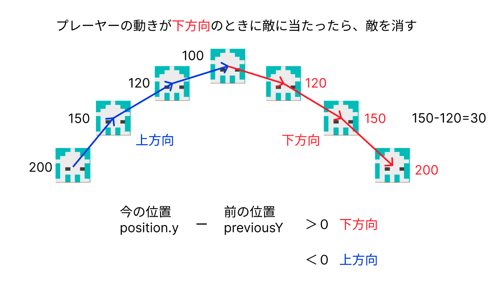

# **07_敵の表示**
（目安：3回）

## **この単元でやること**

1. teki.dartの作成
2. 位置の変更（データから取ってくる）
3. 敵の動き、敵を増やす
4. 当たり判定（負け、倒す）

## **敵の表示**




### **①player.dartをコピー**

player.dartをコピーしてteki.dartを作成
class名を「Teki」にする

```dart

class Teki extends SpriteAnimationComponent
    with HasGameRef<MainGame>, KeyboardHandler, CollisionCallbacks {

//省略

}

```

### **②敵スプライトに変更、ポジション**

```dart

final leftSprites = [
    await gameRef.loadSprite('tako.png'),
];
final rightSprites = [
    await gameRef.loadSprite('tako.png'),
];
final stop_leftSprites = [
    await gameRef.loadSprite('tako.png'),
    await gameRef.loadSprite('tako.png'),
];
final stop_rightSprites = [
    await gameRef.loadSprite('tako.png'),
    await gameRef.loadSprite('tako.png'),
];

```

### **③キーボード操作のプログラムを削除**

```dart

// ==============================
  // キーボード操作
  // @override
  // bool onKeyEvent(
  //   KeyEvent event,
  //   Set<LogicalKeyboardKey> keysPressed,
  // ) {
  //   if (event is KeyDownEvent) {
  //     if (keysPressed.contains(LogicalKeyboardKey.arrowLeft)) {
  //       leftflg = true;
  //       upflg = false;
  //       downflg = false;
  //       rightflg = false;
  //       moveLeft();
  //       if (keysPressed.contains(LogicalKeyboardKey.space)) {
  //         leftflg = false;
  //         upflg = false;
  //         downflg = false;
  //         rightflg = false;
  //         jump();
  //       }
  //     } else if (keysPressed.contains(LogicalKeyboardKey.arrowRight)) {
  //       leftflg = false;
  //       upflg = false;
  //       downflg = false;
  //       rightflg = true;
  //       moveRight();
  //       if (keysPressed.contains(LogicalKeyboardKey.space)) {
  //         leftflg = false;
  //         upflg = false;
  //         downflg = false;
  //         rightflg = false;
  //         jump();
  //       }
  //     } else if (keysPressed.contains(LogicalKeyboardKey.space)) {
  //       leftflg = false;
  //       upflg = false;
  //       downflg = false;
  //       rightflg = false;
  //       jump();
  //     }
  //   } else if (event is KeyUpEvent) {
  //     stopMovement();
  //   }
  //   return true;
  // }

  // // 左移動
  // void moveLeft() {
  //   velocity.x = -moveSpeed;
  //   if (animation != leftAnimation) {
  //     animation = leftAnimation;
  //   }
  // }

  // // 右移動
  // void moveRight() {
  //   velocity.x = moveSpeed;
  //   if (animation != rightAnimation) {
  //     animation = rightAnimation;
  //   }
  // }

  // // ストップ
  // void stopMovement() {
  //   velocity.x = 0;
  //   if (leftflg) {
  //     animation = stop_leftAnimation;
  //   }
  //   if (upflg) {
  //     animation = stop_upAnimation;
  //   }
  //   if (rightflg) {
  //     animation = stop_rightAnimation;
  //   }
  //   if (downflg) {
  //     animation = stop_downAnimation;
  //   }
  // }

  // // ジャンプ
  // void jump() {
  //   // 地上にいるときだけジャンプできる
  //   if (isOnGround) {
  //     velocity.y = -jumpForce;
  //     isOnGround = false;
  //   }
  // }

```

### **④Tekiクラス呼び出し**

**【game.dart】**

```dart

import 'teki.dart'; //⭐️追加

//省略

Future<void> objectRemove() async {
    final List<Component> childrenToRemove = world.children.toList();
    for (var child in childrenToRemove) {
      child.removeFromParent();
    }

    await CameraRemove();

    //背景（worldを追加）
    CameraBackScreen backscreen = CameraBackScreen();
    await world.add(backscreen);
    //地面（worldを追加）
    Cameraground ground = Cameraground();
    await world.add(ground);
    //プレイヤー（インスタンスをグローバルに設定）
    player = Player();
    await world.add(player);

    triangle _triangle = triangle(triangleList[0]);
    await world.add(_triangle);

    triangle _triangle1 = triangle(triangleList[1]);
    await world.add(_triangle1);

    step _step = step(steplist[0]);
    await world.add(_step);

    step _step1 = step(steplist[1]);
    await world.add(_step1);

    //⭐️追加
    Teki _teki1 = Teki();
    await world.add(_teki1);
  }


```




## **2. 位置の変更（データから取ってくる）**

### **①位置データの作成**

**【setting.dart】**

```dart

class TekiData {
  final int idx;
  final double size_x;
  final double size_y;
  final double pos_x;
  final double pos_y;
  final double speed_x;
  final double speed_y;
  final bool gravity;
  final String right_img1;
  final String right_img2;
  final String left_img1;
  final String left_img2;
  final String stop_left_img1;
  final String stop_left_img2;
  final String stop_right_img1;
  final String stop_right_img2;

  TekiData({
    required this.idx,
    required this.size_x,
    required this.size_y,
    required this.pos_x,
    required this.pos_y,
    required this.speed_x,
    required this.speed_y,
    required this.gravity,
    required this.right_img1,
    required this.right_img2,
    required this.left_img1,
    required this.left_img2,
    required this.stop_left_img1,
    required this.stop_left_img2,
    required this.stop_right_img1,
    required this.stop_right_img2,
  });
}

List<TekiData> tekilist = [
  TekiData(
    idx: 0,
    size_x: 50,
    size_y: 50,
    pos_x: screenSize.x - 300,
    pos_y: Y_GROUND_POSITION - 500,
    speed_x: -100,
    speed_y: 0,
    gravity: true,
    right_img1: 'tako.png',
    right_img2: 'tako.png',
    left_img1: 'tako.png',
    left_img2: 'tako.png',
    stop_left_img1: 'tako.png',
    stop_left_img2: 'tako.png',
    stop_right_img1: 'tako.png',
    stop_right_img2: 'tako.png',
  ),
  TekiData(
    idx: 1,
    size_x: 50,
    size_y: 50,
    pos_x: screenSize.x * 1.5,
    pos_y: Y_GROUND_POSITION - 25,
    speed_x: -100,
    speed_y: 0,
    gravity: true,
    right_img1: 'tako.png',
    right_img2: 'tako.png',
    left_img1: 'tako.png',
    left_img2: 'tako.png',
    stop_left_img1: 'tako.png',
    stop_left_img2: 'tako.png',
    stop_right_img1: 'tako.png',
    stop_right_img2: 'tako.png',
  ),
];


```

### **②位置データの作成**

**【game.dart】**

```dart

import 'teki.dart'; //⭐️追加


//省略


Future<void> objectRemove() async {
    final List<Component> childrenToRemove = world.children.toList();
    for (var child in childrenToRemove) {
      child.removeFromParent();
    }

    await CameraRemove();

    //背景（worldを追加）
    CameraBackScreen backscreen = CameraBackScreen();
    await world.add(backscreen);
    //地面（worldを追加）
    Cameraground ground = Cameraground();
    await world.add(ground);
    //プレイヤー（インスタンスをグローバルに設定）
    player = Player();
    await world.add(player);

    triangle _triangle = triangle(triangleList[0]);
    await world.add(_triangle);

    triangle _triangle1 = triangle(triangleList[1]);
    await world.add(_triangle1);

    step _step = step(steplist[0]);
    await world.add(_step);

    step _step1 = step(steplist[1]);
    await world.add(_step1);

    //⭐️追加
    Teki _teki1 = Teki(tekilist[0]);
    await world.add(_teki1);
}
```


### **③位置データを適用**

TekiDataを適用して表示する

**【teki.dart】**

```dart

class Teki extends SpriteAnimationComponent
    with HasGameRef<MainGame>, KeyboardHandler, CollisionCallbacks {

  //⭐️追加
  Teki(this.data);
  final TekiData data;

    //省略

  @override
  Future<void> onLoad() async {
    // sprite = await Sprite.load('ika2.png');

    //⭐️修正
    final leftSprites = [
      await gameRef.loadSprite(data.left_img1),
    ];
    //⭐️修正
    final rightSprites = [
      await gameRef.loadSprite(data.right_img1),
    ];
    //⭐️修正
    final stop_leftSprites = [
      await gameRef.loadSprite(data.stop_left_img1),
      await gameRef.loadSprite(data.stop_left_img2),
    ];
    //⭐️修正
    final stop_rightSprites = [
      await gameRef.loadSprite(data.stop_right_img1),
      await gameRef.loadSprite(data.stop_right_img2),
    ];

    leftAnimation = SpriteAnimation.spriteList(leftSprites, stepTime: 0.2);
    rightAnimation = SpriteAnimation.spriteList(rightSprites, stepTime: 0.2);

    stop_leftAnimation =
        SpriteAnimation.spriteList(stop_leftSprites, stepTime: 0.2);
    stop_rightAnimation =
        SpriteAnimation.spriteList(stop_rightSprites, stepTime: 0.2);

    animation = stop_rightAnimation;

    //⭐️修正
    size = Vector2(data.size_x, data.size_y);
    //⭐️修正
    position = Vector2(data.pos_x, data.pos_y);
    anchor = Anchor.center;
    priority = 10;
    add(RectangleHitbox());
  }
}

```

**【game.dart】**

objectRemove()の中にインスタンス作成

```dart

Teki _teki = Teki(tekilist[0]);
    await world.add(_teki);

```

このままだと動かない




## **3. 敵の動き、敵を増やす**

### **①速度をデータから取得**

**【teki.dart】**

```dart

@override
  Future<void> onLoad() async {
    //省略

    //⭐️追加
    velocity.x = data.speed_x;
    velocity.y = data.speed_y;

    size = Vector2(data.size_x, data.size_y);
    position = Vector2(data.pos_x, data.pos_y);
    anchor = Anchor.center;
    priority = 10;
    add(RectangleHitbox());
  }

```

### **②左の壁に当たったら消す**

**【teki.dart】**

```dart

@override
void update(double dt) {
    super.update(dt);

    applyGravity(dt, gravity);

    checkGroundCollision();

    if (position.x < size.x / 2) {
        //⭐️修正
        removeFromParent();
    }

    position += velocity * dt;
}

//省略

@override
Future<void> onRemove() async {
    //⭐️再描画はしない
    // await gameRef.objectRemove();

    super.onRemove();
}


```

### **③障害物に当たったら跳ね返る**

**【game.dart】**

```dart

// スクリーンサイズを保持する変数
late Vector2 screenSize;
//⭐️当たったかどうか判定
bool isColliding = false;


```

**【teki.dart】**

```dart

  @override
  // 当たった瞬間の処理（敵に当たった瞬間消える、スコアが減るなど）
  void onCollisionStart(
    Set<Vector2> intersectionPoints,
    PositionComponent other,
  ) {
    //⭐️!isColliding追加
    if (other is triangle　&& !isColliding) {
      //⭐️跳ね返る
      if (velocity.x > 0) {
        velocity.x = data.speed_x;
      } else {
        velocity.x = -data.speed_x;
      }
      isColliding = true;

    }
  }

  @override
  // 当たり終わった時の処理
  void onCollisionEnd(PositionComponent other) {
    //⭐️当たり終わったらフラグを初期化
    if (other is triangle) {
      isColliding = false;
    }
  }

```

### **④敵を増やす**

**【game.dart】**

objectRemove()の中にインスタンス作成

```dart

Teki _teki1 = Teki(tekilist[1]);
    await world.add(_teki1);

```



### **⑤飛んでいる敵を追加**

**【setting.dart】**

```dart

List<TekiData> tekilist = [

  //省略

  //⭐️追加
  TekiData(
    idx: 2,
    size_x: 50,
    size_y: 50,
    pos_x: screenSize.x * 1.3,
    pos_y: Y_GROUND_POSITION - 200,
    speed_x: -200,
    speed_y: 0,
    gravity: false,
    right_img1: 'karasu.png',
    right_img2: 'karasu.png',
    left_img1: 'karasu.png',
    left_img2: 'karasu.png',
    stop_left_img1: 'karasu.png',
    stop_left_img2: 'karasu.png',
    stop_right_img1: 'karasu.png',
    stop_right_img2: 'karasu.png',
  ),
];

```

**【teki.dart】**

```dart

  //速度の指定
  Vector2 velocity = Vector2.zero();
  //移動速度
  double moveSpeed = 200;
  //ジャンプ力
  double jumpForce = 500;
  //重力
  double gravity = 800;
  //地面にいるかの判定
  bool isOnGround = false;
  //⭐️重力かけるかどうか
  bool isGravity = true;


  //省略


  @override
  Future<void> onLoad() async {
    
    //省略

    //⭐️追加　
    isGravity = data.gravity;
    velocity.x = data.speed_x;
    velocity.y = data.speed_y;
    size = Vector2(data.size_x, data.size_y);
    position = Vector2(data.pos_x, data.pos_y);
    anchor = Anchor.center;
    priority = 10;
    add(RectangleHitbox());
  }

  //省略

  void applyGravity(double dt, double gravity) {
    //⭐️isGravityを追加
    if (!isOnGround && isGravity) {
      velocity.y += gravity * dt; // 速度に重力を適用して下降
    }

    position += velocity * dt; // 速度に基づいてキャラクターの位置を更新（下に移動する）
  }

```

**【game.dart】**

objectRemove()内にインスタンス追加

```dart

Teki _teki2 = Teki(tekilist[2]);
    await world.add(_teki2);

```




### **⑥飛んでいる敵は障害物を通り抜ける**

**【teki.dart】**

重力がかかっている状態の時だけ、stepに当たったときの処理を追加する

```dart

@override
  // 当たっている間の処理（壁に当たっている間動かないなど）
  void onCollision(Set<Vector2> intersectionPoints, PositionComponent other) {
    //⭐️isGravityを追加
    if (other is step && isGravity) {
        //省略
    }
  }


```


## **4. 当たり判定（負け、倒す）**



### **①敵に当たったらプレーヤーを消す**

**【player.dart】**

```dart

import 'teki.dart'; //⭐️追加

//省略

  @override
  // 当たった瞬間の処理（敵に当たった瞬間消える、スコアが減るなど）
  void onCollisionStart(
    Set<Vector2> intersectionPoints,
    PositionComponent other,
  ) {
    // 障害物に当たったら
    if (other is triangle) {
      // プレーヤーを消す
      removeFromParent();
    }

    //⭐️ 敵に当たったら
    if (other is Teki) {
        velocity.y = -300;
        velocity.x = 0;
        size.x = PLAYER_SIZE_X / 2;
        add(TimerComponent(
          period: 0.8, // 0.8秒
          repeat: false, // 1回だけ実行d
          onTick: () {
            removeFromParent();
          },
        ));
    }
  }

```




### **②敵を上から叩く**



**【player.dart】**

```dart

//速度の指定
  Vector2 velocity = Vector2.zero();
  //移動速度
  double moveSpeed = 200;
  //ジャンプ力
  double jumpForce = 500;
  //重力
  double gravity = 800;
  //地面にいるかの判定
  bool isOnGround = false;
  // ⭐️上下移動の方向を検知
  double previousY = 0.0;
  // ⭐️落下中かどうか判定
  bool isFall = false;

  //省略

  @override
  Future<void> onLoad() async {

    //省略

    //⭐️追加　プレーヤーのポジション　
    previousY = position.y;
    size = Vector2(PLAYER_SIZE_X, PLAYER_SIZE_Y);
    position = Vector2(PLAYER_SIZE_X / 2, Y_GROUND_POSITION - 100);
    anchor = Anchor.center;
    priority = 10;
    add(RectangleHitbox());
  }

  //省略

  void update(double dt) {
    super.update(dt);

    //⭐️
    previousY = position.y;

    // 重力をかける
    applyGravity(dt, gravity);
    // 地面との衝突を確認
    checkGroundCollision();
    // 左の壁より先に行けない
    if (position.x < size.x / 2) {
      position.x = size.x / 2 + 1;
    }

    position += velocity * dt;

    //⭐️一つ前の位置と今の位置を比較して落下中か判断
    if (position.y > previousY) {
      isFall = true;
    } else {
      isFall = false;
    }
  }
```

**isFallがtrueのときに敵を倒す**

```dart

if (other is Teki) {
    if (!isFall) {
        velocity.y = -300;
        velocity.x = 0;
        size.x = PLAYER_SIZE_X / 2;
        add(TimerComponent(
            period: 0.8, // 0.8秒
            repeat: false, // 1回だけ実行d
            onTick: () {
            removeFromParent();
            },
        ));
    } else {
        velocity.y = -300;
        velocity.x = 100;
        add(TimerComponent(
            period: 1, // 1秒
            repeat: false, // 1回だけ実行d
            onTick: () {
            velocity.x = 0;
            },
        ));
    }
}

```

**【teki.dart】**

敵が潰れてから消える

```dart

import 'player.dart'; //⭐️追加

//省略

  @override
  // 当たった瞬間の処理（敵に当たった瞬間消える、スコアが減るなど）
  void onCollisionStart(
    Set<Vector2> intersectionPoints,
    PositionComponent other,
  ) {
    //障害物に当たったら
    if (other is triangle) {
      // 跳ね返る
      if (velocity.x > 0) {
        velocity.x = data.speed_x;
      } else {
        velocity.x = -data.speed_x;
      }
    }

    //⭐️ 上から叩いた時だけ消す
    if (other is Player) {
      if (other.isFall) {
        velocity.x = 0;
        velocity.y = 100;
        size = Vector2(data.size_x, data.size_y / 5);
        add(TimerComponent(
          period: 1, // 1秒
          repeat: false, // 1回だけ実行d
          onTick: () {
            removeFromParent(); // コンポーネントを削除
          },
        ));
      }
    }
  }


```