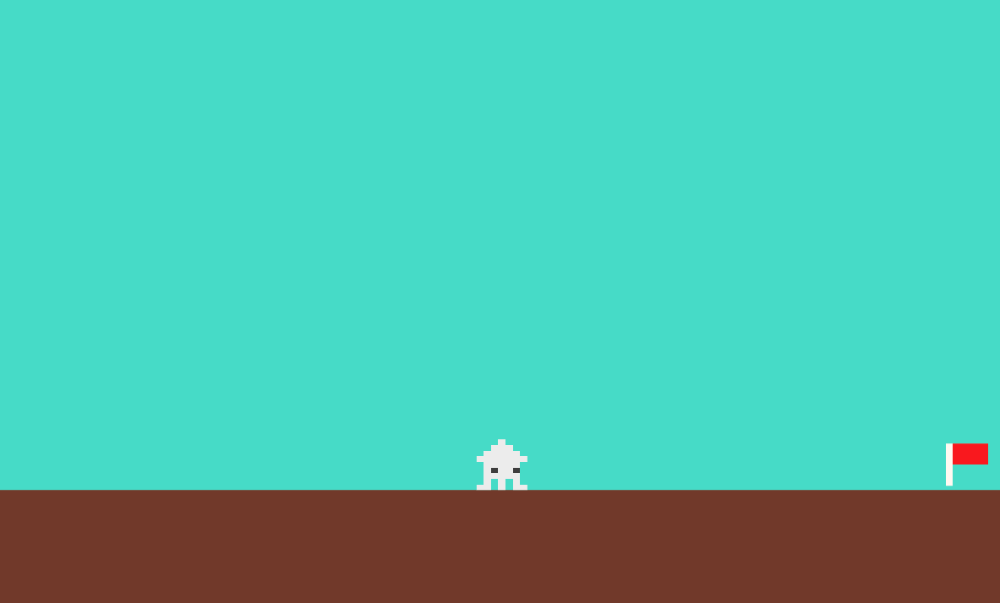

# **08_中間地点の制御**

## **この単元でやること**

1. 中間地点とゴールにフラグを立てる
2. 中間地点以降の動き

## **1. 中間地点とゴールにフラグを立てる**


### **①位置データを作成**

**【setting.dart】**

一番下に追加

```dart

//⭐️ 中間地点のフラッグ
class RetryData {
  final int idx;
  final double size_x;
  final double size_y;
  final double pos_x;
  final double pos_y;
  final String object_img;

  RetryData({
    required this.idx,
    required this.size_x,
    required this.size_y,
    required this.pos_x,
    required this.pos_y,
    required this.object_img,
  });
}

List<RetryData> retrylist = [
  RetryData(
    idx: 0,
    size_x: 50,
    size_y: 50,
    pos_x: screenSize.x * 2.5,
    pos_y: Y_GROUND_POSITION - PLAYER_SIZE_Y / 2,
    object_img: 'checkflag.png',
  ),
];

//⭐️ ゴールフラッグ
class GoalData {
  final int idx;
  final double size_x;
  final double size_y;
  final double pos_x;
  final double pos_y;
  final String object_img;

  GoalData({
    required this.idx,
    required this.size_x,
    required this.size_y,
    required this.pos_x,
    required this.pos_y,
    required this.object_img,
  });
}

List<GoalData> goallist = [
  GoalData(
    idx: 0,
    size_x: 50,
    size_y: 50,
    pos_x: screenSize.x * 4 - 50,
    pos_y: Y_GROUND_POSITION - PLAYER_SIZE_Y / 2,
    object_img: 'redflag.png',
  ),
];

```

### **②オブジェクト作成**

**【object.dat】**

一番下に追加

```dart

//⭐️中間地点のオブジェクト
class retryflag extends SpriteComponent
    with HasGameRef<MainGame>, CollisionCallbacks {
  retryflag(this.data);
  final RetryData data;
  @override
  Future<void> onLoad() async {

    sprite = await gameRef.loadSprite(data.object_img);
    size = Vector2(data.size_x, data.size_y);
    position = Vector2(data.pos_x, data.pos_y);
    anchor = Anchor.center;

    add(RectangleHitbox());
  }
}

//⭐️ゴールのオブジェクト
class goalflag extends SpriteComponent
    with HasGameRef<MainGame>, CollisionCallbacks {
  goalflag(this.data);
  final GoalData data;
  @override
  Future<void> onLoad() async {
    
    sprite = await gameRef.loadSprite(data.object_img);
    size = Vector2(data.size_x, data.size_y);
    position = Vector2(data.pos_x, data.pos_y);
    anchor = Anchor.center;

    add(RectangleHitbox());
  }
}

```

### **③インスタンス作成**

**【game.dat】**

objectRemove()内

```dart
//省略

retryflag _retryflag = retryflag(retrylist[0]);
await world.add(_retryflag);

goalflag _goalflag = goalflag(goallist[0]);
await world.add(_goalflag);

```




## **2.中間地点以降の動き**

### **①中間地点の保存**

**【game.dart】**

```dart
//省略

late Vector2 screenSize;

//⭐️ 中間地点の保存（初期値は先頭位置）
var RetryPosition = PLAYER_SIZE_X / 2;

class MainGame extends FlameGame
    with HasKeyboardHandlerComponents, HasCollisionDetection {
  final BuildContext context;
  MainGame(this.context);

    //省略

}
```

**【object.dart】**

```dart

class retryflag extends SpriteComponent
    with HasGameRef<MainGame>, CollisionCallbacks {
  retryflag(this.data);
  final RetryData data;
  @override
  Future<void> onLoad() async {
    sprite = await gameRef.loadSprite(data.object_img);
    size = Vector2(data.size_x, data.size_y);
    position = Vector2(data.pos_x, data.pos_y);
    anchor = Anchor.center;

    add(RectangleHitbox());
  }
}

```

### **②中間地点フラッグに当たった時**

**【game.dart】**

```dart

//最初は先頭位置
var RetryPosition = PLAYER_SIZE_X / 2;
//⭐️リトライフラグ
bool RetryFlg = false;

```

**【player.dart】**

```dart

@override
  // 当たった瞬間の処理（敵に当たった瞬間消える、スコアが減るなど）
  void onCollisionStart(
    Set<Vector2> intersectionPoints,
    PositionComponent other,
  ) {

    //省略

    //⭐️中間地点まで来たら位置を保存
    if (other is retryflag && !RetryFlg) {
      RetryPosition = other.position.x;
      RetryFlg = true;
    }
  }

```

**`!RetryFlg`を追加する理由**

中間地点のフラグに当たり続けていると、gameRef.TekiRemove();実行され、敵が複数表示されてしまう可能性がある  
1回触れた時点でRetryFlgをtrueにすることで関数が実行されなくなる

### **③中間地点に来たら新しい敵を出す**

**【setting.dart】**

スクリーン×3の位置に敵を出す  
tekilistに追加

```dart

TekiData(
    idx: 0,
    size_x: 50,
    size_y: 50,
    pos_x: screenSize.x * 3,
    pos_y: Y_GROUND_POSITION - 500,
    speed_x: -100,
    speed_y: 0,
    gravity: true,
    right_img1: 'tako.png',
    right_img2: 'tako.png',
    left_img1: 'tako.png',
    left_img2: 'tako.png',
    stop_left_img1: 'tako.png',
    stop_left_img2: 'tako.png',
    stop_right_img1: 'tako.png',
    stop_right_img2: 'tako.png',
),

```

**【game.dart】**

```dart
Future<void> objectRemove() async {
    
    //省略
    
}

//⭐️
Future<void> TekiRemove() async {
    Teki _teki3 = Teki(tekilist[3]);
    await world.add(_teki3);
}

```

**objectRemoveで直接addしない理由**

特定のオブジェクトだけをaddしたい場合に独立しておく


**【player.dart】**

```dart

if (other is retryflag && !RetryFlg) {
    RetryPosition = other.position.x;
    RetryFlg = true;
    //⭐️敵オブジェクト作成呼び出し
    gameRef.TekiRemove();
}

```


### **④敵に当たったら中間地点に戻る**

プレーヤーのポジションをRetryPositionにする

**【player.dart】**

```dart

@override
  Future<void> onLoad() async {
    
    //省略

    previousY = position.y;
    size = Vector2(PLAYER_SIZE_X, PLAYER_SIZE_Y);
    //⭐️RetryPositionに変更
    position = Vector2(RetryPosition, Y_GROUND_POSITION - 100);
    anchor = Anchor.center;
    priority = 10;
    add(RectangleHitbox());
  }

```

中間地点に戻るが、敵が複数出現する・・・


### **⑤オブジェクト削除**

**【game.dart】**

削除してからオブジェクト作成

```dart

Future<void> TekiRemove() async {
    //⭐️敵オブジェクト削除
    world.children.whereType<Teki>().forEach((text) {
            text.removeFromParent();
          });
    Teki _teki3 = Teki(tekilist[3]);
    await world.add(_teki3);
}

```
