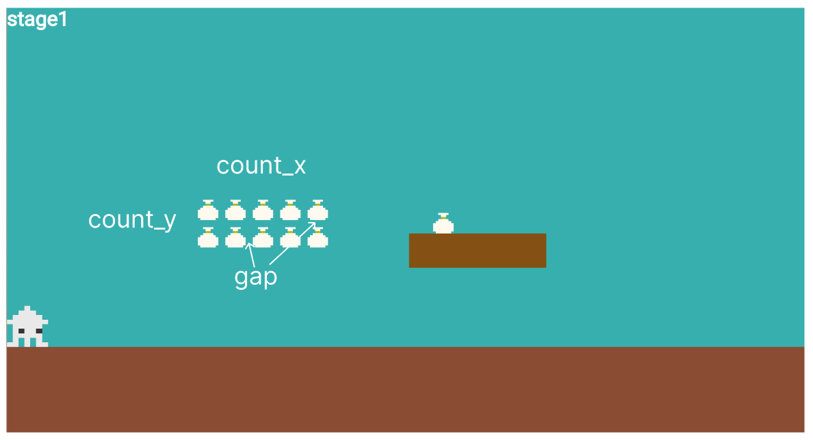
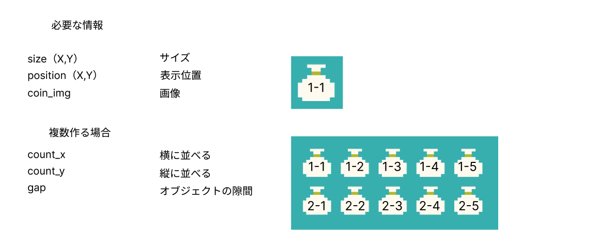
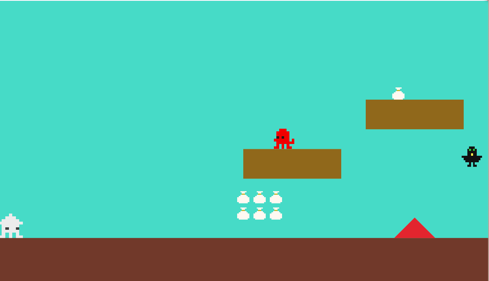
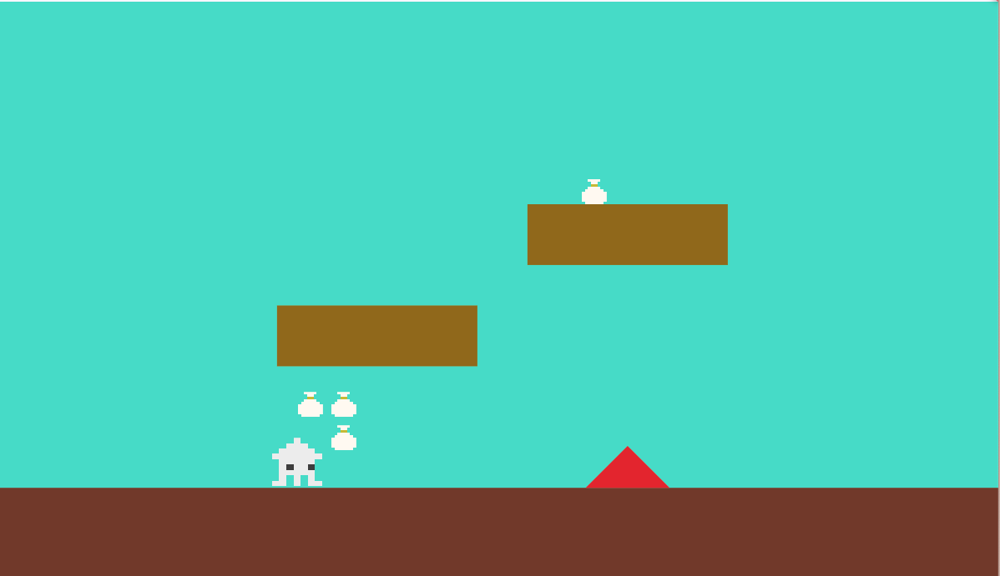

# **０９_アイテムを取得**

## **この単元でやること**

1. コインの作り方
2. コインゲット

## **1. コインの作り方**




### **①位置データを作成**

**【setting.dart】**

```dart

//⭐️追加
class CoinData {
  final int idx;
  final double size_x;
  final double size_y;
  final double pos_x;
  final double pos_y;
  final String coin_img;

  CoinData({
    required this.idx,
    required this.size_x,
    required this.size_y,
    required this.pos_x,
    required this.pos_y,
    required this.coin_img,
  });
}

List<CoinData> coinlist = [
  CoinData(
    idx: 0,
    size_x: 30,
    size_y: 30,
    pos_x: screenSize.x * 3 / 4 + 50,
    pos_y: screenSize.y * 1 / 3 - 45,
    coin_img: 'coin.png',
  ),
  CoinData(
    idx: 1,
    size_x: 30,
    size_y: 30,
    pos_x: screenSize.x * 0.5,
    pos_y: Y_GROUND_POSITION - 100,
    coin_img: 'coin.png',
  ),
];

```

### **②オブジェクト作成**

**【object.dat】**

一番下に追加

```dart

//⭐️追加
class coin extends SpriteComponent
    with HasGameRef<MainGame>, CollisionCallbacks {
  coin(this.data, this.count_x, this.count_y, this.gap);
  final CoinData data;
  int count_x;
  int count_y;
  double gap;

  @override
  Future<void> onLoad() async {
    sprite = await gameRef.loadSprite(data.coin_img);
    size = Vector2(data.size_x, data.size_y);
    position = Vector2(data.pos_x + (gap + data.size_x) * count_x,
        data.pos_y + (gap + data.size_y) * count_y);
    anchor = Anchor.center;

    add(RectangleHitbox());
  }
}

```

### **③インスタンス作成**

**【game.dart】**

objectRemove()関数内に作る

```dart

    //⭐️追加
    coin _coin = coin(coinlist[0], 1, 1, 0);
    await world.add(_coin);
    
    //⭐️追加
    for (int i = 0; i < 2; i++) {
      for (int j = 0; j < 3; j++) {
        coin _coin1 = coin(coinlist[1], j, i, 10);
        await world.add(_coin1);
      }
    }

```



## **2. コインゲット**

**【player.dart】**

```dart

  @override
  void onCollisionStart(
    Set<Vector2> intersectionPoints,
    PositionComponent other,
  ) {

    //省略

    //⭐️追加
    if (other is coin) {
      other.removeFromParent();
    }

  }

```



### **【ここまでのソースコード】**

**【game.dart】**

```dart

import 'package:flame/game.dart';
import 'package:flutter/material.dart';
import 'package:flame/input.dart';
import 'package:flame/camera.dart';
import 'package:flame/components.dart';
import 'screen.dart';
import 'player.dart';
import 'setting.dart';
import 'object.dart';
import 'teki.dart';

late Vector2 screenSize;
bool isColliding = false;
var RetryPosition = PLAYER_SIZE_X / 2;
bool RetryFlg = false;

class MainGame extends FlameGame
    with HasKeyboardHandlerComponents, HasCollisionDetection {
  final BuildContext context;
  MainGame(this.context);

  // カメラコンポーネントの追加
  late final CameraComponent cameraComponent;
  Player player = Player();

  @override
  void onGameResize(Vector2 size) {
    super.onGameResize(size);
    screenSize = size;
  }

  @override
  Future<void> onLoad() async {
    super.onLoad();
    screenSize = size;

    //worldを作る
    world = World();
    add(world);

    //カメラコンポーネントを作る
    cameraComponent = CameraComponent.withFixedResolution(
      width: screenSize.x,
      height: screenSize.y,
    );

    //worldの一部を切り取ってカメラに表示する
    cameraComponent.world = world;

    //デフォルトのカメラをcameraComponentに置き換える
    camera = cameraComponent;

    //コンポーネント追加
    await add(cameraComponent);

    await objectRemove();
  }

  Future<void> objectRemove() async {
    final List<Component> childrenToRemove = world.children.toList();
    for (var child in childrenToRemove) {
      child.removeFromParent();
    }

    //カメラの初期値設定（関数呼び出し）
    await CameraRemove();

    CameraBackScreen backscreen = CameraBackScreen();
    await world.add(backscreen);

    Cameraground ground = Cameraground();
    await world.add(ground);

    player = Player();
    await world.add(player);

    triangle _triangle = triangle(triangleList[0]);
    await world.add(_triangle);

    triangle _triangle1 = triangle(triangleList[1]);
    await world.add(_triangle1);

    triangle _triangle2 = triangle(triangleList[2]);
    await world.add(_triangle2);

    step _step = step(steplist[0]);
    await world.add(_step);

    step _step1 = step(steplist[1]);
    await world.add(_step1);

    Teki _teki = Teki(tekilist[0]);
    await world.add(_teki);

    Teki _teki1 = Teki(tekilist[1]);
    await world.add(_teki1);

    Teki _teki2 = Teki(tekilist[2]);
    await world.add(_teki2);

    retryflag _retryflag = retryflag(retrylist[0]);
    await world.add(_retryflag);

    goalflag _goalflag = goalflag(goallist[0]);
    await world.add(_goalflag);

    coin _coin = coin(coinlist[0], 1, 1, 0);
    await world.add(_coin);

    for (int i = 0; i < 2; i++) {
      for (int j = 0; j < 3; j++) {
        coin _coin1 = coin(coinlist[1], j, i, 10);
        await world.add(_coin1);
      }
    }
  }

  Future<void> TekiRemove() async {
    world.children.whereType<Teki>().forEach((text) {
      text.removeFromParent();
    });

    Teki _teki3 = Teki(tekilist[3]);
    await world.add(_teki3);
  }

  Future<void> CameraRemove() async {
    cameraComponent.viewfinder.anchor =
        Anchor(CAMERA_POSITION_X, CAMERA_POSITION_Y);
    cameraComponent.viewfinder.position = Vector2.zero();
    cameraComponent.viewfinder.zoom = 1.0;
  }

  @override
  void update(double dt) {
    super.update(dt);

    if (player.position.x > VIEW_X_START && player.position.x < VIEW_X_END) {
      //プレイヤーに追従する
      cameraComponent.viewfinder.position =
          Vector2(player.position.x, Y_GROUND_POSITION);
    } else {
      if (player.position.x > VIEW_X_END) {
        // 範囲外になったら追従しない
        cameraComponent.viewfinder.position =
            Vector2(VIEW_X_END, Y_GROUND_POSITION);
      } else {
        // 範囲まで追従しない
        cameraComponent.viewfinder.position =
            Vector2(VIEW_X_START, Y_GROUND_POSITION);
      }
    }
    cameraComponent.update(dt);
  }
}


```

**【object.dart】**

```dart

import 'package:flutter/material.dart';
import 'package:flame/components.dart';
import 'package:flame/collisions.dart';
import 'game.dart';
import 'setting.dart';

class triangle extends RectangleComponent
    with HasGameRef<MainGame>, CollisionCallbacks {
  triangle(this.data);
  final TriangleData data;

  @override
  Future<void> onLoad() async {
    // print("triangle");
    paint = Paint()..color = data.color;

    anchor = Anchor.topCenter;

    add(PolygonHitbox([
      Vector2(data.pos_x1, data.pos_y1),
      Vector2(data.pos_x2, data.pos_y2),
      Vector2(data.pos_x3, data.pos_y3),
    ])
      ..collisionType = CollisionType.passive);
  }

  @override
  Future<void> render(Canvas canvas) async {
    super.render(canvas);
    final path = Path();
    path.moveTo(data.pos_x1, data.pos_y1);
    path.lineTo(data.pos_x2, data.pos_y2);
    path.lineTo(data.pos_x3, data.pos_y3);
    path.close();
    canvas.drawPath(path, paint);

    // パスをキャンバスに描画
    canvas.drawPath(path, paint);
  }
}

class step extends RectangleComponent with HasGameRef<MainGame> {
  step(this.data);
  final StepData data;

  @override
  Future<void> onLoad() async {
    paint = Paint()..color = data.color;
    position = Vector2(data.pos_x, data.pos_y);
    size = Vector2(data.size_x, data.size_y);
    anchor = Anchor.topLeft;
    add(RectangleHitbox());
  }

  @override
  Future<void> render(Canvas canvas) async {
    super.render(canvas);
  }
}

class retryflag extends SpriteComponent
    with HasGameRef<MainGame>, CollisionCallbacks {
  retryflag(this.data);
  final RetryData data;
  @override
  Future<void> onLoad() async {
    RetryPosition = data.pos_x;

    sprite = await gameRef.loadSprite(data.object_img);
    size = Vector2(data.size_x, data.size_y);
    position = Vector2(data.pos_x, data.pos_y);
    anchor = Anchor.center;

    add(RectangleHitbox());
  }
}

//ゴールのオブジェクト
class goalflag extends SpriteComponent
    with HasGameRef<MainGame>, CollisionCallbacks {
  goalflag(this.data);
  final GoalData data;
  @override
  Future<void> onLoad() async {
    sprite = await gameRef.loadSprite(data.object_img);
    size = Vector2(data.size_x, data.size_y);
    position = Vector2(data.pos_x, data.pos_y);
    anchor = Anchor.center;

    add(RectangleHitbox());
  }
}

class coin extends SpriteComponent
    with HasGameRef<MainGame>, CollisionCallbacks {
  coin(this.data, this.count_x, this.count_y, this.gap);
  final CoinData data;
  int count_x;
  int count_y;
  double gap;

  @override
  Future<void> onLoad() async {
    sprite = await gameRef.loadSprite(data.coin_img);
    size = Vector2(data.size_x, data.size_y);
    position = Vector2(data.pos_x + (gap + data.size_x) * count_x,
        data.pos_y + (gap + data.size_y) * count_y);
    anchor = Anchor.center;

    add(RectangleHitbox());
  }
}


```

**【player.dart】**

```dart

import 'package:flame/components.dart';
import 'package:flutter/services.dart';
import 'package:flame/collisions.dart';
import 'game.dart';
import 'setting.dart';
import 'object.dart';
import 'teki.dart';

class Player extends SpriteAnimationComponent
    with HasGameRef<MainGame>, KeyboardHandler, CollisionCallbacks {
  //速度の指定
  Vector2 velocity = Vector2.zero();
  //移動速度
  double moveSpeed = 200;
  //ジャンプ力
  double jumpForce = 500;
  //重力
  double gravity = 800;
  //地面にいるかの判定
  bool isOnGround = false;
  //上下移動の方向を検知
  double previousY = 0.0;
  //落下中かどうか判定
  bool isFall = false;

  //各方向のスプライト
  late SpriteAnimation leftAnimation;
  late SpriteAnimation rightAnimation;
  late SpriteAnimation stop_leftAnimation;
  late SpriteAnimation stop_rightAnimation;

  //方向フラグ（どちらを向いているか）
  bool leftflg = false;
  bool rightflg = false;

  @override
  Future<void> onLoad() async {
    // sprite = await Sprite.load('ika2.png');

    //スプライトロード
    final leftSprites = [
      await gameRef.loadSprite('ika.png'),
    ];
    final rightSprites = [
      await gameRef.loadSprite('ika2.png'),
    ];
    final stop_leftSprites = [
      await gameRef.loadSprite('ika.png'),
      await gameRef.loadSprite('ika_up.png'),
    ];
    final stop_rightSprites = [
      await gameRef.loadSprite('ika2.png'),
      await gameRef.loadSprite('ika2_up.png'),
    ];

    //アニメーション（画像切り替え）
    leftAnimation = SpriteAnimation.spriteList(leftSprites, stepTime: 0.2);
    rightAnimation = SpriteAnimation.spriteList(rightSprites, stepTime: 0.2);

    stop_leftAnimation =
        SpriteAnimation.spriteList(stop_leftSprites, stepTime: 0.2);
    stop_rightAnimation =
        SpriteAnimation.spriteList(stop_rightSprites, stepTime: 0.2);

    //最初に表示するアニメーション
    animation = stop_rightAnimation;

    previousY = position.y;
    size = Vector2(PLAYER_SIZE_X, PLAYER_SIZE_Y);
    position = Vector2(RetryPosition, Y_GROUND_POSITION - 100);
    RetryFlg = false;
    anchor = Anchor.center;
    priority = 10;
    add(RectangleHitbox());
  }

  //キーボード操作
  @override
  bool onKeyEvent(
    KeyEvent event,
    Set<LogicalKeyboardKey> keysPressed,
  ) {
    if (event is KeyDownEvent) {
      leftflg = false;
      rightflg = false;

      //左矢印押した時
      if (keysPressed.contains(LogicalKeyboardKey.arrowLeft)) {
        leftflg = true;
        moveLeft();
        //スペースキー押した時
        if (keysPressed.contains(LogicalKeyboardKey.space)) {
          jump();
        }
        //右矢印押した時
      } else if (keysPressed.contains(LogicalKeyboardKey.arrowRight)) {
        rightflg = true;
        moveRight();
        // スペースキー押した時
        if (keysPressed.contains(LogicalKeyboardKey.space)) {
          jump();
        }
        //スペースキー押した時
      } else if (keysPressed.contains(LogicalKeyboardKey.space)) {
        jump();
      }
    } else if (event is KeyUpEvent) {
      stopMovement();
    }
    return true;
  }

  // 左移動
  void moveLeft() {
    velocity.x = -moveSpeed;
    if (animation != leftAnimation) {
      animation = leftAnimation;
    }
  }

  // 右移動
  void moveRight() {
    velocity.x = moveSpeed;
    if (animation != rightAnimation) {
      animation = rightAnimation;
    }
  }

  // ストップ
  void stopMovement() {
    velocity.x = 0;
    if (leftflg) {
      animation = stop_leftAnimation;
    }
    if (rightflg) {
      animation = stop_rightAnimation;
    }
  }

  // ジャンプ
  void jump() {
    if (isOnGround) {
      velocity.y = -jumpForce;
      isOnGround = false;
    }
  }

  @override
  // 当たった瞬間の処理（敵に当たった瞬間消える、スコアが減るなど）
  void onCollisionStart(
    Set<Vector2> intersectionPoints,
    PositionComponent other,
  ) {
    // 障害物に当たったら
    if (other is triangle) {
      // プレーヤーを消す→onRemove()関数が呼び出される
      removeFromParent();
    }

    if (other is Teki) {
      if (!isFall) {
        velocity.y = -300;
        velocity.x = 0;
        size.x = PLAYER_SIZE_X / 2;
        add(TimerComponent(
          period: 0.8, // 0.8秒
          repeat: false, // 1回だけ実行d
          onTick: () {
            removeFromParent();
          },
        ));
      } else {
        velocity.y = -300;
        velocity.x = 100;
        add(TimerComponent(
          period: 1, // 1秒
          repeat: false, // 1回だけ実行d
          onTick: () {
            velocity.x = 0;
          },
        ));
      }
    }

    if (other is retryflag && !RetryFlg) {
      RetryPosition = other.position.x;
      RetryFlg = true;
      gameRef.TekiRemove();
    }

    if (other is coin) {
      other.removeFromParent();
    }
  }

  @override
  // 当たっている間の処理（壁に当たっている間動かないなど）
  void onCollision(Set<Vector2> intersectionPoints, PositionComponent other) {
    if (other is step) {
      // プレーヤーの各辺と障害物の各辺の位置を取得
      final playerRight = this.x + this.width;
      final playerLeft = this.x;
      final playerBottom = this.y + this.height;
      final playerTop = this.y;

      final obstacleRight = other.x + other.width + this.width;
      final obstacleLeft = other.x;
      final obstacleBottom = other.y + other.height;
      final obstacleTop = other.y;

      // 各方向の距離を計算
      final double rightDistance = (playerRight - obstacleLeft).abs();
      final double leftDistance = (playerLeft - obstacleRight).abs();
      final double bottomDistance = (playerBottom - obstacleTop).abs();
      final double topDistance = (playerTop - obstacleBottom).abs();

      // 最小の距離に基づいて衝突方向を判定
      double minDistance = [
        rightDistance,
        leftDistance,
        bottomDistance,
        topDistance
      ].reduce((a, b) => a < b ? a : b);

      if (minDistance == rightDistance) {
        //左から当たった
        position.x = other.x - this.width / 2;
      } else if (minDistance == leftDistance) {
        //右から当たった
        position.x = other.x + other.width + this.width / 2;
      } else if (minDistance == bottomDistance) {
        //上から当たった
        position.y = other.y - this.width / 2;
        velocity.y = 0;
        isOnGround = true;
      } else if (minDistance == topDistance) {
        //下から当たった
        velocity.y += gravity;
      }
    }
  }

  @override
  // 当たり終わった時の処理
  void onCollisionEnd(PositionComponent other) {}

  @override
  void update(double dt) {
    super.update(dt);

    previousY = position.y;

    //重力をかける
    applyGravity(dt, gravity);
    //地面との衝突を確認
    checkGroundCollision();

    if (position.x < size.x / 2) {
      position.x = size.x / 2;
    }

    //ポジションを変える
    position += velocity * dt;

    if (position.y > previousY) {
      isFall = true;
    } else {
      isFall = false;
    }
  }

  void applyGravity(double dt, double gravity) {
    if (!isOnGround) {
      velocity.y += gravity * dt; // 速度に重力を適用して下降
    }

    position += velocity * dt; // 速度に基づいてキャラクターの位置を更新（下に移動する）
  }

  void checkGroundCollision() {
    // 地面より下には行かないようにする
    if (position.y >= Y_GROUND_POSITION - size.y / 2) {
      //地上にいるフラグ
      isOnGround = true;
      //常に地面の上にいるようにする
      position.y = Y_GROUND_POSITION - size.y / 2;
      //速度は0
      velocity.y = 0;
    } else {
      //地上にいないフラグ（空中）
      isOnGround = false;
    }
  }

  @override
  Future<void> onRemove() async {
    // もう一回表示
    await gameRef.objectRemove();

    super.onRemove();
  }
}


```

**【setting.dart】**

```dart

import 'package:flutter/material.dart';
import 'game.dart';

//スクリーンサイズ４つ分
final FIELD_SIZE_X = screenSize.x * 4;
//スクリーンの高さと同じ
final FIELD_SIZE_Y = screenSize.y;

//地面の位置をスクリーンの高さの80%の位置にする
final Y_GROUND_POSITION = screenSize.y * 0.8;

final PLAYER_SIZE_X = 60.0;
final PLAYER_SIZE_Y = 60.0;

final CAMERA_POSITION_X = 0.3;
final CAMERA_POSITION_Y = 0.8;

final VIEW_X_START = screenSize.x * CAMERA_POSITION_X;
final VIEW_X_END = FIELD_SIZE_X - screenSize.x * (1 - CAMERA_POSITION_X);

//コンストラクタ
class TriangleData {
  final int idx;
  final Color color;
  final double pos_x1;
  final double pos_y1;
  final double pos_x2;
  final double pos_y2;
  final double pos_x3;
  final double pos_y3;

  TriangleData({
    required this.idx,
    required this.color,
    required this.pos_x1,
    required this.pos_y1,
    required this.pos_x2,
    required this.pos_y2,
    required this.pos_x3,
    required this.pos_y3,
  });
}

//イニシャライザ
List<TriangleData> triangleList = [
  TriangleData(
    idx: 0,
    color: Color.fromARGB(255, 211, 46, 46),
    pos_x1: screenSize.x * 0.85,
    pos_y1: Y_GROUND_POSITION - 50,
    pos_x2: screenSize.x * 0.85 - 50,
    pos_y2: Y_GROUND_POSITION,
    pos_x3: screenSize.x * 0.85 + 50,
    pos_y3: Y_GROUND_POSITION,
  ),
  TriangleData(
    idx: 1,
    color: Color.fromARGB(255, 211, 46, 46),
    pos_x1: screenSize.x * 1.85,
    pos_y1: Y_GROUND_POSITION - 100,
    pos_x2: screenSize.x * 1.85 - 50,
    pos_y2: Y_GROUND_POSITION,
    pos_x3: screenSize.x * 1.85 + 50,
    pos_y3: Y_GROUND_POSITION,
  ),
  TriangleData(
    idx: 2,
    color: Color.fromARGB(255, 211, 46, 46),
    pos_x1: screenSize.x * 2.1,
    pos_y1: Y_GROUND_POSITION - 100,
    pos_x2: screenSize.x * 2.1 - 50,
    pos_y2: Y_GROUND_POSITION,
    pos_x3: screenSize.x * 2.1 + 50,
    pos_y3: Y_GROUND_POSITION,
  ),
];

class StepData {
  final int idx;
  final Color color;
  final double size_x;
  final double size_y;
  final double pos_x;
  final double pos_y;
  final double start_pos_x;
  final double start_pos_y;
  final double end_pos_x;
  final double end_pos_y;

  StepData({
    required this.idx,
    required this.color,
    required this.size_x,
    required this.size_y,
    required this.pos_x,
    required this.pos_y,
    required this.start_pos_x,
    required this.start_pos_y,
    required this.end_pos_x,
    required this.end_pos_y,
  });
}

List<StepData> steplist = [
  StepData(
    idx: 0,
    color: Color.fromARGB(255, 136, 107, 0),
    size_x: screenSize.x * 0.2,
    size_y: screenSize.y * 0.1,
    pos_x: screenSize.x / 2,
    pos_y: screenSize.y / 2,
    start_pos_x: screenSize.x / 2 - PLAYER_SIZE_X / 2,
    start_pos_y: screenSize.y / 2 - PLAYER_SIZE_Y / 2,
    end_pos_x: screenSize.x / 2 + 200 + PLAYER_SIZE_X / 2,
    end_pos_y: screenSize.y / 2 + PLAYER_SIZE_Y / 2,
  ),
  StepData(
    idx: 1,
    color: Color.fromARGB(255, 136, 107, 0),
    size_x: screenSize.x * 0.2,
    size_y: screenSize.y * 0.1,
    pos_x: screenSize.x * 3 / 4,
    pos_y: screenSize.y * 1 / 3,
    start_pos_x: screenSize.x * 3 / 4 - PLAYER_SIZE_X / 2,
    start_pos_y: screenSize.y * 1 / 3 - PLAYER_SIZE_Y / 2,
    end_pos_x: screenSize.x * 3 / 4 + 200 + PLAYER_SIZE_X / 2,
    end_pos_y: screenSize.y * 1 / 3 + PLAYER_SIZE_Y / 2,
  ),
];

class TekiData {
  final int idx;
  final double size_x;
  final double size_y;
  final double pos_x;
  final double pos_y;
  final double speed_x;
  final double speed_y;
  final bool gravity;
  final String right_img1;
  final String right_img2;
  final String left_img1;
  final String left_img2;
  final String stop_left_img1;
  final String stop_left_img2;
  final String stop_right_img1;
  final String stop_right_img2;

  TekiData({
    required this.idx,
    required this.size_x,
    required this.size_y,
    required this.pos_x,
    required this.pos_y,
    required this.speed_x,
    required this.speed_y,
    required this.gravity,
    required this.right_img1,
    required this.right_img2,
    required this.left_img1,
    required this.left_img2,
    required this.stop_left_img1,
    required this.stop_left_img2,
    required this.stop_right_img1,
    required this.stop_right_img2,
  });
}

List<TekiData> tekilist = [
  TekiData(
    idx: 0,
    size_x: 50,
    size_y: 50,
    pos_x: screenSize.x - 300,
    pos_y: Y_GROUND_POSITION - 500,
    speed_x: -100,
    speed_y: 0,
    gravity: true,
    right_img1: 'tako.png',
    right_img2: 'tako.png',
    left_img1: 'tako.png',
    left_img2: 'tako.png',
    stop_left_img1: 'tako.png',
    stop_left_img2: 'tako.png',
    stop_right_img1: 'tako.png',
    stop_right_img2: 'tako.png',
  ),
  TekiData(
    idx: 1,
    size_x: 50,
    size_y: 50,
    pos_x: screenSize.x * 1.5,
    pos_y: Y_GROUND_POSITION - 25,
    speed_x: -100,
    speed_y: 0,
    gravity: true,
    right_img1: 'tako.png',
    right_img2: 'tako.png',
    left_img1: 'tako.png',
    left_img2: 'tako.png',
    stop_left_img1: 'tako.png',
    stop_left_img2: 'tako.png',
    stop_right_img1: 'tako.png',
    stop_right_img2: 'tako.png',
  ),
  TekiData(
    idx: 2,
    size_x: 50,
    size_y: 50,
    pos_x: screenSize.x * 1.3,
    pos_y: Y_GROUND_POSITION - 200,
    speed_x: -200,
    speed_y: 0,
    gravity: false,
    right_img1: 'karasu.png',
    right_img2: 'karasu.png',
    left_img1: 'karasu.png',
    left_img2: 'karasu.png',
    stop_left_img1: 'karasu.png',
    stop_left_img2: 'karasu.png',
    stop_right_img1: 'karasu.png',
    stop_right_img2: 'karasu.png',
  ),
  TekiData(
    idx: 0,
    size_x: 50,
    size_y: 50,
    pos_x: screenSize.x * 3,
    pos_y: Y_GROUND_POSITION - 500,
    speed_x: -100,
    speed_y: 0,
    gravity: true,
    right_img1: 'tako.png',
    right_img2: 'tako.png',
    left_img1: 'tako.png',
    left_img2: 'tako.png',
    stop_left_img1: 'tako.png',
    stop_left_img2: 'tako.png',
    stop_right_img1: 'tako.png',
    stop_right_img2: 'tako.png',
  ),
];

class RetryData {
  final int idx;
  final double size_x;
  final double size_y;
  final double pos_x;
  final double pos_y;
  final String object_img;

  RetryData({
    required this.idx,
    required this.size_x,
    required this.size_y,
    required this.pos_x,
    required this.pos_y,
    required this.object_img,
  });
}

List<RetryData> retrylist = [
  RetryData(
    idx: 0,
    size_x: 50,
    size_y: 50,
    pos_x: screenSize.x * 2.5,
    pos_y: Y_GROUND_POSITION - PLAYER_SIZE_Y / 2,
    object_img: 'checkflag.png',
  ),
];

//ゴールフラッグ
class GoalData {
  final int idx;
  final double size_x;
  final double size_y;
  final double pos_x;
  final double pos_y;
  final String object_img;

  GoalData({
    required this.idx,
    required this.size_x,
    required this.size_y,
    required this.pos_x,
    required this.pos_y,
    required this.object_img,
  });
}

List<GoalData> goallist = [
  GoalData(
    idx: 0,
    size_x: 50,
    size_y: 50,
    pos_x: screenSize.x * 4 - 50,
    pos_y: Y_GROUND_POSITION - PLAYER_SIZE_Y / 2,
    object_img: 'redflag.png',
  ),
];

class CoinData {
  final int idx;
  final double size_x;
  final double size_y;
  final double pos_x;
  final double pos_y;
  final String coin_img;

  CoinData({
    required this.idx,
    required this.size_x,
    required this.size_y,
    required this.pos_x,
    required this.pos_y,
    required this.coin_img,
  });
}

List<CoinData> coinlist = [
  CoinData(
    idx: 0,
    size_x: 30,
    size_y: 30,
    pos_x: screenSize.x * 3 / 4 + 50,
    pos_y: screenSize.y * 1 / 3 - 45,
    coin_img: 'coin.png',
  ),
  CoinData(
    idx: 1,
    size_x: 30,
    size_y: 30,
    pos_x: screenSize.x * 0.5,
    pos_y: Y_GROUND_POSITION - 100,
    coin_img: 'coin.png',
  ),
];


```