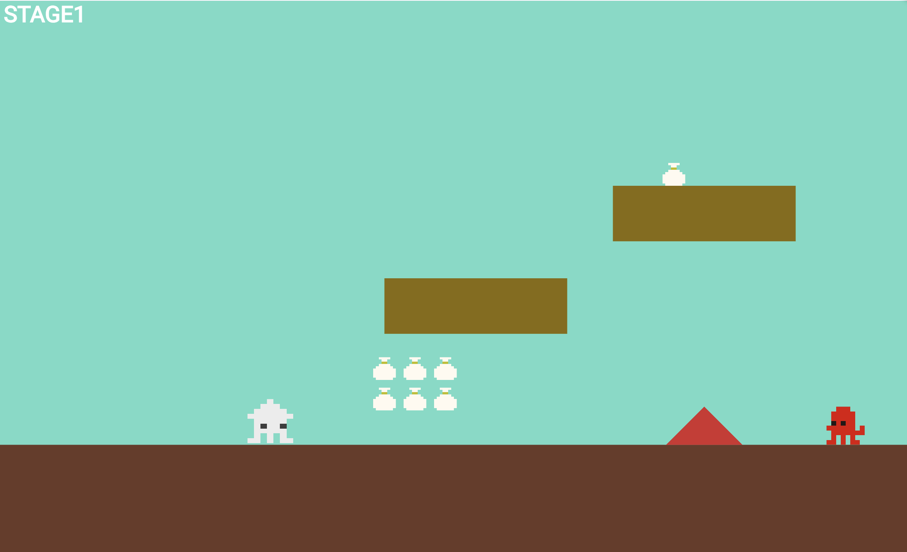
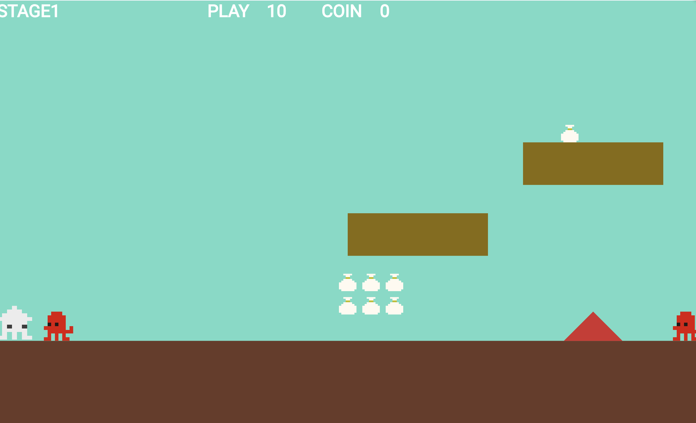
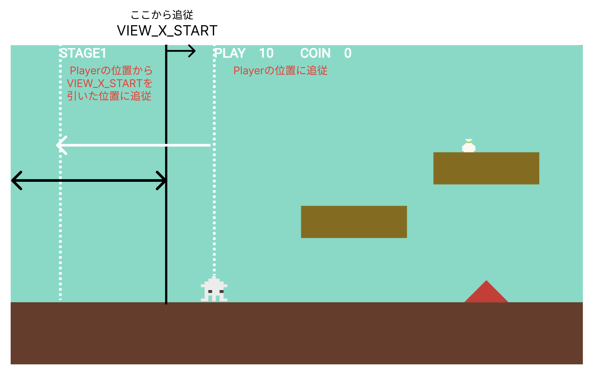

# **10_スコアー表示**
（目安：2回）

## **この単元でやること**

1. テキストの表示
2. HP,コインの表示
3. タイマー
4. ゴール（スコアー）、ゲームオーバー
5. リトライ
6. 右に行けないようにする

## **1. テキストの表示**



### **①位置データを作成**

**【setting.dart】**

```dart

class StageData {
  final int idx;
  final double font_size;
  final double pos_x;
  final double pos_y;
  final Color color;

  StageData({
    required this.idx,
    required this.font_size,
    required this.pos_x,
    required this.pos_y,
    required this.color,
  });
}

List<StageData> stagelist = [
  // stage
  StageData(
    idx: 0,
    font_size: 30,
    pos_x: 0,
    pos_y: 0,
    color: Color.fromARGB(255, 255, 255, 255),
  ),
];

```

### **②オブジェクト作成**

**【stagetext.dart】**

stagetext.dartを新規作成

```dart

import 'package:flutter/material.dart';
import 'package:flame/components.dart';
import 'game.dart';
import 'setting.dart';

class StageText extends TextComponent with HasGameRef<MainGame> {
  StageText(this.data);
  final StageData data;

  @override
  Future<void> onLoad() async {
    position = Vector2(data.pos_x, data.pos_y);
    text = "STAGE1";

    textRenderer = TextPaint(
        style: TextStyle(
            fontSize: data.font_size,
            fontWeight: FontWeight.bold,
            color: data.color));
  }

  @override
  Future<void> render(Canvas canvas) async {
    super.render(canvas);
  }

  @override
  void update(double dt) {
    super.update(dt);

    // プレイヤーの位置に合わせてNextTextの位置を更新
    if (gameRef.player.position.x > VIEW_X_START &&
        gameRef.player.position.x < VIEW_X_END) {
      position.x = gameRef.player.position.x - VIEW_X_START + 10;
    }

    text = "STAGE1";
  }
}

```

### **③インスタンス作成**

**【game.dart】**

```dart
import 'package:flame/game.dart';
import 'package:flutter/material.dart';
import 'package:flame/input.dart';
import 'package:flame/camera.dart';
import 'package:flame/components.dart';
import 'screen.dart';
import 'player.dart';
import 'setting.dart';
import 'object.dart';
import 'teki.dart';
import 'stagetext.dart';    //⭐️追加

//省略

  Future<void> objectRemove() async {
    //省略

    //⭐️追加
    StageText _stagetext = StageText(stagelist[0]);
    await world.add(_stagetext);
  }

```


## **2. HP,コインの表示**



### **①位置データを作成**

**【setting.dart】**

```dart

//省略

List<StageData> stagelist = [
  // stage
  StageData(
    idx: 0,
    font_size: 30,
    pos_x: 0,
    pos_y: 0,
    color: Color.fromARGB(255, 255, 255, 255),
  ),
  //⭐️ score
  StageData(
    idx: 1,
    font_size: 30,
    pos_x: VIEW_X_START,
    pos_y: 0,
    color: Color.fromARGB(255, 255, 255, 255),
  ),
]

```

### **②オブジェクト作成**

**【game.dart】**

```dart

//省略

//最初は先頭位置
var RetryPosition = PLAYER_SIZE_X / 2;
// リトライフラグ
bool RetryFlg = false;
// ⭐️プレーヤーのHP
int player_count = 10;
// ⭐️コインの数
int coin_count = 0;

```

**【stagetext.dart】**

一番下に追加

```dart

class ScoreText extends TextComponent with HasGameRef<MainGame> {
  ScoreText(this.data);
  final StageData data;

  @override
  Future<void> onLoad() async {
    position = Vector2(data.pos_x, data.pos_y);
    text = "PLAY　${player_count}　　COIN　${coin_count}";

    textRenderer = TextPaint(
        style: TextStyle(
            fontSize: data.font_size,
            fontWeight: FontWeight.bold,
            color: data.color));
  }

  @override
  Future<void> render(Canvas canvas) async {
    super.render(canvas);
  }

  @override
  void update(double dt) {
    super.update(dt);

    // プレイヤーの位置に合わせてScoreTextの位置を更新
    if (gameRef.player.position.x > VIEW_X_START &&
        gameRef.player.position.x < VIEW_X_END) {
      position.x = gameRef.player.position.x;
    }
    
    text = "PLAY　${player_count}　　COIN　${coin_count}";
  }
}

```

### **③インスタンス作成**

**【game.dart】**

```dart

  Future<void> objectRemove() async {
    //省略

    // ⭐️スコアー
    ScoreText _scoretext = ScoreText(stagelist[1]);
    await world.add(_scoretext);
  }

```



### **④スコアとコインの更新**

敵に当たったらPLAYを-1、コインに当たったらCOINを+1

**【player.dart】**

```dart

//省略

@override

  void onCollisionStart(
    Set<Vector2> intersectionPoints,
    PositionComponent other,
  ) {
    // 障害物に当たったら
    if (other is triangle) {
      // プレーヤーを消す
      removeFromParent();
    }

    // 敵に当たったら
    if (other is Teki) {
      // 落下中は消えない
      if (!isFall) {
        velocity.y = -300;
        velocity.x = 0;
        size.x = PLAYER_SIZE_X / 2;
        add(TimerComponent(
          period: 0.8,
          repeat: false,
          onTick: () {
            //⭐️　-１
            player_count--;
            removeFromParent();
          },
        ));
      } else {
        velocity.y = -300;
        velocity.x = 100;
        add(TimerComponent(
          period: 1,
          repeat: false,
          onTick: () {
            velocity.x = 0;
          },
        ));
      }
    }
    if (other is retryflag && !RetryFlg) {
      print("中間地点");
      // 中間地点まできたら更新
      RetryPosition = other.position.x;
      currentPosition = RetryPosition;
      position.y = Y_GROUND_POSITION - PLAYER_SIZE_Y / 2;
      RetryFlg = true;
    }

    if (other is coin) {
      //⭐️　コインを+1
      coin_count++;
      other.removeFromParent();
    }
  }

//省略

```

## **3. タイマーを追加**

### **①位置データを作成**

**【setting.dart】**

stagelistの中に追加

```dart

  StageData(
    idx: 2,
    font_size: 30,
    pos_x: VIEW_X_START * 2.5,
    pos_y: 0,
    color: Color.fromARGB(255, 255, 255, 255),
  ),

```

### **②オブジェクト作成**

**【game.dart】**

```dart

// ⭐️タイマーストップ
bool StopTimer = false;
// ⭐️経過時間
double elapsedTime = 0.0;

class MainGame extends FlameGame
    with HasKeyboardHandlerComponents, HasCollisionDetection {
  final BuildContext context;
  MainGame(this.context);

  late final CameraComponent cameraComponent;
  Player player = Player();

  //⭐️　タイマーオブジェクト
  late countTimer _countTimer;

  //省略

}


```

**【stagetext.dart】**

```dart

class countTimer extends TextComponent with HasGameRef<MainGame> {
  countTimer(this.data);
  final StageData data;

  Stopwatch _stopwatch = Stopwatch(); // システムのストップウォッチを使用

  @override
  Future<void> onLoad() async {
    super.onLoad();
    _stopwatch.start(); // ストップウォッチ開始
    position = Vector2(data.pos_x, data.pos_y);
    text = 'Time: 0.0';
    textRenderer = TextPaint(
        style: TextStyle(
            fontSize: data.font_size,
            fontWeight: FontWeight.bold,
            color: data.color));
  }

  @override
  void update(double dt) {
    super.update(dt);

    // システムのストップウォッチから経過時間を取得
    elapsedTime = _stopwatch.elapsedMilliseconds / 1000.0; // 秒単位に変換

    // プレイヤーの位置に基づいて位置を更新
    if (gameRef.player.position.x > VIEW_X_START &&
        gameRef.player.position.x < VIEW_X_END) {
      position.x = gameRef.player.position.x + VIEW_X_START * 1.5;
    }

    // 経過時間をテキストに表示
    text = 'Time: ${elapsedTime.toStringAsFixed(1)}';
  }
}

```

### **③インスタンス作成**

**【game.dart】**

タイマーはゲームオーバー、ゴールでリセット
それ以外は継続

```dart

    
  @override
  Future<void> onLoad() async {
    super.onLoad();

    final SharedPreferences prefs = await SharedPreferences.getInstance();
    recordTime = prefs.getDouble('TIME') ?? 0.0;

    print("recordTime=${recordTime}");

    RetryPosition = PLAYER_SIZE_X / 2;
    RetryFlg = false;

    cameraComponent = CameraComponent(
      world: world,
    );
    await add(cameraComponent);

    //⭐️オブジェクト作成　
    _countTimer = countTimer(stagelist[2]);
    await world.add(_countTimer);

    await objectRemove();

  }

  //省略

  Future<void> objectRemove() async {
    // world.children.removeWhere((child) => true);
    final List<Component> childrenToRemove = world.children.toList();
    for (var child in childrenToRemove) {
      //⭐️タイマーは消さない
      if (child is! countTimer) {
        child.removeFromParent();
      }
    }

    await CameraRemove();

    //背景（worldを追加）
    CameraBackScreen backscreen = CameraBackScreen();
    await world.add(backscreen);
    //地面（worldを追加）
    Cameraground ground = Cameraground();
    await world.add(ground);
    //プレイヤー（インスタンスをグローバルに設定）
    player = Player();
    await world.add(player);

    //⭐️タイマーがworldになければ追加
    if (!world.children.contains(_countTimer)) {
      _countTimer = countTimer(stagelist[2]);
      await world.add(_countTimer);
    }

    //省略

  }
  }

```

**【stagetext.dart】**

```dart

@override
  Future<void> onLoad() async {
    super.onLoad();
    _stopwatch.start(); // ストップウォッチ開始
    position = Vector2(data.pos_x, data.pos_y);
    text = 'Time: 0.0';
    textRenderer = TextPaint(
        style: TextStyle(
            fontSize: data.font_size,
            fontWeight: FontWeight.bold,
            color: data.color));
    //⭐️スクリーンの後ろにいかないようにする、優先を上げる
    priority = 1000;
  }


```
