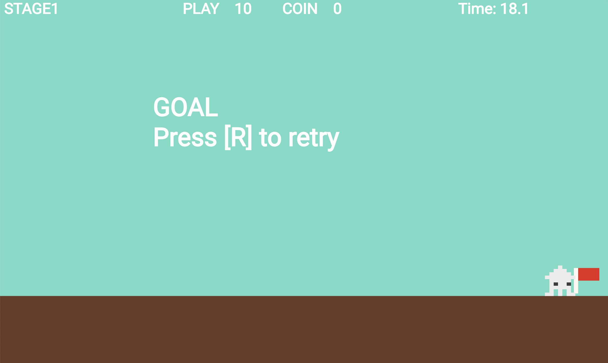

# **11_ゴール**

## **この単元でやること**

1. ゴールとゲームオーバー
2. リトライ

## **1. ゴールとゲームオーバー**



ゴールした時に、実行結果のような文字を出したい  
どんな位置データ、オブジェクトを作ったら良いか考えてみよう  

**ヒント**

- setting.dartにデータを作る→StageDataに追加
- 文字の大きさ
- ポジション
- 色

今まで書いたプログラムを参考に自分で考えて追加してみよう！！


### **①位置データを作成**

stagelistに追加

```dart

  StageData(
    idx: 3,
    font_size: 50,
    pos_x: FIELD_SIZE_X - screenSize.x * 3 / 4,
    pos_y: Y_GROUND_POSITION - 400,
    color: Color.fromARGB(255, 255, 255, 255),
  ),
  StageData(
    idx: 4,
    font_size: 50,
    pos_x: 0,
    pos_y: Y_GROUND_POSITION - 400,
    color: Color.fromARGB(255, 255, 255, 255),
  ),

```

### **②オブジェクト作成**

**【stagetext.dart】**

stagetext.dartを新規作成

```dart

//ゴール
class goalText extends TextComponent with HasGameRef<MainGame> {
  goalText(this.data);
  final StageData data;

  @override
  Future<void> onLoad() async {
    position = Vector2(data.pos_x, data.pos_y);
    text = "GOAL\nPress [R] to retry";

    textRenderer = TextPaint(
        style: TextStyle(
            fontSize: data.font_size,
            fontWeight: FontWeight.bold,
            color: data.color));
  }

  @override
  Future<void> render(Canvas canvas) async {
    super.render(canvas);
  }

  @override
  void update(double dt) {
    super.update(dt);
  }
}

//ゲームオーバー
class gameOverText extends TextComponent with HasGameRef<MainGame> {
  gameOverText(this.data);
  final StageData data;

  @override
  Future<void> onLoad() async {
    position = Vector2(data.pos_x, data.pos_y);
    text = "GAMEORVER\nPress [R] to retry";

    textRenderer = TextPaint(
        style: TextStyle(
            fontSize: data.font_size,
            fontWeight: FontWeight.bold,
            color: data.color));
  }

  @override
  Future<void> render(Canvas canvas) async {
    super.render(canvas);
  }

  @override
  void update(double dt) {
    super.update(dt);

    // プレイヤーの位置に合わせてScoreTextの位置を更新
    if (gameRef.player.position.x > VIEW_X_START &&
        gameRef.player.position.x < VIEW_X_END) {
      position.x = gameRef.player.position.x;
    }
    // print("${gameRef.player.velocity.x}/${position.x}");
    text = "GAMEORVER\nPress [R] to retry";
  }
}

```

### **③インスタンス作成**

**【game.dart】**

```dart

  //省略

  Future<void> objectRemove() async {
    //省略

  }

  // ゴールした時に呼び出すために関数にする
  Future<void> goaltextRemove() async {
    goalText _goalText = goalText(stagelist[3]);
    await world.add(_goalText);
  }

  // ゲームオーバーの時に呼び出すために関数にする
  Future<void> gameoverRemove() async {
    gameOverText _gameoverText = gameOverText(stagelist[4]);
    await world.add(_gameoverText);
  }

```

### **④ゲームオーバーの処理**

**【game.dart】**

```dart

//最初は先頭位置
var RetryPosition = PLAYER_SIZE_X / 2;
// リトライフラグ
bool RetryFlg = false;
// プレーヤーのHP
int player_count = 10;
// コインの数
int coin_count = 0;
//⭐️ ゲームオーバーした
bool isGameOver = false;
//⭐️タイマーストップ
bool StopTimer = false;
//⭐️ゴールした
bool isGoal = false;

```

**【player.dart】**

```dart

//省略

void onCollisionStart(
    Set<Vector2> intersectionPoints,
    PositionComponent other,
  ) {
    // 敵に当たったら
    if (other is Teki) {
      if (!isFall) {
        velocity.y = -300;
        velocity.x = 0;
        size.x = PLAYER_SIZE_X / 2;
        add(TimerComponent(
          period: 0.8,
          repeat: false,
          onTick: () {
            player_count--;
            // ⭐️ ゲームオーバー
            if (player_count <= 0) {
              player_count = 0;
              gameRef.gameoverRemove();
              stopMovement(); // 動きを止める
              StopTimer = true; // タイマーを止める
              isGameOver = true;
            } else {
              removeFromParent();
            }
          },
        ));
      } else {
        velocity.y = -300;
        velocity.x = 100;
        add(TimerComponent(
          period: 1, // 1秒
          repeat: false, // 1回だけ実行d
          onTick: () {
            velocity.x = 0;
          },
        ));
      }
    }

    //⭐️ゴールした時
    if (other is goalflag && !isGoal) {
      gameRef.goaltextRemove(); // ゴールの文字を出す
      stopMovement(); // 動きを止める
      StopTimer = true; // タイマーを止める
      isGoal = true;
    }
  }


```

**タイマーを止める**

**【stagetext.dart】**

```dart

class countTimer extends TextComponent with HasGameRef<MainGame> {

countTimer(this.data);
  final StageData data;

  Stopwatch _stopwatch = Stopwatch(); // システムのストップウォッチを使用

  //省略

@override
  void update(double dt) {
    super.update(dt);

    // システムのストップウォッチから経過時間を取得
    _elapsedTime = _stopwatch.elapsedMilliseconds / 1000.0; // 秒単位に変換

    //⭐️タイマーストップ
    if (StopTimer) {
      _stopwatch.stop();
      return;
    }

    // プレイヤーの位置に基づいて位置を更新
    if (gameRef.player.position.x > VIEW_X_START &&
        gameRef.player.position.x < VIEW_X_END) {
      position.x = gameRef.player.position.x + VIEW_X_START * 1.5;
    }

    // 経過時間をテキストに表示
    text = 'Time: ${_elapsedTime.toStringAsFixed(1)}';
  }

//省略

}


```

**敵を消す**

**【game.dart】**

```dart

  Future<void> goaltextRemove() async {
    //⭐️敵を全て消しておく
    world.children.whereType<Teki>().forEach((teki) {
      teki.removeFromParent();
    });

    goalText _goalText = goalText(stagelist[3]);
    await world.add(_goalText);
  }

Future<void> gameoverRemove() async {
    //⭐️敵を全て消しておく
    world.children.whereType<Teki>().forEach((teki) {
      teki.removeFromParent();
    });

    gameOverText _gameoverText = gameOverText(stagelist[4]);
    await world.add(_gameoverText);
  }

```

## **2. リトライ**

### **①Rが押されたらリセットする**

**【player.dart】**

```dart

//省略

@override
  bool onKeyEvent(
    KeyEvent event,
    Set<LogicalKeyboardKey> keysPressed,
  ) {
    if (event is KeyDownEvent) {
      leftflg = false;
      rightflg = false;

      //⭐️ゲームオーバー、ゴールの時は「R」だけ押せる  
      if (isGameOver || isGoal) {
        if (event.character == 'r') {
          position = Vector2(PLAYER_SIZE_X / 2, Y_GROUND_POSITION - 100);
          gameRef.initializeGame();
        }
      }else{
          //左矢印押した時
        if (keysPressed.contains(LogicalKeyboardKey.arrowLeft)) {
          leftflg = true;
          moveLeft();
          //スペースキー押した時
          if (keysPressed.contains(LogicalKeyboardKey.space)) {
            jump();
          }
          //右矢印押した時
        } else if (keysPressed.contains(LogicalKeyboardKey.arrowRight)) {
          rightflg = true;
          moveRight();
          // スペースキー押した時
          if (keysPressed.contains(LogicalKeyboardKey.space)) {
            jump();
          }
          //スペースキー押した時
        } else if (keysPressed.contains(LogicalKeyboardKey.space)) {
          jump();
        }
      }
    } else if (event is KeyUpEvent) {
      stopMovement();
    }
    return true;
  }

```

### **②初期化関数作成**

**【game.dart】**

```dart

//省略

@override
  Future<void> onLoad() async {
    super.onLoad();

    //カメラを使う場合はworldにコンポーネントを追加する
    cameraComponent = CameraComponent(
      world: world,
    );

    await add(cameraComponent);

    await objectRemove();
  }

  //⭐️初期化 
  Future<void> initializeGame() async {
    print("=========initializeGame=======");
    world.children.removeWhere((child) => true);

    // ゲームの状態をリセット
    player_count = 10;
    coin_count = 0;
    StopTimer = false;
    isGoal = false;
    isGameOver = false;
    RetryFlg = false;
    RetryPosition = PLAYER_SIZE_X / 2;
    await objectRemove();
  }

//省略

```
