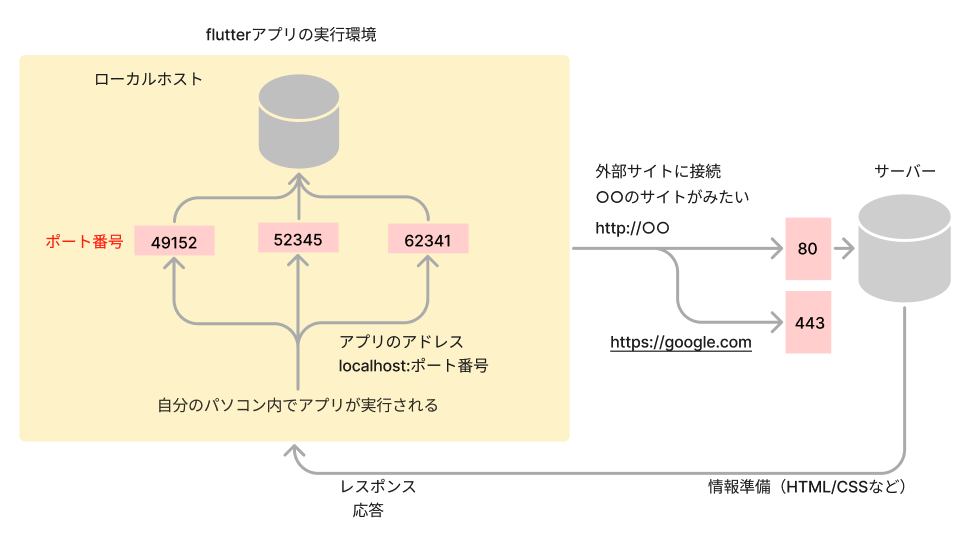
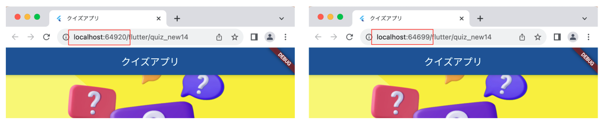
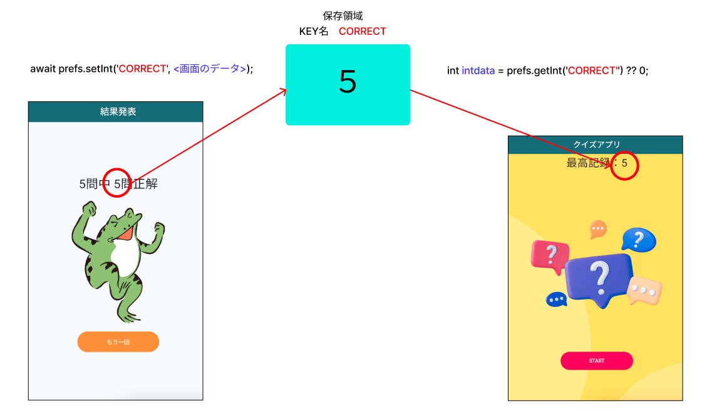
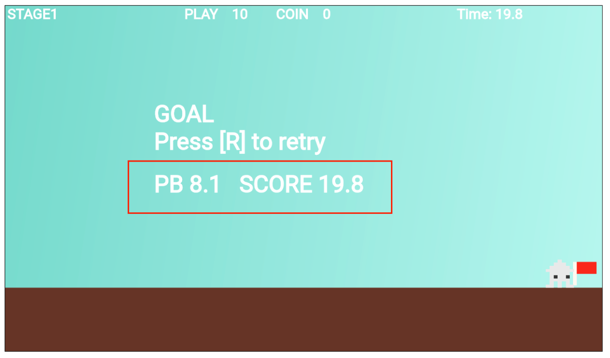

# **11_データ保存**
（目安：2回）

## **この単元でやること**

1. 保存の仕組み
2. ゲームに適用してみよう
3. 保存とロード


## **1. 保存の仕組み**

まずは、保存の仕組みを説明します。  
2で実際にゲームに適用するので、コードはまだ書かないでよいです。

## **shared_preferencesプラグインの使い方**

- [ ] アプリの実行環境について



自分のパソコン上でアプリが実行される（ローカルホスト接続）  
この時のURLは「localhost:ポート番号」となっていて、実行するたびにポート番号が変わります    
ポート番号・・・通信する時の出入口（処理を実行している部屋のようなイメージ）



<br>

shared_preferencesプラグインは、このポート番号で割り当てられたメモリ領域にデータを読み書きする機能です


### **アプリの実行方法**

- `VSCode＞ターミナル`　アプリのディレクトリを指定
- `flutter run --web-port 8080` として実行  
  

**launch.json**

- ポート番号の情報を追加することで、「実行とデバック」から実行可能です。

```dart

{
    "version": "0.2.0",
    "configurations": [
        {
            "name": "Flutter",
            "request": "launch",
            "type": "dart",
            "program": "lib/main.dart", // エントリーポイント
            "args": [
              "--web-port",
              "8080" // 指定したいポート番号
            ]
        }
    ]
}

```

<br>

### **shared_preferencesの仕組み** 



### **プラグインのインストール**  

pubspec.yaml
```dart

dependencies:
  flutter:
    sdk: flutter
  shared_preferences: ^2.5.2

```

自動でインストールされない場合  

```dart
flutter pub get
```

### **インポート**  
「import 'package:shared_preferences/shared_preferences.dart';」を追加

```dart

import 'package:shared_preferences/shared_preferences.dart';

```

### **データを保存する**

- [ ] Shared preferencesのインスタンスを取得する

```dart
final SharedPreferences prefs = await SharedPreferences.getInstance();
```

- [ ] int型のデータを保存する


```dart
await prefs.setInt('KEY_INT', 9999);
```

- [ ] String型のデータを保存する


```dart
await prefs.setString('KEY_STRING', 'HELLO');
```

- [ ] BOOL型のデータを保存する


```dart
await prefs.setBool('KEY_BOOL', true);
```

- [ ] double型のデータを保存する


```dart
await prefs.setDouble('KEY_DOUBLE', 1.2345);
```

- [ ] List型のデータを保存する  
  Listの型は必ず文字列型でなくてはならない  
  `List<String> `で宣言する

```dart
List<String> listdata = ['a','b'];
await prefs.getStringList('KEY_List', listdata);
```

### **データを読み取る（取り出す）**

- [ ] Shared preferencesのインスタンスを取得する

```dart
final SharedPreferences prefs = await SharedPreferences.getInstance();
```

- [ ] int型のデータを読み取る


```dart
 int intdata = prefs.getInt('KEY_INT') ?? 0;
```

- [ ] String型のデータを読み取る


```dart
 String stringdata = prefs.getString('KEY_STRING') ?? "";
```

- [ ] bool型のデータを読み取る


```dart
 bool booldata = prefs.getBool('KEY_BOOL') ?? true;
```

- [ ] double型のデータを読み取る


```dart
 double doubledata = prefs.getDouble('KEY_DOUBLE') ?? 0.0;
```

- [ ] List型のデータを読み取る


```dart
 double listdata = prefs.getStringList('KEY_List') ?? [];
```

## **2. ゲームに適用してみよう**

ゴールした時に「最高記録」と「スコア」を表示する



### **設定**

**【pabspec.yaml】**

最新バージョンで追加しよう

```dart

dependencies:
  flutter:
    sdk: flutter
  flame: ^1.24.0
  shared_preferences: ^2.5.2 //⭐️追加

```

パッケージをインポート

**【game.dart】**

```dart

import 'package:shared_preferences/shared_preferences.dart';

```

この時点でエラーになる場合は、ターミナルで下記を実行

```dart

flutter pub get

```

### **記録を表示する**

**【game.dart】**

```dart
//省略

//ゴールした
bool isGoal = false;
//ゲームオーバーした
bool isGameOver = false;
// 当たっているかどうか判定
bool isColliding = false;
// ⭐️最高記録
double recordTime = 0.0;

//省略

```

### **①位置データを作成**

**【setting.dart】**

stagelistの最後に記録用のデータ追加

```dart

List<StageData> stagelist = [
  
  //省略
  
  StageData(
    idx: 5,
    font_size: 50,
    pos_x: FIELD_SIZE_X - screenSize.x * 3 / 4,
    pos_y: Y_GROUND_POSITION - 250,
    color: Color.fromARGB(255, 255, 255, 255),
  ),
];

```

### **②オブジェクト作成**

**【stagetext.dart】**

```dart

class RecordText extends TextComponent with HasGameRef<MainGame> {
  RecordText(this.data);
  final StageData data;

  @override
  Future<void> onLoad() async {
    position = Vector2(data.pos_x, data.pos_y);
    text =
        "PB ${recordTime.toStringAsFixed(1)}   SCORE ${elapsedTime.toStringAsFixed(1)}";

    textRenderer = TextPaint(
        style: TextStyle(
            fontSize: data.font_size,
            fontWeight: FontWeight.bold,
            color: data.color));
  }

  @override
  Future<void> render(Canvas canvas) async {
    super.render(canvas);
  }

  @override
  void update(double dt) {
    super.update(dt);
  }
}


```

### **③インスタンス作成**

**【game.dart】**

```dart

Future<void> goaltextRemove() async {
    world.children.whereType<Teki>().forEach((teki) {
      teki.removeFromParent();
    });

    goalText _goalText = goalText(stagelist[3]);
    await world.add(_goalText);
    
    // ⭐️最高記録
    RecordText _recordText = RecordText(stagelist[5]);
    await world.add(_recordText);
  }


```

### **記録を保存する**

**【game.dart】**

```dart

Future<void> goaltextRemove() async {
    world.children.whereType<Teki>().forEach((teki) {
      teki.removeFromParent();
    });

    //⭐️タイマー保存
    if (recordTime == 0.0) {
      // 無条件追加
      final SharedPreferences prefs = await SharedPreferences.getInstance();
      await prefs.setDouble('TIME', elapsedTime);
    } else if (recordTime > elapsedTime) {
      // 最高記録よりもスコアが短かったら追加
      final SharedPreferences prefs = await SharedPreferences.getInstance();
      await prefs.setDouble('TIME', elapsedTime);
    }

    goalText _goalText = goalText(stagelist[3]);
    await world.add(_goalText);
    
    //最高記録
    RecordText _recordText = RecordText(stagelist[5]);
    await world.add(_recordText);
  }

```

### **記録を読み取るする**

**【game.dart】**

```dart

  @override
  Future<void> onLoad() async {
    super.onLoad();

    //⭐️ データ読み取り
    final SharedPreferences prefs = await SharedPreferences.getInstance();
    recordTime = prefs.getDouble('TIME') ?? 0.0;

    screenSize = size;

    RetryPosition = PLAYER_SIZE_X / 2;
    RetryFlg = false;

    //worldを作る
    world = World();
    add(world);

    //省略


  }

```

### **【ここまでのソースコード】**

**【game.dart】**

```dart

import 'package:flame/game.dart';
import 'package:flutter/material.dart';
import 'package:flame/input.dart';
import 'package:flame/camera.dart';
import 'package:flame/components.dart';
import 'package:shared_preferences/shared_preferences.dart'; // ⭐️追加
import 'screen.dart';
import 'player.dart';
import 'setting.dart';
import 'object.dart';
import 'teki.dart';
import 'stagetext.dart';

late Vector2 screenSize;
var RetryPosition = PLAYER_SIZE_X / 2;
bool RetryFlg = false;
//プレーヤーのHP
int player_count = 10;
//コインの数
int coin_count = 0;
//タイマーストップ
bool StopTimer = false;
// 経過時間
double elapsedTime = 0.0;
//ゴールした
bool isGoal = false;
//ゲームオーバーした
bool isGameOver = false;
// 当たっているかどうか判定
bool isColliding = false;
// 最高記録
double recordTime = 0.0;

class MainGame extends FlameGame
    with HasKeyboardHandlerComponents, HasCollisionDetection {
  final BuildContext context;
  MainGame(this.context) {
    // debugMode = true;
  }

  // カメラコンポーネントの追加
  late final CameraComponent cameraComponent;
  Player player = Player();

  late countTimer _countTimer;

  @override
  void onGameResize(Vector2 size) {
    super.onGameResize(size);
    screenSize = size;
  }

  @override
  Future<void> onLoad() async {
    super.onLoad();

    //データ読み取り
    final SharedPreferences prefs = await SharedPreferences.getInstance();
    recordTime = prefs.getDouble('TIME') ?? 0.0;

    screenSize = size;

    RetryPosition = PLAYER_SIZE_X / 2;
    RetryFlg = false;

    //worldを作る
    world = World();
    add(world);

    //カメラコンポーネントを作る
    cameraComponent = CameraComponent.withFixedResolution(
      width: screenSize.x,
      height: screenSize.y,
    );

    //worldの一部を切り取ってカメラに表示する
    cameraComponent.world = world;

    //デフォルトのカメラをcameraComponentに置き換える
    camera = cameraComponent;

    //コンポーネント追加
    await add(cameraComponent);

    _countTimer = countTimer(stagelist[2]);
    await world.add(_countTimer);

    await objectRemove();
  }

  Future<void> initializeGame() async {
    print("=========initializeGame=======");
    world.children.removeWhere((child) => true);

    _countTimer = countTimer(stagelist[2]);
    await world.add(_countTimer);

    // ゲームの状態をリセット
    player_count = 10;
    coin_count = 0;
    StopTimer = false;
    isGoal = false;
    isGameOver = false;
    RetryFlg = false;
    RetryPosition = PLAYER_SIZE_X / 2;
    await objectRemove();
  }

  Future<void> objectRemove() async {
    final List<Component> childrenToRemove = world.children.toList();
    // print(childrenToRemove);
    for (var child in childrenToRemove) {
      if (child is! countTimer) {
        // countTimer 以外を削除
        child.removeFromParent();
      }
    }

    world.children.whereType<Teki>().forEach((teki) {
      teki.removeFromParent();
    });

    //カメラの初期値設定（関数呼び出し）
    await CameraRemove();

    CameraBackScreen backscreen = CameraBackScreen();
    await world.add(backscreen);

    Cameraground ground = Cameraground();
    await world.add(ground);

    player = Player();
    player.position = Vector2(RetryPosition, Y_GROUND_POSITION);
    await world.add(player);

    if (!world.children.contains(_countTimer)) {
      _countTimer = countTimer(stagelist[2]);
      await world.add(_countTimer);
    }

    triangle _triangle = triangle(triangleList[0]);
    await world.add(_triangle);

    triangle _triangle1 = triangle(triangleList[1]);
    await world.add(_triangle1);

    triangle _triangle2 = triangle(triangleList[2]);
    await world.add(_triangle2);

    step _step = step(steplist[0]);
    await world.add(_step);

    step _step1 = step(steplist[1]);
    await world.add(_step1);

    Teki _teki = Teki(tekilist[0]);
    await world.add(_teki);

    Teki _teki1 = Teki(tekilist[1]);
    await world.add(_teki1);

    Teki _teki2 = Teki(tekilist[2]);
    await world.add(_teki2);

    retryflag _retryflag = retryflag(retrylist[0]);
    await world.add(_retryflag);

    goalflag _goalflag = goalflag(goallist[0]);
    await world.add(_goalflag);

    coin _coin = coin(coinlist[0], 1, 1, 0);
    await world.add(_coin);

    for (int i = 0; i < 2; i++) {
      for (int j = 0; j < 3; j++) {
        coin _coin1 = coin(coinlist[1], j, i, 10);
        await world.add(_coin1);
      }
    }

    StageText _stagetext = StageText(stagelist[0]);
    await world.add(_stagetext);

    ScoreText _scoretext = ScoreText(stagelist[1]);
    await world.add(_scoretext);
  }

  Future<void> TekiRemove() async {
    world.children.whereType<Teki>().forEach((text) {
      text.removeFromParent();
    });

    Teki _teki3 = Teki(tekilist[3]);
    await world.add(_teki3);
  }

  // ゴールした時に呼び出すために関数にする
  Future<void> goaltextRemove() async {
    world.children.whereType<Teki>().forEach((teki) {
      teki.removeFromParent();
    });
    //タイマー保存
    if (recordTime == 0.0) {
      // 無条件追加
      final SharedPreferences prefs = await SharedPreferences.getInstance();
      await prefs.setDouble('TIME', elapsedTime);
    } else if (recordTime > elapsedTime) {
      // 短かったら追加
      final SharedPreferences prefs = await SharedPreferences.getInstance();
      await prefs.setDouble('TIME', elapsedTime);
    }

    goalText _goalText = goalText(stagelist[3]);
    await world.add(_goalText);
    //最高記録
    RecordText _recordText = RecordText(stagelist[5]);
    await world.add(_recordText);
  }

  // ゲームオーバーの時に呼び出すために関数にする
  Future<void> gameoverRemove() async {
    world.children.whereType<Teki>().forEach((teki) {
      teki.removeFromParent();
    });

    gameOverText _gameoverText = gameOverText(stagelist[4]);
    await world.add(_gameoverText);
  }

  Future<void> CameraRemove() async {
    cameraComponent.viewfinder.anchor =
        Anchor(CAMERA_POSITION_X, CAMERA_POSITION_Y);
    cameraComponent.viewfinder.position = Vector2.zero();
    cameraComponent.viewfinder.zoom = 1.0;
  }

  @override
  void update(double dt) {
    super.update(dt);

    if (player.position.x > VIEW_X_START && player.position.x < VIEW_X_END) {
      //プレイヤーに追従する
      cameraComponent.viewfinder.position =
          Vector2(player.position.x, Y_GROUND_POSITION);
    } else {
      if (player.position.x > VIEW_X_END) {
        // 範囲外になったら追従しない
        cameraComponent.viewfinder.position =
            Vector2(VIEW_X_END, Y_GROUND_POSITION);
      } else {
        // 範囲まで追従しない
        cameraComponent.viewfinder.position =
            Vector2(VIEW_X_START, Y_GROUND_POSITION);
      }
    }
    cameraComponent.update(dt);
  }
}

```

**【stagetext.dart】**

```dart

import 'package:flutter/material.dart';
import 'package:flame/components.dart';
import 'game.dart';
import 'setting.dart';

class StageText extends TextComponent with HasGameRef<MainGame> {
  StageText(this.data);
  final StageData data;

  @override
  Future<void> onLoad() async {
    position = Vector2(data.pos_x, data.pos_y);
    text = "STAGE1";

    textRenderer = TextPaint(
        style: TextStyle(
            fontSize: data.font_size,
            fontWeight: FontWeight.bold,
            color: data.color));
  }

  @override
  Future<void> render(Canvas canvas) async {
    super.render(canvas);
  }

  @override
  void update(double dt) {
    super.update(dt);

    // プレイヤーの位置に合わせてNextTextの位置を更新
    if (gameRef.player.position.x > VIEW_X_START &&
        gameRef.player.position.x < VIEW_X_END) {
      position.x = gameRef.player.position.x - VIEW_X_START + 10;
    }

    text = "STAGE1";
  }
}

class ScoreText extends TextComponent with HasGameRef<MainGame> {
  ScoreText(this.data);
  final StageData data;

  @override
  Future<void> onLoad() async {
    position = Vector2(data.pos_x, data.pos_y);
    text = "PLAY　${player_count}　　COIN　${coin_count}";

    textRenderer = TextPaint(
        style: TextStyle(
            fontSize: data.font_size,
            fontWeight: FontWeight.bold,
            color: data.color));
  }

  @override
  Future<void> render(Canvas canvas) async {
    super.render(canvas);
  }

  @override
  void update(double dt) {
    super.update(dt);

    // プレイヤーの位置に合わせてScoreTextの位置を更新
    if (gameRef.player.position.x > VIEW_X_START &&
        gameRef.player.position.x < VIEW_X_END) {
      position.x = gameRef.player.position.x;
    }

    text = "PLAY　${player_count}　　COIN　${coin_count}";
  }
}

class countTimer extends TextComponent with HasGameRef<MainGame> {
  countTimer(this.data);
  final StageData data;

  Stopwatch _stopwatch = Stopwatch(); // システムのストップウォッチを使用

  @override
  Future<void> onLoad() async {
    super.onLoad();
    _stopwatch.start(); // ストップウォッチ開始
    position = Vector2(data.pos_x, data.pos_y);
    text = 'Time: 0.0';
    textRenderer = TextPaint(
        style: TextStyle(
            fontSize: data.font_size,
            fontWeight: FontWeight.bold,
            color: data.color));
    priority = 1000;
  }

  @override
  void update(double dt) {
    super.update(dt);

    // システムのストップウォッチから経過時間を取得
    elapsedTime = _stopwatch.elapsedMilliseconds / 1000.0; // 秒単位に変換

    if (StopTimer) {
      _stopwatch.stop();
      return;
    }

    // プレイヤーの位置に基づいて位置を更新
    if (gameRef.player.position.x > VIEW_X_START &&
        gameRef.player.position.x < VIEW_X_END) {
      position.x = gameRef.player.position.x + VIEW_X_START * 1.5;
    }

    // 経過時間をテキストに表示
    text = 'Time: ${elapsedTime.toStringAsFixed(1)}';
  }
}

//ゴール
class goalText extends TextComponent with HasGameRef<MainGame> {
  goalText(this.data);
  final StageData data;

  @override
  Future<void> onLoad() async {
    position = Vector2(data.pos_x, data.pos_y);
    text = "GOAL\nPress [R] to retry";

    textRenderer = TextPaint(
        style: TextStyle(
            fontSize: data.font_size,
            fontWeight: FontWeight.bold,
            color: data.color));
  }

  @override
  Future<void> render(Canvas canvas) async {
    super.render(canvas);
  }

  @override
  void update(double dt) {
    super.update(dt);
  }
}

//ゲームオーバー
class gameOverText extends TextComponent with HasGameRef<MainGame> {
  gameOverText(this.data);
  final StageData data;

  @override
  Future<void> onLoad() async {
    position = Vector2(data.pos_x, data.pos_y);
    text = "GAMEORVER\nPress [R] to retry";

    textRenderer = TextPaint(
        style: TextStyle(
            fontSize: data.font_size,
            fontWeight: FontWeight.bold,
            color: data.color));
  }

  @override
  Future<void> render(Canvas canvas) async {
    super.render(canvas);
  }

  @override
  void update(double dt) {
    super.update(dt);

    // プレイヤーの位置に合わせてScoreTextの位置を更新
    if (gameRef.player.position.x > VIEW_X_START &&
        gameRef.player.position.x < VIEW_X_END) {
      position.x = gameRef.player.position.x;
    }
    // print("${gameRef.player.velocity.x}/${position.x}");
    text = "GAMEORVER\nPress [R] to retry";
  }
}

class RecordText extends TextComponent with HasGameRef<MainGame> {
  RecordText(this.data);
  final StageData data;

  @override
  Future<void> onLoad() async {
    position = Vector2(data.pos_x, data.pos_y);
    text =
        "PB ${recordTime.toStringAsFixed(1)}   SCORE ${elapsedTime.toStringAsFixed(1)}";

    textRenderer = TextPaint(
        style: TextStyle(
            fontSize: data.font_size,
            fontWeight: FontWeight.bold,
            color: data.color));
  }

  @override
  Future<void> render(Canvas canvas) async {
    super.render(canvas);
  }

  @override
  void update(double dt) {
    super.update(dt);
  }
}


```

**【setting.dart】**

```dart

import 'package:flutter/material.dart';
import 'game.dart';

//スクリーンサイズ４つ分
final FIELD_SIZE_X = screenSize.x * 4;
//スクリーンの高さと同じ
final FIELD_SIZE_Y = screenSize.y;

//地面の位置をスクリーンの高さの80%の位置にする
final Y_GROUND_POSITION = screenSize.y * 0.8;

final PLAYER_SIZE_X = 60.0;
final PLAYER_SIZE_Y = 60.0;

final CAMERA_POSITION_X = 0.3;
final CAMERA_POSITION_Y = 0.8;

final VIEW_X_START = screenSize.x * CAMERA_POSITION_X;
final VIEW_X_END = FIELD_SIZE_X - screenSize.x * (1 - CAMERA_POSITION_X);

//コンストラクタ
class TriangleData {
  final int idx;
  final Color color;
  final double pos_x1;
  final double pos_y1;
  final double pos_x2;
  final double pos_y2;
  final double pos_x3;
  final double pos_y3;

  TriangleData({
    required this.idx,
    required this.color,
    required this.pos_x1,
    required this.pos_y1,
    required this.pos_x2,
    required this.pos_y2,
    required this.pos_x3,
    required this.pos_y3,
  });
}

//イニシャライザ
List<TriangleData> triangleList = [
  TriangleData(
    idx: 0,
    color: Color.fromARGB(255, 211, 46, 46),
    pos_x1: screenSize.x * 0.85,
    pos_y1: Y_GROUND_POSITION - 50,
    pos_x2: screenSize.x * 0.85 - 50,
    pos_y2: Y_GROUND_POSITION,
    pos_x3: screenSize.x * 0.85 + 50,
    pos_y3: Y_GROUND_POSITION,
  ),
  TriangleData(
    idx: 1,
    color: Color.fromARGB(255, 211, 46, 46),
    pos_x1: screenSize.x * 1.85,
    pos_y1: Y_GROUND_POSITION - 100,
    pos_x2: screenSize.x * 1.85 - 50,
    pos_y2: Y_GROUND_POSITION,
    pos_x3: screenSize.x * 1.85 + 50,
    pos_y3: Y_GROUND_POSITION,
  ),
  TriangleData(
    idx: 2,
    color: Color.fromARGB(255, 211, 46, 46),
    pos_x1: screenSize.x * 2.1,
    pos_y1: Y_GROUND_POSITION - 100,
    pos_x2: screenSize.x * 2.1 - 50,
    pos_y2: Y_GROUND_POSITION,
    pos_x3: screenSize.x * 2.1 + 50,
    pos_y3: Y_GROUND_POSITION,
  ),
];

class StepData {
  final int idx;
  final Color color;
  final double size_x;
  final double size_y;
  final double pos_x;
  final double pos_y;
  final double start_pos_x;
  final double start_pos_y;
  final double end_pos_x;
  final double end_pos_y;

  StepData({
    required this.idx,
    required this.color,
    required this.size_x,
    required this.size_y,
    required this.pos_x,
    required this.pos_y,
    required this.start_pos_x,
    required this.start_pos_y,
    required this.end_pos_x,
    required this.end_pos_y,
  });
}

List<StepData> steplist = [
  StepData(
    idx: 0,
    color: Color.fromARGB(255, 136, 107, 0),
    size_x: screenSize.x * 0.2,
    size_y: screenSize.y * 0.1,
    pos_x: screenSize.x / 2,
    pos_y: screenSize.y / 2,
    start_pos_x: screenSize.x / 2 - PLAYER_SIZE_X / 2,
    start_pos_y: screenSize.y / 2 - PLAYER_SIZE_Y / 2,
    end_pos_x: screenSize.x / 2 + 200 + PLAYER_SIZE_X / 2,
    end_pos_y: screenSize.y / 2 + PLAYER_SIZE_Y / 2,
  ),
  StepData(
    idx: 1,
    color: Color.fromARGB(255, 136, 107, 0),
    size_x: screenSize.x * 0.2,
    size_y: screenSize.y * 0.1,
    pos_x: screenSize.x * 3 / 4,
    pos_y: screenSize.y * 1 / 3,
    start_pos_x: screenSize.x * 3 / 4 - PLAYER_SIZE_X / 2,
    start_pos_y: screenSize.y * 1 / 3 - PLAYER_SIZE_Y / 2,
    end_pos_x: screenSize.x * 3 / 4 + 200 + PLAYER_SIZE_X / 2,
    end_pos_y: screenSize.y * 1 / 3 + PLAYER_SIZE_Y / 2,
  ),
];

class TekiData {
  final int idx;
  final double size_x;
  final double size_y;
  final double pos_x;
  final double pos_y;
  final double speed_x;
  final double speed_y;
  final bool gravity;
  final String right_img1;
  final String right_img2;
  final String left_img1;
  final String left_img2;
  final String stop_left_img1;
  final String stop_left_img2;
  final String stop_right_img1;
  final String stop_right_img2;

  TekiData({
    required this.idx,
    required this.size_x,
    required this.size_y,
    required this.pos_x,
    required this.pos_y,
    required this.speed_x,
    required this.speed_y,
    required this.gravity,
    required this.right_img1,
    required this.right_img2,
    required this.left_img1,
    required this.left_img2,
    required this.stop_left_img1,
    required this.stop_left_img2,
    required this.stop_right_img1,
    required this.stop_right_img2,
  });
}

List<TekiData> tekilist = [
  TekiData(
    idx: 0,
    size_x: 50,
    size_y: 50,
    pos_x: screenSize.x - 300,
    pos_y: Y_GROUND_POSITION - 500,
    speed_x: -100,
    speed_y: 0,
    gravity: true,
    right_img1: 'tako.png',
    right_img2: 'tako.png',
    left_img1: 'tako.png',
    left_img2: 'tako.png',
    stop_left_img1: 'tako.png',
    stop_left_img2: 'tako.png',
    stop_right_img1: 'tako.png',
    stop_right_img2: 'tako.png',
  ),
  TekiData(
    idx: 1,
    size_x: 50,
    size_y: 50,
    pos_x: screenSize.x * 1.5,
    pos_y: Y_GROUND_POSITION - 25,
    speed_x: -100,
    speed_y: 0,
    gravity: true,
    right_img1: 'tako.png',
    right_img2: 'tako.png',
    left_img1: 'tako.png',
    left_img2: 'tako.png',
    stop_left_img1: 'tako.png',
    stop_left_img2: 'tako.png',
    stop_right_img1: 'tako.png',
    stop_right_img2: 'tako.png',
  ),
  TekiData(
    idx: 2,
    size_x: 50,
    size_y: 50,
    pos_x: screenSize.x * 1.3,
    pos_y: Y_GROUND_POSITION - 200,
    speed_x: -200,
    speed_y: 0,
    gravity: false,
    right_img1: 'karasu.png',
    right_img2: 'karasu.png',
    left_img1: 'karasu.png',
    left_img2: 'karasu.png',
    stop_left_img1: 'karasu.png',
    stop_left_img2: 'karasu.png',
    stop_right_img1: 'karasu.png',
    stop_right_img2: 'karasu.png',
  ),
  TekiData(
    idx: 0,
    size_x: 50,
    size_y: 50,
    pos_x: screenSize.x * 3,
    pos_y: Y_GROUND_POSITION - 500,
    speed_x: -100,
    speed_y: 0,
    gravity: true,
    right_img1: 'tako.png',
    right_img2: 'tako.png',
    left_img1: 'tako.png',
    left_img2: 'tako.png',
    stop_left_img1: 'tako.png',
    stop_left_img2: 'tako.png',
    stop_right_img1: 'tako.png',
    stop_right_img2: 'tako.png',
  ),
];

class RetryData {
  final int idx;
  final double size_x;
  final double size_y;
  final double pos_x;
  final double pos_y;
  final String object_img;

  RetryData({
    required this.idx,
    required this.size_x,
    required this.size_y,
    required this.pos_x,
    required this.pos_y,
    required this.object_img,
  });
}

List<RetryData> retrylist = [
  RetryData(
    idx: 0,
    size_x: 50,
    size_y: 50,
    pos_x: screenSize.x * 2.5,
    pos_y: Y_GROUND_POSITION - PLAYER_SIZE_Y / 2,
    object_img: 'checkflag.png',
  ),
];

//ゴールフラッグ
class GoalData {
  final int idx;
  final double size_x;
  final double size_y;
  final double pos_x;
  final double pos_y;
  final String object_img;

  GoalData({
    required this.idx,
    required this.size_x,
    required this.size_y,
    required this.pos_x,
    required this.pos_y,
    required this.object_img,
  });
}

List<GoalData> goallist = [
  GoalData(
    idx: 0,
    size_x: 50,
    size_y: 50,
    pos_x: screenSize.x * 4 - 50,
    pos_y: Y_GROUND_POSITION - PLAYER_SIZE_Y / 2,
    object_img: 'redflag.png',
  ),
];

class CoinData {
  final int idx;
  final double size_x;
  final double size_y;
  final double pos_x;
  final double pos_y;
  final String coin_img;

  CoinData({
    required this.idx,
    required this.size_x,
    required this.size_y,
    required this.pos_x,
    required this.pos_y,
    required this.coin_img,
  });
}

List<CoinData> coinlist = [
  CoinData(
    idx: 0,
    size_x: 30,
    size_y: 30,
    pos_x: screenSize.x * 3 / 4 + 50,
    pos_y: screenSize.y * 1 / 3 - 45,
    coin_img: 'coin.png',
  ),
  CoinData(
    idx: 1,
    size_x: 30,
    size_y: 30,
    pos_x: screenSize.x * 0.5,
    pos_y: Y_GROUND_POSITION - 100,
    coin_img: 'coin.png',
  ),
];

class StageData {
  final int idx;
  final double font_size;
  final double pos_x;
  final double pos_y;
  final Color color;

  StageData({
    required this.idx,
    required this.font_size,
    required this.pos_x,
    required this.pos_y,
    required this.color,
  });
}

List<StageData> stagelist = [
  // stage
  StageData(
    idx: 0,
    font_size: 30,
    pos_x: 0,
    pos_y: 0,
    color: Color.fromARGB(255, 255, 255, 255),
  ),
  StageData(
    idx: 1,
    font_size: 30,
    pos_x: VIEW_X_START,
    pos_y: 0,
    color: Color.fromARGB(255, 255, 255, 255),
  ),
  StageData(
    idx: 2,
    font_size: 30,
    pos_x: VIEW_X_START * 2.5,
    pos_y: 0,
    color: Color.fromARGB(255, 255, 255, 255),
  ),
  StageData(
    idx: 3,
    font_size: 50,
    pos_x: FIELD_SIZE_X - screenSize.x * 3 / 4,
    pos_y: Y_GROUND_POSITION - 400,
    color: Color.fromARGB(255, 255, 255, 255),
  ),
  StageData(
    idx: 4,
    font_size: 50,
    pos_x: 0,
    pos_y: Y_GROUND_POSITION - 400,
    color: Color.fromARGB(255, 255, 255, 255),
  ),
  StageData(
    idx: 5,
    font_size: 50,
    pos_x: FIELD_SIZE_X - screenSize.x * 3 / 4,
    pos_y: Y_GROUND_POSITION - 250,
    color: Color.fromARGB(255, 255, 255, 255),
  ),
];


```
