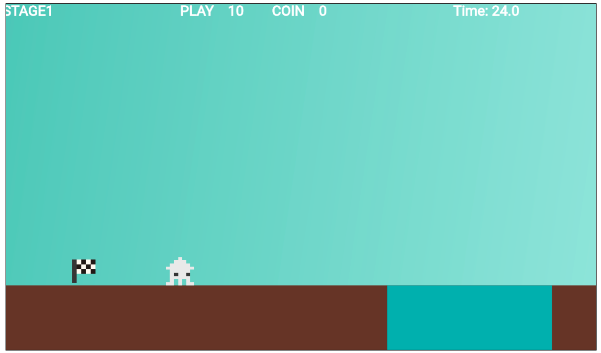
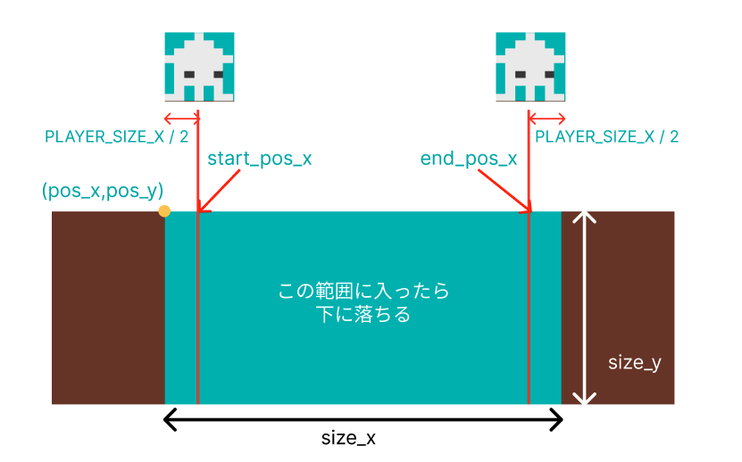

# **20_落とし穴**

## **この単元でやること**

1. 落とし穴を描画
2. 落とし穴の範囲で重力をかける
3. 敵も穴に落とす

## **1. 落とし穴を描画**



### **①位置データを作成**



**【setting.dart】**

一番下に追加

```dart

class HoleData {
  final int idx;
  final Color color;
  final double size_x;
  final double size_y;
  final double pos_x;
  final double pos_y;
  final double start_pos_x;
  final double start_pos_y;
  final double end_pos_x;
  final double end_pos_y;

  HoleData({
    required this.idx,
    required this.color,
    required this.size_x,
    required this.size_y,
    required this.pos_x,
    required this.pos_y,
    required this.start_pos_x,
    required this.start_pos_y,
    required this.end_pos_x,
    required this.end_pos_y,
  });
}

List<HoleData> holelist = [
  HoleData(
    idx: 0,
    color: Color.fromARGB(255, 68, 185, 183),
    size_x: 350,
    size_y: Y_GROUND_POSITION,
    pos_x: screenSize.x * 3.0,
    pos_y: Y_GROUND_POSITION,
    start_pos_x: screenSize.x * 3.0 + PLAYER_SIZE_X / 2,
    start_pos_y: Y_GROUND_POSITION,
    end_pos_x: screenSize.x * 3.0 + 300 - PLAYER_SIZE_X / 2,
    end_pos_y: Y_GROUND_POSITION,
  )
];

```

### **②オブジェクト作成**

**【object.dat】**

一番下に追加

```dart

class hole extends RectangleComponent
    with HasGameRef<MainGame>, CollisionCallbacks {
  // データ番号を受け取る
  hole(this.data);
  final HoleData data;

  @override
  Future<void> onLoad() async {
    paint = Paint()..color = data.color;
    position = Vector2(data.pos_x, data.pos_y);
    size = Vector2(data.size_x, data.size_y);
    anchor = Anchor.topLeft;
    add(RectangleHitbox());
  }

  @override
  Future<void> render(Canvas canvas) async {
    super.render(canvas);
  }
}

```

### **③インスタンス作成**

**【game.dat】**

objectRemove()内

```dart

Future<void> objectRemove() async {

    //省略

    hole _hole = hole(holelist[0]);
    await world.add(_hole);

}

```

## 2. 落とし穴の範囲で重力をかける

### ①落とし穴の範囲にいるかどうか判定する変数を追加

**【player.dart】**

```dart


//上下移動の方向を検知
  double previousY = 0.0;
  //落下中かどうか判定
  bool isFall = false;
  //⭐️下に落ちているかどうか
  bool isInHole = false;

```

### ②落とし穴との当たり判定

```dart

void onCollision(Set<Vector2> intersectionPoints, PositionComponent other) {

    //省略

    //⭐️追加
    if (other is hole) {
      if (position.x > other.data.start_pos_x &&
          position.x < other.data.end_pos_x) {
        isInHole = true;
        isOnGround = false;
        velocity.y += 50;
      }
    }
}


```

### ③地面との衝突処理に条件
### ④スクリーンの一番下に達したら消す

```dart

  @override
  void update(double dt) {
    super.update(dt);

    previousY = position.y;

    //重力をかける
    applyGravity(dt, gravity);
    //地面との衝突を確認
    //⭐️isInHoleがfalseの時だけ
    if(!isInHole){
        checkGroundCollision();
    }

    if (position.x < size.x / 2) {
      position.x = size.x / 2;
    }

    //ポジションを変える
    position += velocity * dt;

    if (position.y > previousY) {
      isFall = true;
    } else {
      isFall = false;
    }

    //⭐️追加
    if (position.y > screenSize.y) {
      isInHole = false; //初期値に戻す
      removeFromParent();
    }
  }

```

## 3. 敵も穴に落とす

**【teki.dart】**

```dart

//地面にいるかの判定
  bool isOnGround = false;
  //重力をかけるかどうか
  bool isGravity = true;
  //⭐️下に落ちているかどうか
  bool isInHole = false;

```

```dart

void onCollision(Set<Vector2> intersectionPoints, PositionComponent other) {
   
   //省略

   //⭐️追加（敵が飛んでいない時だけ）
    if (other is hole) {
      if (position.x > other.data.start_pos_x &&
          position.x < other.data.end_pos_x &&
          isGravity) {
        isInHole = true;
        isOnGround = false;
        velocity.y += 50;
      }
    }
  }

```


```dart

@override
  void update(double dt) {
    super.update(dt);

    //重力をかける
    applyGravity(dt, gravity);
    //⭐️地面との衝突を確認（落ちてないかつ飛んでない）
    if (!isInHole && isGravity) {
      checkGroundCollision();
    }

    if (position.x < size.x / 2) {
      removeFromParent();
    }

    //ポジションを変える
    position += velocity * dt;

    if (position.y > screenSize.y) {
      isInHole = false;
      removeFromParent();
    }
  }

```

