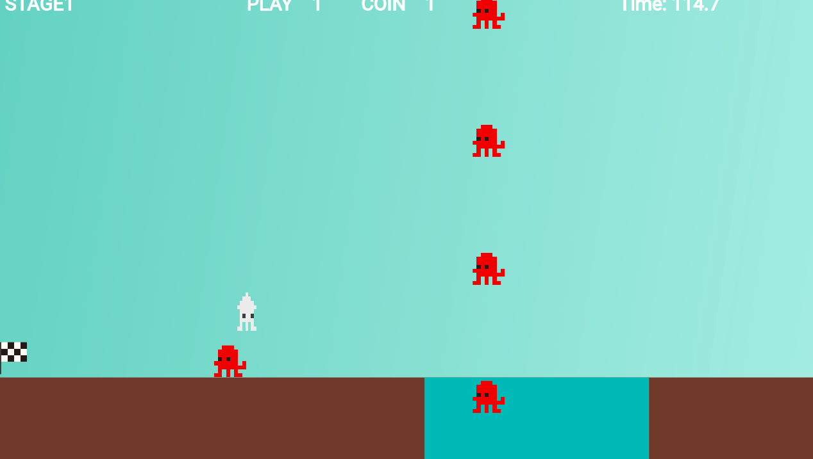

# **21 敵を下から上に出す**

## **この単元でやること**

1. 敵を追加
2. 下から上に出す

## **1. 敵を追加**



### **①位置データを作成**

**【setting.dart】**

tekilistの一番下に追加

```dart

List<TekiData> tekilist = [
  
  //省略

  TekiData(
    idx: 4,
    size_x: 50,
    size_y: 50,
    pos_x: screenSize.x * 3 + 100, //holeの中
    pos_y: screenSize.y - 50, //holeの中
    speed_x: 0,
    speed_y: -100, //上方向に移動
    gravity: false,
    right_img1: 'tako.png',
    right_img2: 'tako.png',
    left_img1: 'tako.png',
    left_img2: 'tako.png',
    stop_left_img1: 'tako.png',
    stop_left_img2: 'tako.png',
    stop_right_img1: 'tako.png',
    stop_right_img2: 'tako.png',
  ),
];

```


### **②オブジェクト作成**

**【object.dat】**

すでに作成済みのため不要

### **③インスタンス作成**

**【game.dat】**

中間地点に来た時に出現させる

```dart

Future<void> TekiRemove() async {
    world.children.whereType<Teki>().forEach((text) {
      text.removeFromParent();
    });

    Teki _teki3 = Teki(tekilist[3]);
    await world.add(_teki3);

    // ⭐️
    Teki _teki4 = Teki(tekilist[4]);
    await world.add(_teki4);

    timerComponent = TimerComponent(
      period: 1, // 1秒ごと
      repeat: true, // 繰り返し実行
      onTick: () {
        Teki _teki4 = Teki(tekilist[4]);
        world.add(_teki4);
      },
    );
    add(timerComponent!);
  }

```
