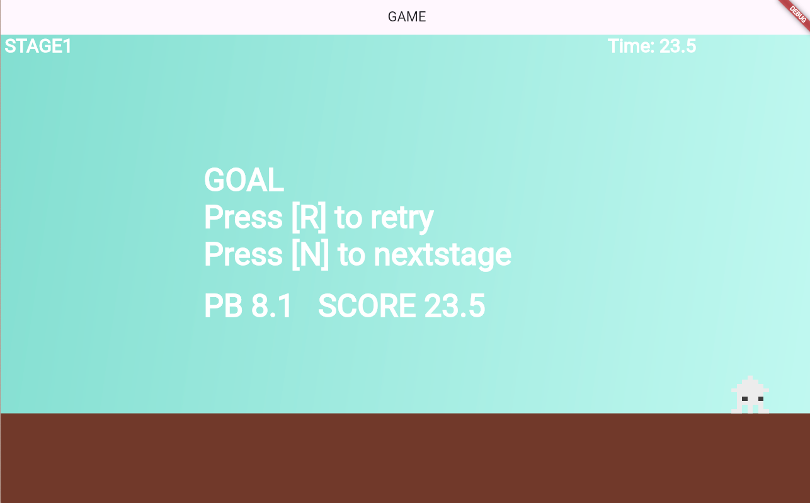
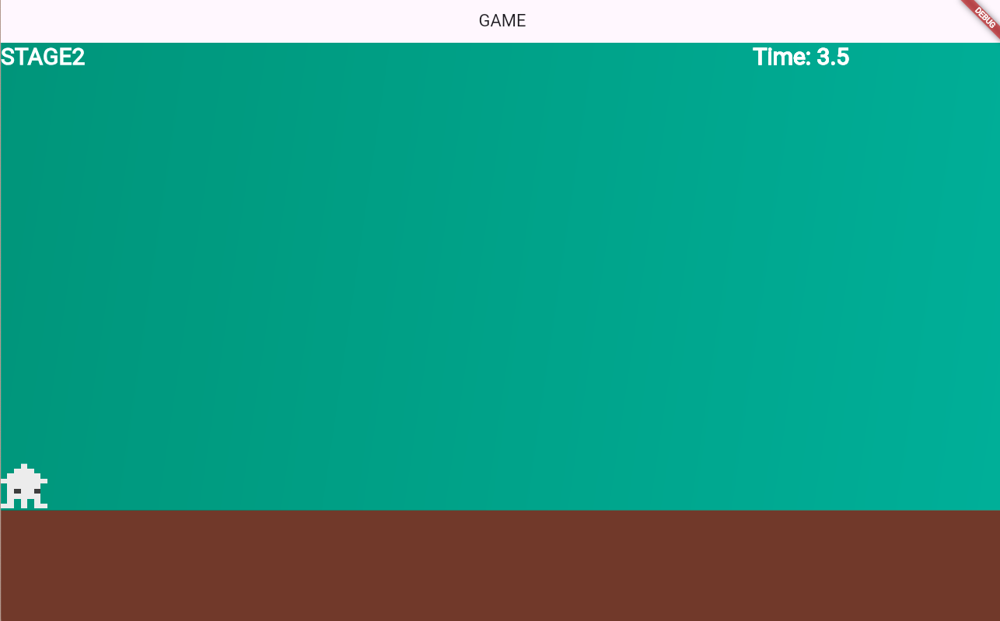

# **22_ステージを変える**

## **この単元でやること**

1. 次のステージを作る

## **1. 次のステージを作る**




### **①ステージを管理する**

**【game.dart】**

ステージを管理する変数を追加

```dart

//省略

//最高記録
double recordTime = 0.0;
// ⭐️ステージ管理
int currentStage = 0;

//省略


```

### **②ステージの表示を変数にする**

**【stagetext.dart】**

```dart

class StageText extends TextComponent with HasGameRef<MainGame> {
  StageText(this.data);
  final StageData data;

  @override
  Future<void> onLoad() async {
    print("currentStage==${currentStage}");
    position = Vector2(data.pos_x, data.pos_y);
    // ⭐️ステージ表示データと変数
    text = "STAGE" + (currentStage + 1).toString();

    textRenderer = TextPaint(
        style: TextStyle(
            fontSize: data.font_size,
            fontWeight: FontWeight.bold,
            color: data.color));
  }

  @override
  Future<void> render(Canvas canvas) async {
    super.render(canvas);
  }

  @override
  void update(double dt) {
    super.update(dt);

    // プレイヤーの位置に合わせてNextTextの位置を更新
    if (gameRef.player.position.x > VIEW_X_START &&
        gameRef.player.position.x < VIEW_X_END) {
      position.x = gameRef.player.position.x - VIEW_X_START + 10;
    }

    // ⭐️ステージ表示データと変数
    text = "STAGE" + (currentStage + 1).toString();
  }
}


```

### **③ゴール時に次のステージメッセージ表示**

**【stagetext.dart】**

```dart

class goalText extends TextComponent with HasGameRef<MainGame> {
  goalText(this.data);
  final StageData data;

  @override
  Future<void> onLoad() async {
    position = Vector2(data.pos_x, data.pos_y);
    // ⭐️修正
    text = "GOAL\nPress [R] to retry\nPress [N] to nextstage";

    textRenderer = TextPaint(
        style: TextStyle(
            fontSize: data.font_size,
            fontWeight: FontWeight.bold,
            color: data.color));
  }

  @override
  Future<void> render(Canvas canvas) async {
    super.render(canvas);
  }

  @override
  void update(double dt) {
    super.update(dt);
  }
}

```

**【setting.dart】**

最高記録表示が被ってしまうので少し下にずらす

```dart

StageData(
    idx: 5,
    font_size: 50,
    pos_x: FIELD_SIZE_X - screenSize.x * 3 / 4,
    pos_y: Y_GROUND_POSITION - 200, //⭐️下にずらす
    color: Color.fromARGB(255, 255, 255, 255),
  ),

```

### **④「N」キーを押した時の処理**

**【player.dart】**

```dart

@override
  bool onKeyEvent(
    KeyEvent event,
    Set<LogicalKeyboardKey> keysPressed,
  ) {
    if (event is KeyDownEvent) {
      leftflg = false;
      rightflg = false;
      if (isGameOver || isGoal) {
        if (event.character == 'r') {
          position = Vector2(PLAYER_SIZE_X / 2, Y_GROUND_POSITION - 100);
          gameRef.initializeGame();
        }
        //⭐️
        if (isGoal && event.character == 'n') {
            //ステージをプラスする
          currentStage++;
          gameRef.initializeGame();
        }
      } else {

        //省略

      }
    }
  }

```

### **⑤リセット処理**

**【game.dart】**

```dart

Future<void> objectRemove() async {
    final List<Component> childrenToRemove = world.children.toList();
    for (var child in childrenToRemove) {
      if (child is! countTimer) {
        // countTimer 以外を削除
        child.removeFromParent();
      }
    }

    timerComponent?.removeFromParent();
    timerComponent = null;

    world.children.whereType<Teki>().forEach((teki) {
      teki.removeFromParent();
    });

    //カメラの初期値設定（関数呼び出し）
    await CameraRemove();

    CameraBackScreen backscreen = CameraBackScreen();
    await world.add(backscreen);

    Cameraground ground = Cameraground();
    await world.add(ground);

    player = Player();
    player.position = Vector2(RetryPosition, Y_GROUND_POSITION);
    await world.add(player);

    if (!world.children.contains(_countTimer)) {
      _countTimer = countTimer(stagelist[2]);
      await world.add(_countTimer);
    }

    // ⭐️共通部分として移動
    StageText _stagetext = StageText(stagelist[0]);
    await world.add(_stagetext);
    ScoreText _scoretext = ScoreText(stagelist[1]);
    await world.add(_scoretext);

    // ⭐️ステージにより処理を切り替える
    switch (currentStage) {
      case 0:
        triangle _triangle = triangle(triangleList[0]);
        await world.add(_triangle);

        triangle _triangle1 = triangle(triangleList[1]);
        await world.add(_triangle1);

        triangle _triangle2 = triangle(triangleList[2]);
        await world.add(_triangle2);

        step _step = step(steplist[0]);
        await world.add(_step);

        step _step1 = step(steplist[1]);
        await world.add(_step1);

        Teki _teki = Teki(tekilist[0]);
        await world.add(_teki);

        Teki _teki1 = Teki(tekilist[1]);
        await world.add(_teki1);

        Teki _teki2 = Teki(tekilist[2]);
        await world.add(_teki2);

        retryflag _retryflag = retryflag(retrylist[0]);
        await world.add(_retryflag);

        goalflag _goalflag = goalflag(goallist[0]);
        await world.add(_goalflag);

        coin _coin = coin(coinlist[0], 1, 1, 0);
        await world.add(_coin);

        for (int i = 0; i < 2; i++) {
          for (int j = 0; j < 3; j++) {
            coin _coin1 = coin(coinlist[1], j, i, 10);
            await world.add(_coin1);
          }
        }

        // ⭐️移動
        // StageText _stagetext = StageText(stagelist[0]);
        // await world.add(_stagetext);

        // ScoreText _scoretext = ScoreText(stagelist[1]);
        // await world.add(_scoretext);

        hole _hole = hole(holelist[0]);
        await world.add(_hole);

        break;
      case 1:
        break;
      default:
    }
  }

```

### **⑥ゴールしたときにオブジェクトを消す**

**【game.dart】**

```dart
Future<void> goaltextRemove() async {
    // ⭐️コメントアウト
    // world.children.whereType<Teki>().forEach((teki) {
    //   teki.removeFromParent();
    // });
    // ⭐️消したいオブジェクトをリストに追加
    final typesToRemove = [
      Teki,
      triangle,
      step,
      retryflag,
      goalflag,
      coin,
      ScoreText,
      hole,
    ];

    for (final type in typesToRemove) {
      world.children.where((c) => c.runtimeType == type).toList().forEach((c) {
        c.removeFromParent();
      });
    }

    // タイマー止める
    timerComponent?.removeFromParent();
    timerComponent = null;
    //タイマー保存
    if (recordTime == 0.0) {
      // 無条件追加
      recordTime = elapsedTime;
      final SharedPreferences prefs = await SharedPreferences.getInstance();
      await prefs.setDouble('TIME', elapsedTime);
    } else if (recordTime > elapsedTime) {
      // 短かったら追加
      recordTime = elapsedTime;
      final SharedPreferences prefs = await SharedPreferences.getInstance();
      await prefs.setDouble('TIME', elapsedTime);
    }

    goalText _goalText = goalText(stagelist[3]);
    await world.add(_goalText);
    //最高記録
    RecordText _recordText = RecordText(stagelist[5]);
    await world.add(_recordText);
  }
```
