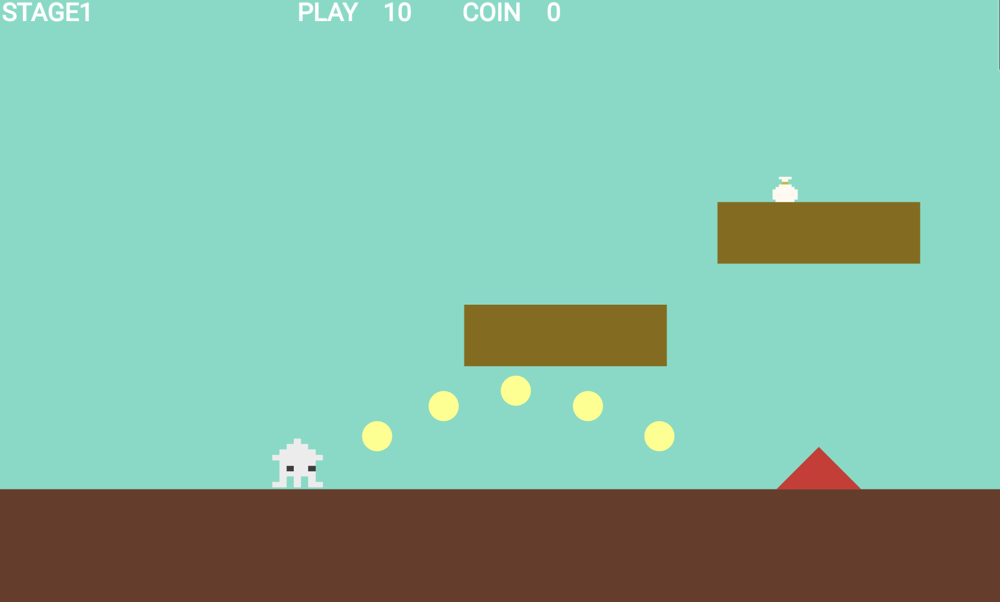
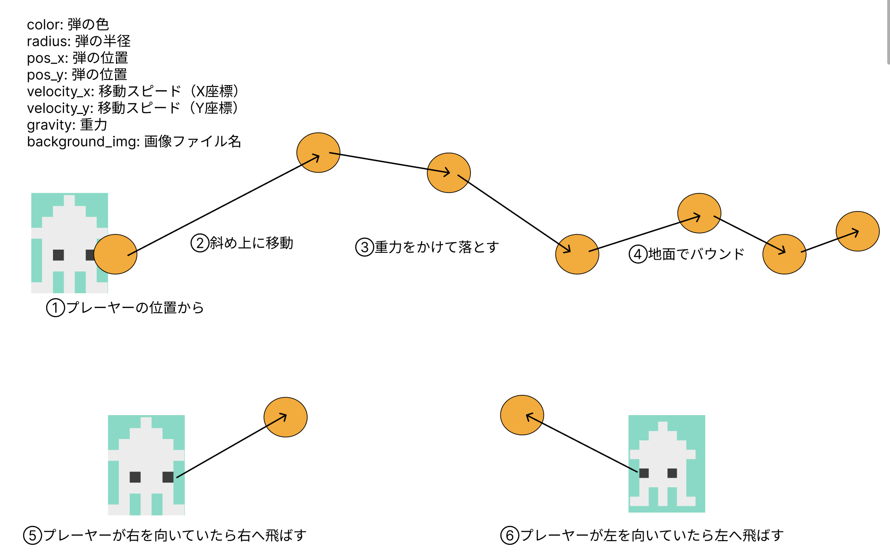

# **23_弾を出す**

## **この単元でやること**

1. プレーヤーから弾を出す
2. 効果音をつける

## **1. プレーヤーから弾を出す**




### **①位置データを作成**

**【setting.dart】**

新しくTamaDataをつくる

```dart

class TamaData {
  final int idx;
  final Color color;
  final double radius;
  final double size_x;
  final double size_y;
  final double velocity_x;
  final double velocity_y;
  final double gravity;
  final String background_img;

  TamaData({
    required this.idx,
    required this.color,
    required this.radius,
    required this.size_x,
    required this.size_y,
    required this.velocity_x,
    required this.velocity_y,
    required this.gravity,
    required this.background_img,
  });
}

List<TamaData> TamaDatalist = [
  TamaData(
    idx: 0,
    color: Color.fromARGB(255, 255, 174, 0),
    radius: 10,
    size_x: 0,
    size_y: 0,
    velocity_x: 500,
    velocity_y: 300,
    gravity: 800,
    background_img: "", //SpriteComponent使う場合
  )
];

```

### **②オブジェクト作成**

**【tama.dart】新規作成**

```dart

import 'package:flame/components.dart';
import 'package:flame/collisions.dart';
import 'package:flutter/material.dart';
import 'game.dart';
import 'setting.dart';

class Playertama extends CircleComponent
    with HasGameRef<MainGame>, KeyboardHandler, CollisionCallbacks {
  Playertama(this.data);
  final TamaData data;

  Vector2 velocity = Vector2.zero();
  double speed_x = 0;
  double speed_y = 0;

  @override
  Future<void> onLoad() async {
    //プレーヤーの位置から発射する
    position = Vector2(gameRef.player.position.x, gameRef.player.position.y);
    radius = data.radius;
    paint = Paint()..color = data.color;
    await add(CircleHitbox(radius: data.radius));
    await super.onLoad();
  }

  @override
  void update(double delta) {

    // 斜め上に飛ばす
    speed_x = data.velocity_x;
    speed_y = -data.velocity_y;

    // 重力加速度をY方向速度に加算
    speed_y += data.gravity * delta;

    // 位置を更新
    position.x += speed_x * delta;
    position.y += speed_y * delta;
  }

  @override
  void onCollisionStart(
    Set<Vector2> intersectionPoints,
    PositionComponent other,
  ) {
    super.onCollisionStart(intersectionPoints, other);
  }
}

```

### **③インスタンス作成**

**【game.dart】**

**関数追加**

```dart

//省略

Future<void> PlayertamaRemove() async {
    Playertama _playertama = Playertama(TamaDatalist[0]);
    await world.add(_playertama);
}

```

****

### **④Eキー押されたら弾を出す**

**【player.dart】**


```dart

if (event is KeyDownEvent) {
      leftflg = false;
      rightflg = false;
      if (isGameOver || isGoal) {
        if (event.character == 'r') {
          position = Vector2(PLAYER_SIZE_X / 2, Y_GROUND_POSITION - 100);
          gameRef.initializeGame();
        }
        if (isGoal && event.character == 'n') {
          currentStage++;
          gameRef.initializeGame();
        }
      } else {
        //左矢印押した時
        if (keysPressed.contains(LogicalKeyboardKey.arrowLeft)) {
          leftflg = true;
          rightflg = false;
          moveLeft();
          //スペースキー押した時
          if (keysPressed.contains(LogicalKeyboardKey.space)) {
            jump();
          }
          //右矢印押した時
        } else if (keysPressed.contains(LogicalKeyboardKey.arrowRight)) {
          leftflg = false;
          rightflg = true;
          moveRight();
          // スペースキー押した時
          if (keysPressed.contains(LogicalKeyboardKey.space)) {
            jump();
          }
          //スペースキー押した時
        } else if (keysPressed.contains(LogicalKeyboardKey.space)) {
          jump();
        }
        //⭐️追加
        if (keysPressed.contains(LogicalKeyboardKey.keyE)) {
            gameRef.PlayertamaRemove();
        }
      }
    } else if (event is KeyUpEvent) {
        stopMovement();
    }


```

このままだと斜め上に飛んでいってしまう・・・  

**⑤最初だけ斜めに飛ばし、その後重力をかける**

**【tama.dart】**

```dart

class Playertama extends CircleComponent
    with HasGameRef<MainGame>, KeyboardHandler, CollisionCallbacks {
  Playertama(this.data);
  final TamaData data;

  Vector2 velocity = Vector2.zero();
  double speed_x = 0;
  double speed_y = 0;
  double bounceFactor = 0.7; //⭐️追加
  bool hasFired = false;  //⭐️追加

  @override
  Future<void> onLoad() async {
    //①プレーヤーの位置から発射する
    position = Vector2(gameRef.player.position.x, gameRef.player.position.y);
    radius = data.radius;
    paint = Paint()..color = data.color;
    await add(CircleHitbox(radius: data.radius));
    await super.onLoad();
  }

  @override
  void update(double delta) {

    // ⭐️斜め上に飛ばす（最初だけ）
    if (!hasFired) {
      speed_x = data.velocity_x;
      speed_y = -data.velocity_y;
      hasFired = true;
    }

    // 重力加速度をY方向速度に加算
    speed_y += data.gravity * delta;

    // 位置を更新
    position.x += speed_x * delta;
    position.y += speed_y * delta;

  }

}

```

**⑥地面でバウンドさせる**  

**【tama.dart】**

```dart

class Playertama extends CircleComponent
    with HasGameRef<MainGame>, KeyboardHandler, CollisionCallbacks {
  
  //省略

  @override
  void update(double delta) {

    // 斜め上に飛ばす（最初だけ）
    if (!hasFired) {
      speed_x = data.velocity_x;
      speed_y = -data.velocity_y;
      hasFired = true;
    }

    // 重力加速度をY方向速度に加算
    speed_y += data.gravity * delta;

    // 位置を更新
    position.x += speed_x * delta;
    position.y += speed_y * delta;

    // ⭐️地面でバウンド
    if (position.y >= Y_GROUND_POSITION) {
      position.y = Y_GROUND_POSITION; // 地面に位置を補正
      speed_y = -speed_y * bounceFactor; // 反発上へ少しスピードを落とす

      //バウンドの大きさが50より小さくなったら、止める .absは絶対値（マイナス方向の場合も対応できるように）
      if (speed_y.abs() < 50) {
        speed_y = 0;
      }
    }

    // ⭐️枠外に行ったら消す
    if (position.y < 0 ||
        position.x < 0 ||
        position.x > FIELD_SIZE_X ||
        position.y > FIELD_SIZE_Y) {
      removeFromParent();
    }
  }

}

```

左を向いても右方向に出てしまう  

**⑦左右に出るようにする**

**【player.dart】**  

方向フラグをグローバル変数にする player.dartからgame.dartに移す

```dart

class Player extends SpriteAnimationComponent
    with HasGameRef<MainGame>, KeyboardHandler, CollisionCallbacks {
  
  //省略

  //各方向のスプライト
  late SpriteAnimation leftAnimation;
  late SpriteAnimation rightAnimation;
  late SpriteAnimation stop_leftAnimation;
  late SpriteAnimation stop_rightAnimation;

  //⭐️方向フラグ　コメントアウト
  // bool leftflg = false;
  // bool rightflg = false;

  //省略

```

**【game.dart】**

```dart

//省略

//最高記録
double recordTime = 0.0;
// ステージ管理
int currentStage = 0;
// 弾を出す
bool ptama = false;
// ⭐️ここに移動
bool leftflg = false;
bool rightflg = true; //最初は右を向いている

TimerComponent? timerComponent;

class MainGame extends FlameGame
    with HasKeyboardHandlerComponents, HasCollisionDetection {

//省略

```

**【player.dart】**

```dart

@override
  bool onKeyEvent(
    KeyEvent event,
    Set<LogicalKeyboardKey> keysPressed,
  ) {
    if (event is KeyDownEvent) {
      //⭐️ leftflg = false;
      //⭐️ rightflg = false;
      if (isGameOver || isGoal) {
        if (event.character == 'r') {
          position = Vector2(PLAYER_SIZE_X / 2, Y_GROUND_POSITION - 100);
          gameRef.initializeGame();
        }
        if (isGoal && event.character == 'n') {
          currentStage++;
          gameRef.initializeGame();
        }
      } else {
        //左矢印押した時
        if (keysPressed.contains(LogicalKeyboardKey.arrowLeft)) {
          leftflg = true;
          rightflg = false;//⭐️
          moveLeft();
          //スペースキー押した時
          if (keysPressed.contains(LogicalKeyboardKey.space)) {
            jump();
          }
          //右矢印押した時
        } else if (keysPressed.contains(LogicalKeyboardKey.arrowRight)) {
          leftflg = false;//⭐️
          rightflg = true;
          moveRight();
          // スペースキー押した時
          if (keysPressed.contains(LogicalKeyboardKey.space)) {
            jump();
          }
          //スペースキー押した時
        } else if (keysPressed.contains(LogicalKeyboardKey.space)) {
          jump();
        }
        if (keysPressed.contains(LogicalKeyboardKey.keyE)) {
          gameRef.PlayertamaRemove();
        }
      }
    } else if (event is KeyUpEvent) {
      stopMovement();
    }
    return true;
  }

```

**【tama.dart】**

```dart

void update(double delta) {

    if (!hasFired) {
        //⭐️左右の判定
        if (leftflg) {
          speed_x = -data.velocity_x;
          speed_y = -data.velocity_y;
        } else if (rightflg) {
          speed_x = data.velocity_x;
          speed_y = -data.velocity_y;
        }
      hasFired = true;
    }

    //省略
  }

```

障害物に当たったら消す  
敵に当たったら消す　敵も消す

```dart

import 'teki.dart'; //⭐️追加

@override
  void onCollisionStart(
    Set<Vector2> intersectionPoints,
    PositionComponent other,
  ) {
    super.onCollisionStart(intersectionPoints, other);

    //⭐️障害物に当たったら消す
    if (other is triangle) {
      removeFromParent();
    }

    //⭐️敵に当たったら消す
    if (other is Teki) {
      removeFromParent();
      other.removeFromParent();
    }
  }


```

## **2. 効果音を追加する**

**①「flame_audio」プラグインのインストール**

**【pubspec.yaml】**


```dart

dependencies:
  flutter:
    sdk: flutter
  flame: 1.25.0
  shared_preferences: ^2.5.2
  flame_audio: ^2.10.7 //⭐️追加

  //省略

  assets:
    - assets/images/
    - assets/audio/   //⭐️追加

```

保存「flutter pub get」が実行される
うまくいかない場合は、ターミナルから「flutter pub get」を実行  

**②audioフォルダを作成、音源ファイルを保存**

プロジェクト＞assets の中に「audio」フォルダを作成  
音声ファイルを追加する  

無料で使える効果音
https://otologic.jp/

演習音源フォルダにサンプルデータがあります  

**③弾に合わせて効果音を出す**

**【player.dart】**

```dart

import 'package:flame_audio/flame_audio.dart';


//省略


//Eキー押されたら
if (keysPressed.contains(LogicalKeyboardKey.keyE)) {
    gameRef.PlayertamaRemove();
    FlameAudio.play('Onoma-Pop04-1(High-Dry).mp3');
}
```
