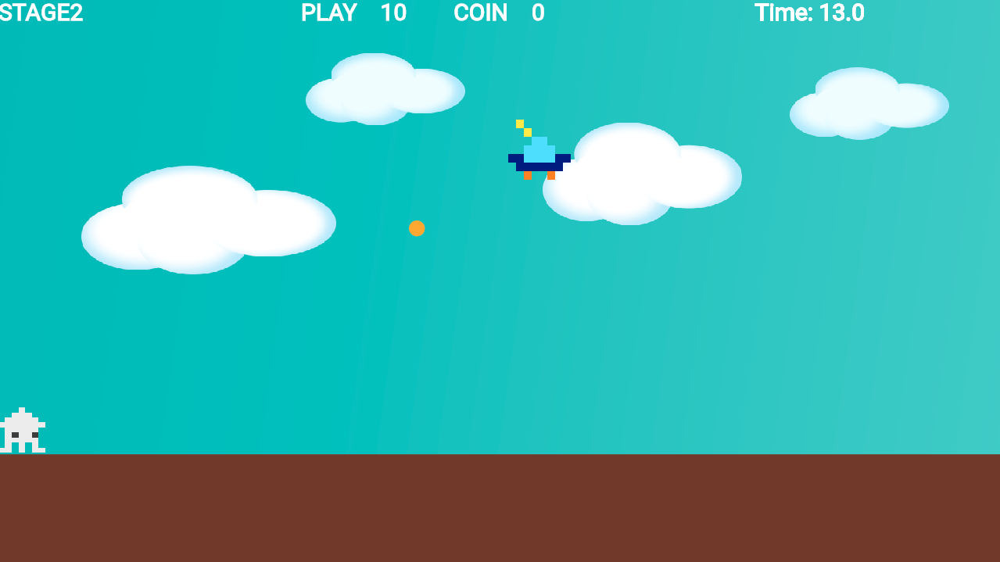

# **25_敵をランダムに出す**

## **この単元でやること**

1. 敵をランダムに出す
2. 敵から弾を出す
3. プレーヤーから弾を出す

## **1. 敵をランダムに出す**



### **①位置データの追加と修正**

 - 敵が弾を出すかどうかの判定を追加する
 - 出現位置をランダムにする

**【setting.dart】**


```dart

class TekiData {
  final int idx;
  final double size_x;
  final double size_y;
  final double pos_x;
  final double pos_y;
  final double speed_x;
  final double speed_y;
  final bool gravity;
  final String right_img1;
  final String right_img2;
  final String left_img1;
  final String left_img2;
  final String stop_left_img1;
  final String stop_left_img2;
  final String stop_right_img1;
  final String stop_right_img2;
  final bool isShooter; //⭐️追加

  TekiData({
    required this.idx,
    required this.size_x,
    required this.size_y,
    required this.pos_x,
    required this.pos_y,
    required this.speed_x,
    required this.speed_y,
    required this.gravity,
    required this.right_img1,
    required this.right_img2,
    required this.left_img1,
    required this.left_img2,
    required this.stop_left_img1,
    required this.stop_left_img2,
    required this.stop_right_img1,
    required this.stop_right_img2,
    required this.isShooter, //⭐️追加
  });

  // ⭐️後から修正したいものをメソッドとしておく
  //copyWithという名前をつけて更新したい変数を入れておく
  TekiData copyWith({
    double? pos_x,
    double? pos_y,
  }) {
    return TekiData(
      idx: idx,
      size_x: size_x,
      size_y: size_y,
      pos_x: pos_x ?? this.pos_x,
      pos_y: pos_y ?? this.pos_y,
      speed_x: speed_x,
      speed_y: speed_y,
      gravity: gravity,
      right_img1: right_img1,
      right_img2: right_img2,
      left_img1: left_img1,
      left_img2: left_img2,
      stop_left_img1: stop_left_img1,
      stop_left_img2: stop_left_img2,
      stop_right_img1: stop_right_img1,
      stop_right_img2: stop_right_img2,
      isShooter: isShooter, 
    );
  }
}

List<TekiData> tekilist = [
  TekiData(
    idx: 0,
    size_x: 50,
    size_y: 50,
    pos_x: screenSize.x - 300,
    pos_y: Y_GROUND_POSITION - 500,
    speed_x: -100,
    speed_y: 0,
    gravity: true,
    right_img1: 'tako.png',
    right_img2: 'tako.png',
    left_img1: 'tako.png',
    left_img2: 'tako.png',
    stop_left_img1: 'tako.png',
    stop_left_img2: 'tako.png',
    stop_right_img1: 'tako.png',
    stop_right_img2: 'tako.png',
    isShooter: false, //⭐️追加
  ),
  TekiData(
    idx: 1,
    size_x: 50,
    size_y: 50,
    pos_x: screenSize.x * 1.5,
    pos_y: Y_GROUND_POSITION - 25,
    speed_x: -100,
    speed_y: 0,
    gravity: true,
    right_img1: 'tako.png',
    right_img2: 'tako.png',
    left_img1: 'tako.png',
    left_img2: 'tako.png',
    stop_left_img1: 'tako.png',
    stop_left_img2: 'tako.png',
    stop_right_img1: 'tako.png',
    stop_right_img2: 'tako.png',
    isShooter: false, //⭐️追加
  ),
  TekiData(
    idx: 2,
    size_x: 50,
    size_y: 50,
    pos_x: screenSize.x * 1.3,
    pos_y: Y_GROUND_POSITION - 200,
    speed_x: -200,
    speed_y: 0,
    gravity: false,
    right_img1: 'karasu.png',
    right_img2: 'karasu.png',
    left_img1: 'karasu.png',
    left_img2: 'karasu.png',
    stop_left_img1: 'karasu.png',
    stop_left_img2: 'karasu.png',
    stop_right_img1: 'karasu.png',
    stop_right_img2: 'karasu.png',
    isShooter: false, //⭐️追加
  ),
  TekiData(
    idx: 3,
    size_x: 50,
    size_y: 50,
    pos_x: screenSize.x * 3,
    pos_y: Y_GROUND_POSITION - 500,
    speed_x: -100,
    speed_y: 0,
    gravity: true,
    right_img1: 'tako.png',
    right_img2: 'tako.png',
    left_img1: 'tako.png',
    left_img2: 'tako.png',
    stop_left_img1: 'tako.png',
    stop_left_img2: 'tako.png',
    stop_right_img1: 'tako.png',
    stop_right_img2: 'tako.png',
    isShooter: false, //⭐️追加
  ),
  TekiData(
    idx: 4,
    size_x: 50,
    size_y: 50,
    pos_x: screenSize.x * 3 + 100,
    pos_y: screenSize.y - 50,
    speed_x: 0,
    speed_y: -100,
    gravity: false,
    right_img1: 'tako.png',
    right_img2: 'tako.png',
    left_img1: 'tako.png',
    left_img2: 'tako.png',
    stop_left_img1: 'tako.png',
    stop_left_img2: 'tako.png',
    stop_right_img1: 'tako.png',
    stop_right_img2: 'tako.png',
    isShooter: false, //⭐️追加
  ),
  TekiData(
    idx: 5,
    size_x: 100,
    size_y: 100,
    pos_x: screenSize.x / 2,
    pos_y: screenSize.y / 2,
    speed_x: 0,
    speed_y: 0,
    gravity: false,
    right_img1: 'UFO.png',
    right_img2: 'UFO.png',
    left_img1: 'UFO.png',
    left_img2: 'UFO.png',
    stop_left_img1: 'UFO.png',
    stop_left_img2: 'UFO.png',
    stop_right_img1: 'UFO.png',
    stop_right_img2: 'UFO.png',
    isShooter: true, //⭐️追加
  ),
];

```

### **②インスタンス作成**

 - math関数インポート
 - 2秒ごとにランダムに出現

**【game.dart】**

```dart

import 'dart:math';//⭐️追加

//省略

Future<void> objectRemove() async {

  //省略
  switch (currentStage) {
      case 1:

        //省略

        break;
      case 0:
        for (int i = 0; i < 4; i++) {
          BackScreenImg _backscreenimg = BackScreenImg(BackGroundlist[1], i);
          await world.add(_backscreenimg);
        }

        // カメラの追従なしにする
        camerafollow = false;

        //⭐️敵をランダムに出す
        await TekiRandom();

        break;
      default:
    }

    //省略

    //⭐️追加
    Future<void> TekiRandom() async {
    final Random _random = Random();

    timerComponent = TimerComponent(
      period: 2, // 2秒ごとに出現
      repeat: true, // 繰り返し実行
      onTick: () {
        double randomX = _random.nextDouble() * (screenSize.x - 100);
        double randomY = _random.nextDouble() * screenSize.y / 2 + 100;

        //メソッド部分を更新
        Teki _teki5 = Teki(tekilist[5].copyWith(
          pos_x: randomX,
          pos_y: randomY,
        ));

        //3秒で消える
        final removeTimer = TimerComponent(
          period: 3,
          repeat: false,
          onTick: () {
            _teki5.removeFromParent();
          },
        );

        world.add(_teki5);
        world.add(removeTimer);
      },
    );
    add(timerComponent!);
  }

```

## **２. 敵からプレーヤーに向かって弾をだす**

### **①位置データ追加**

**【setting.dart】**

```dart

  TamaData(
    idx: 1,
    color: Color.fromARGB(255, 255, 174, 0),
    radius: 10,
    size_x: 0,
    size_y: 0,
    velocity_x: 300,
    velocity_y: 300,
    gravity: 0,
    tama_img: "",
  )

```

### **②オブジェクト作成**

```dart
import 'player.dart';

//省略

class Tekitama extends CircleComponent
    with HasGameRef<MainGame>, KeyboardHandler, CollisionCallbacks {
  Tekitama(this.data);
  final TamaData data;

  Vector2 velocity = Vector2.zero();
  double speed_x = 0;
  double speed_y = 0;

  @override
  Future<void> onLoad() async {
    radius = data.radius;
    paint = Paint()..color = data.color;
    await add(CircleHitbox(radius: data.radius));
    await super.onLoad();
  }

  @override
  void update(double delta) {
    // 位置を更新
    position.x += speed_x * delta;
    position.y += speed_y * delta;

    // 枠外に行ったら消す
    if (position.y < 0 ||
        position.x < 0 ||
        position.x > FIELD_SIZE_X ||
        position.y > Y_GROUND_POSITION) {
      removeFromParent();
    }
  }

  @override
  void onCollisionStart(
    Set<Vector2> intersectionPoints,
    PositionComponent other,
  ) {
    super.onCollisionStart(intersectionPoints, other);

    //プレーヤーに当たったら消す
    if (other is Player) {
      removeFromParent();
      player_count--;
    }
  }
}

```

### **③インスタンス作成**

**【game.dart】**

```dart

  Future<void> TekitamaRemove(Teki teki) async {

    Vector2 from = teki.position.clone(); //敵のポジションをコピー
    Vector2 to = player.position.clone(); //プレーヤーのポジションをコピー
    Vector2 direction = (to - from).normalized(); //長さ１のベクトル
    Vector2 velocity = direction * 200;

    final tekitama = Tekitama(TamaDatalist[1])
      ..position = from
      ..speed_x = velocity.x
      ..speed_y = velocity.y;

    world.add(tekitama);
  }

```

### **④一定時間ごとに弾を出す**

**【teki.dart】**

```dart

@override
  Future<void> onLoad() async {
    // 省略

    // 2秒毎に弾を出す
    if (data.isShooter) {
      add(TimerComponent(
        period: 2,
        repeat: true,
        onTick: () {
          gameRef.TekitamaRemove(this);
        },
      ));
    }
  }

```

## **3. プレーヤーから弾を出す**

### **①位置データの追加**

**【setting.dart】**

```dart

  TamaData(
    idx: 1,
    color: Color.fromARGB(255, 255, 174, 0),
    radius: 30,
    size_x: 0,
    size_y: 0,
    velocity_x: 0,
    velocity_y: 300,
    gravity: 0,
    tama_img: "rocket.png",
  ),

```

### **②オブジェクトの追加**

Playertamaクラスをコピーして  
PlayertamaImgクラスに変更  
⭐️の部分が変更


```dart

//⭐️クラス名とコンポーネントの種類を変更
class PlayertamaImg extends SpriteComponent
    with HasGameRef<MainGame>, KeyboardHandler, CollisionCallbacks {
  PlayertamaImg(this.data);
  final TamaData data;

  Vector2 velocity = Vector2.zero();
  double speed_x = 0;
  double speed_y = 0;
  double bounceFactor = 0.7;
  bool hasFired = false;

  @override
  Future<void> onLoad() async {
    //⭐️修正
    sprite = await Sprite.load(data.tama_img);
    position = Vector2(gameRef.player.position.x, gameRef.player.position.y);
    //⭐️修正
    // radius = data.radius;
    //⭐️修正
    size = Vector2(data.size_x, data.size_y);
    paint = Paint()..color = data.color;
    await add(CircleHitbox(radius: data.radius));
    await super.onLoad();
  }

  @override
  void update(double delta) {
    // print(leftflg);
    // print(rightflg);
    // print(data.velocity_x);

    if (!hasFired) {
      if (leftflg) {
        speed_x = -data.velocity_x;
        speed_y = -data.velocity_y;
      } else if (rightflg) {
        speed_x = data.velocity_x;
        speed_y = -data.velocity_y;
      }
      hasFired = true; // 初回のみ設定
    }

    // 重力加速度をY方向速度に加算
    speed_y += data.gravity * delta;

    // 位置を更新
    position.x += speed_x * delta;
    position.y += speed_y * delta;

    // 地面でバウンド処理（仮に Y=groundY を地面とする）
    if (position.y >= Y_GROUND_POSITION) {
      position.y = Y_GROUND_POSITION; // 地面に位置を補正
      speed_y = -speed_y * bounceFactor; // 反発（減衰あり）

      // 速度が小さくなりすぎたら停止（オプション）
      if (speed_y.abs() < 50) {
        speed_y = 0;
      }
    }

    // 枠外に行ったら消す
    if (position.y < 0 ||
        position.x < 0 ||
        position.x > FIELD_SIZE_X ||
        position.y > FIELD_SIZE_Y) {
      removeFromParent();
    }
  }

  @override
  void onCollisionStart(
    Set<Vector2> intersectionPoints,
    PositionComponent other,
  ) {
    super.onCollisionStart(intersectionPoints, other);

    //障害物に当たったら消す
    if (other is triangle) {
      removeFromParent();
    }

    //敵に当たったら消す
    if (other is Teki) {
      removeFromParent();
      other.removeFromParent();
    }
  }
}


```

### **③インスタンス作成**

**【game.dart】**

```dart

  Future<void> PlayertamaRemoveQ() async {
    PlayertamaImg _playertama2 = PlayertamaImg(TamaDatalist[2]);
    await world.add(_playertama2);
  }


```

### **④Qキーが押された時の処理**

**onKeyEventの中に追加**

**【player.dart】**

```dart

    if (keysPressed.contains(LogicalKeyboardKey.keyQ)) {
      gameRef.PlayertamaRemoveQ();
      FlameAudio.play('Onoma-Pop04-1(High-Dry).mp3');
    }

```

### **⑤動きをスムーズにする**

**KeyUpEventの中に条件追加**

```dart

    } else if (event is KeyUpEvent) {
      //⭐️追加
      if (!keysPressed.contains(LogicalKeyboardKey.arrowLeft) &&
          !keysPressed.contains(LogicalKeyboardKey.arrowRight)) {
        stopMovement();
      }
    }
```
