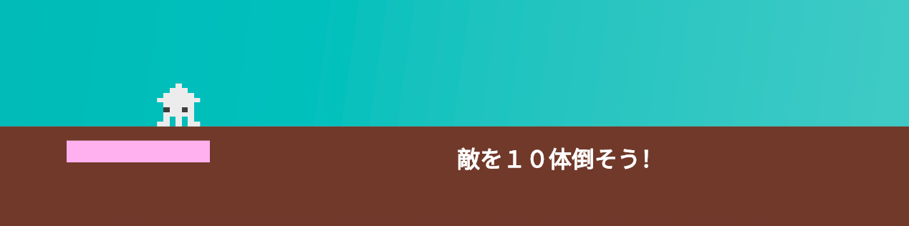
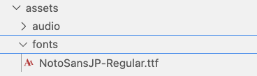

# **26_倒した敵の数**

## **この単元でやること**

1. 日本語を表示する
2. 敵の数をゲージで表示
3. 敵を倒したらドアを出す

## **1. 日本語を表示する**



### **①フォントファイルを保存**

flameでは、デフォルトで日本語を使用することができません。  
日本語のフォントファイルを保存して表示させます。

 - assets>fontsフォルダを作成
 - fontsフォルダにフォントファイルを入れる（「演習フォント」フォルダに入っています）



**【pabspec.yaml】**


```dart

  assets:
    - assets/images/
    - assets/audio/
    - assets/fonts/  ⭐️追加

  ⭐️追加
  fonts:
    - family: NotoSansJP
      fonts:
        - asset: assets/fonts/NotoSansJP-Regular.ttf

```

### **②位置データ追加**

**【setting.dart】**

```dart

class TextData {
  final int idx;
  final Color color;
  final double font_size;
  final double pos_x;
  final double pos_y;
  final String text;

  TextData({
    required this.idx,
    required this.color,
    required this.font_size,
    required this.pos_x,
    required this.pos_y,
    required this.text,
  });
}

List<TextData> Textlist = [
  TextData(
    idx: 1,
    color: Colors.white,
    font_size: 32.0,
    pos_x: screenSize.x / 2,
    pos_y: Y_GROUND_POSITION + 20,
    text: "敵を１０体倒そう！",
  ),
];

```

### **③オブジェクト追加**

**【stagetext.dart】**

```dart

//省略

class TextDisplay extends TextComponent with HasGameRef<MainGame> {
  TextDisplay(this.data);
  final TextData data;

  @override
  Future<void> onLoad() async {
    position = Vector2(data.pos_x, data.pos_y);
    text = data.text;
    priority = 100;

    textRenderer = TextPaint(
        style: TextStyle(
            fontSize: data.font_size,
            fontWeight: FontWeight.bold,
            color: data.color,
            fontFamily: 'NotoSansJP',
        ));
  }

  @override
  Future<void> render(Canvas canvas) async {
    super.render(canvas);
  }
}


```

### **④インスタンス追加**

**【game.dart】**

```dart

    case 1:
        for (int i = 0; i < 4; i++) {
          BackScreenImg _backscreenimg = BackScreenImg(BackGroundlist[1], i);
          await world.add(_backscreenimg);
        }

        // カメラの追従なしにする
        camerafollow = false;

        // 敵をランダムに出す
        await TekiRandom();

        // ⭐️テキスト表示
        TextDisplay _text1 = TextDisplay(Textlist[0]);
        await world.add(_text1);

```

## **2. 敵の数をゲージで表示**

### **①オブジェクト作成**

score.dartを新規作成

```dart

import 'package:flame/events.dart';
import 'package:flutter/services.dart';
import 'package:flutter/material.dart';
import 'package:flame/components.dart';
import 'game.dart';
import 'setting.dart';

class HpBar extends RectangleComponent with HasGameRef<MainGame> {
  final barsize = 200.0;
  @override
  Future<void> onLoad() async {
    position = Vector2(100, Y_GROUND_POSITION + 20);
    size = Vector2((TekiHP * barsize / 10).toDouble(), 30);
    paint = Paint()..color = const Color.fromARGB(255, 255, 173, 243);
  }

  void renderHpBarButton(Canvas canvas) {
    final rect = Rect.fromLTWH(
      0,
      0,
      barsize,
      30,
    );
    final bgPaint = Paint()..color = Colors.white;
    canvas.drawRect(rect, bgPaint);
  }

  @override
  void render(Canvas canvas) async {
    renderHpBarButton(canvas);
    super.render(canvas);
  }
}

```

### **②インスタンス作成**

**【game.dart】**

敵のHPを保存

```dart

//省略

//カメラ追従するしない
bool camerafollow = true;
TimerComponent? timerComponent;

//⭐️追加
int TekiHP = 10;

//省略

    case 1:
      print("2個目のステージ");

      //背景を入れる
      for (int i = 0; i < 4; i++) {
        BackScreenImg _backscreenimg = BackScreenImg(BackGroundlist[1], i);
        await world.add(_backscreenimg);
      }

      // カメラの追従なしにする
      camerafollow = false;

      // 敵をランダムに出す
      await TekiRandom();

      // テキスト表示
      TextDisplay _text1 = TextDisplay(Textlist[0]);
      await world.add(_text1);

      //⭐️　HP表示
      TekiHP = 10;
      await HpTextRemove();

//省略

  //⭐️関数追加
  Future<void> HpTextRemove() async {
    
    children.whereType<HpBar>().forEach((text) {
      text.removeFromParent();
    });
    await world.add(HpBar());
  }
```

### **③敵を倒したらゲージを減らす**

**【player.dart】**

```dart

if (other is Teki && !TekihasCollided) {
      TekihasCollided = true;
      if (!isFall) {

        //省略

      } else {
        velocity.y = -300;
        velocity.x = 100;
        other.velocity.x = 0;
        other.velocity.y = 100;
        other.size = Vector2(other.data.size_x, other.data.size_y / 5);
        add(TimerComponent(
          period: 1, // 1秒
          repeat: false, // 1回だけ実行d
          onTick: () {
            //⭐️追加
            if (TekiHP > 0) {
              TekiHP--;
              gameRef.HpTextRemove();
            }
            velocity.x = 0;
            other.removeFromParent();
          },
        ));
      }
    }

```

### **④プレーヤーの弾が敵に当たったときゲージを減らす**

**【tama.dart】**

PlayertamaImg Classの中を修正

```dart

@override
  void onCollisionStart(
    Set<Vector2> intersectionPoints,
    PositionComponent other,
  ) {
    super.onCollisionStart(intersectionPoints, other);

    //障害物に当たったら消す
    if (other is triangle) {
      removeFromParent();
    }

    //敵に当たったら消す
    if (other is Teki) {
      removeFromParent();
      other.removeFromParent();
      //⭐️追加
      if (TekiHP > 0) {
        TekiHP--;
        gameRef.HpTextRemove();
      }
    }
  }


```


## **3. ゲージが０になったらドアを出す**

### **①ドアの位置情報を設定**

**【setting.dart】**

```dart

class ObjectData {
  final int idx;
  final double size_x;
  final double size_y;
  final double pos_x;
  final double pos_y;
  final String object_img;

  ObjectData({
    required this.idx,
    required this.size_x,
    required this.size_y,
    required this.pos_x,
    required this.pos_y,
    required this.object_img,
  });
}

List<ObjectData> objectlist = [
  ObjectData(
    idx: 0,
    size_x: 80,
    size_y: 100,
    pos_x: screenSize.x - PLAYER_SIZE_X / 2,
    pos_y: Y_GROUND_POSITION - PLAYER_SIZE_Y / 2,
    object_img: 'door1.png',
  ),
  ObjectData(
    idx: 0,
    size_x: 80,
    size_y: 100,
    pos_x: screenSize.x - PLAYER_SIZE_X / 2,
    pos_y: Y_GROUND_POSITION - PLAYER_SIZE_Y / 2,
    object_img: 'door2.png',
  ),
];

```

### **②オブジェクトの作成**

**【object.dart】**

```dart

class Door extends SpriteComponent
    with HasGameRef<MainGame>, CollisionCallbacks {
  Door(this.data);
  final ObjectData data;
  @override
  Future<void> onLoad() async {
    sprite = await gameRef.loadSprite(data.object_img);
    size = Vector2(data.size_x, data.size_y);
    position = Vector2(data.pos_x, data.pos_y);
    anchor = Anchor.center;

    add(RectangleHitbox());
  }
}

```


### **③インスタンスの作成**

**【game.dart】**

```dart

Future<void> DoorRemove() async {
    print("==DoorRemove==");

    Door _door1 = Door(objectlist[0]);
    await world.add(_door1);
  }

  Future<void> DoorRemove2() async {
    print("==DoorRemove2==");

    Door _door2 = Door(objectlist[1]);
    await world.add(_door2);
  }


```

### **④ドアを表示**

**【game.dart】**

```dart

bool doorflg = false;

```

**【player.dart】**

onCollisionStart関数の中

```dart

if (other is Teki && !TekihasCollided) {
      print("Teki当たった");
      TekihasCollided = true;
      if (!isFall) {
        velocity.y = -300;
        velocity.x = 0;
        size.x = PLAYER_SIZE_X / 2;
        add(TimerComponent(
          period: 0.8, // 0.8秒
          repeat: false, // 1回だけ実行d
          onTick: () {
            player_count--;
            if (player_count <= 0) {
              player_count = 0;
              gameRef.gameoverRemove();
              stopMovement(); // 動きを止める
              StopTimer = true; // タイマーを止める
              isGameOver = true;
            } else {
              removeFromParent();
            }
          },
        ));
      } else {
        velocity.y = -300;
        velocity.x = 100;
        other.velocity.x = 0;
        other.velocity.y = 100;
        other.size = Vector2(other.data.size_x, other.data.size_y / 5);
        add(TimerComponent(
          period: 1, // 1秒
          repeat: false, // 1回だけ実行d
          onTick: () {
            if (TekiHP > 0) {
              TekiHP--;
              gameRef.HpTextRemove();
            }
            //⭐️追加
            if (TekiHP <= 0 && !doorflg) {
              doorflg = true;
              gameRef.DoorRemove();
            }
            velocity.x = 0;
            other.removeFromParent();
          },
        ));
      }
    }

```

onCollision関数の中

```dart

if (other is Door) {
  other.removeFromParent();
  doorflg = false;
  gameRef.DoorRemove2();
  Future.delayed(const Duration(seconds: 1), () {});
}

```

**【tama.dart】**

PlayertamaクラスのonCollisionStart関数の中

```dart

  if (other is Teki) {
    removeFromParent();
    other.removeFromParent();
    if (TekiHP > 0) {
      TekiHP--;
      gameRef.HpTextRemove();
    }
    //⭐️追加
    if (TekiHP <= 0 && !doorflg) {
      doorflg = true;
      gameRef.DoorRemove();
    }
  }

```

PlayertamaImgクラスのonCollisionStart関数の中

```dart

if (other is Teki) {
  removeFromParent();
  other.removeFromParent();
  if (TekiHP > 0) {
    TekiHP--;
    gameRef.HpTextRemove();
  }
  //⭐️追加
  if (TekiHP <= 0 && !doorflg) {
    doorflg = true;
    gameRef.DoorRemove();
  }
}

```
